% 一般ルービックキューブ NxNxN 解法
% 2026-06-09 (Tue.)
% パズル

## index

## 概要

普通ルービックキューブは 3x3x3 からなる立方体であるが,
これを拡張した 4x4x4, 5x5x5 などが存在する.
ここではこれらを一般化した NxNxN について考える.

とは言え実は 4x4x4 と 5x5x5 までが必要な知識の上限であり（偶数奇数の違いはある）,
それ以上はただ再帰的に解法を適用していくだけである.

また 3x3x3 の解法は知っているものとする.

## 偉大なる参考リンク

- [[https://cube.uubio.com]]
- [[https://cubevoyage.net/speedcubing/]]

## 記法・名称

### 図

U 面と F 面と R 面を見せてルービックキューブの状態を示す.
色の配置は [世界基準色](https://store.tribox.com/user_data/puzzle_color.php) に従う.

    <figure style='width: 35%; display: inline-block; margin: 0'>
        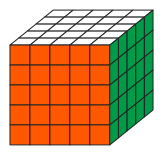
        <figcaption>F面が真正面にあって上にU面, 右にR面</figcaption>
    </figure>
    <figure style='width: 35%; display: inline-block; margin: 0'>
        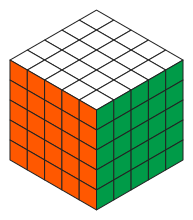
        <figcaption>等角図. 上にU面があって左下がF面, 右下がR面</figcaption>
    </figure>

また「状態が不明（問わない）」なパーツは灰色で描く.

### パーツの名称

ルービックキューブの外側から見えていて回す対象であるパーツは次の3つに分類される.

- センターキューブ
    - 一色の面を持つパーツ
    - 各面の中心に位置する
- エッジキューブ
    - 二色の面を持つパーツ
    - 各面の辺に位置する
- コーナーキューブ
    - 三色の面を持つパーツ
    - 各面の角に位置する

    <figure style='width: 25%; display: inline-block; margin: 0'>
        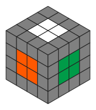
        <figcaption>センターキューブ</figcaption>
    </figure>
    <figure style='width: 25%; display: inline-block; margin: 0'>
        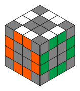
        <figcaption>エッジキューブ</figcaption>
    </figure>
    <figure style='width: 25%; display: inline-block; margin: 0'>
        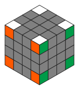
        <figcaption>コーナーキューブ</figcaption>
    </figure>

### 回転の記法

[シングマスター記法](https://tribox.com/3x3x3/solution/notation/) に倣う.
ただし NxNxN なので拡張する.

#### 外側一層の回転

最も外側一層だけの回転は 3x3x3 のときと全く同様

- $U$: U 面を正面から見たとき一層だけを時計回りに 90 度回す
- $U'$: 反時計周りに 90 度回す
- $R$: R 面を正面から見たとき一層だけを時計回りに 90 度回す
- $R'$: 反時計周りに 90 度回す
- $F/F'$: 同様
- $D/D'$: 同様
- $L/L'$: 同様
- $B/B'$: 同様

#### 複数層の回転

一般の NxNxN の場合, 一度に複数の層を回すこともできる.
このとき層の数 $m$ とどの面であるかを組み合わせて次のように表記する.

- $mU$: U 面を正面から見たとき最も外側にあるものから連続した $m$ 層を時計回りに 90 度回す
    - ここで $m$ は具体的な数であって, 実際には $2U$, $3U$ などと表記する
    - もちろん $U$ 以外でも $2U'$ とか $3B$ などと書く.

    <figure style='width: 25%; display: inline-block; margin: 0'>
        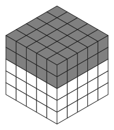
        <figcaption>灰色の層が 2U</figcaption>
    </figure>
    <figure style='width: 25%; display: inline-block; margin: 0'>
        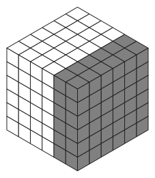
        <figcaption>灰色の層が 2R</figcaption>
    </figure>

#### 中間層の回転

また, 外側から数えて $m$ 番目の一層だけの回転を考えることもある.
このときは $m$ と小文字でどの面かを組み合わせて次のように表記する.

- $mu$: U 面を正面から見たとき外側から数えて $m$ 番目の層を時計回りに 90 度回す
    - ここで $m$ は具体的な数であって, 実際には $2u$, $3u$ などと表記する

とくに $m$ が $1$ の場合の $1U$ とか$1u$ はただの $U$ と等しいので単に $U$ と書く.

    <figure style='width: 25%; display: inline-block; margin: 0'>
        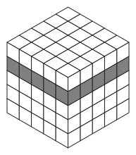
        <figcaption>灰色の層が 2u</figcaption>
    </figure>
    <figure style='width: 25%; display: inline-block; margin: 0'>
        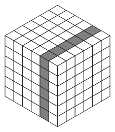
        <figcaption>灰色の層が 2r</figcaption>
    </figure>

#### 繰り返しは下添字で書く

- $X_m$: 操作 $X$ を $m$ 回繰り返す
    - 例えば $U_2$ は $U$ を 2 回繰り返すこと（すなわち 180 度回すこと）を意味する
    - $X$ は何でもよく, 括弧を使って $(RUR'U')_4$ のように複数の操作をまとめて繰り返すこともできる

> 伝統的に 3x3x3 では $U_2$ のことを $U2$ と書くのが一般的であるが,
> 数字は層数にも使うので, 混乱を避けるために下添字で表記することにする.
> 例えば $U2R$ は $U$ と $2R$ の意味.

#### 逆操作はプライム (') で書く

既に $U'$ や $F'$ などと書いていたが, もっと自由に複数の操作の逆操作を考えることが出来る

- $X'$: 操作 $X$ の逆操作
    - 例えば $U'$ は $U$ の逆操作である
    - 一般に $(AB)' = B'A'$
    - 例えば $(RUR'U')' = URU'R'$

#### 補助記号

既に使ったが意味ある単位でグルーピングするのに括弧を使う.

- $(UR') (U'R)$ はただの $UR'U'R$ の意味

また単に区切る為に $-$ を使うこともある.
これらは読みやすさのためであって,
操作の意味には影響しない.

- $2R - (U R' F)_2 - 2R'$
- これは $2R U R' F U R' F 2R'$ の意味

また特に互いに影響無く順序を入れ替えられる操作を並べるときは $+$ で区切る.

- $U+D'$

これは $U-D'$ と読んでも $D'-U$ と読んでも同じ意味.
どちらの順で回しても構わないが,
特に「同時に回すのがオススメ」というニュアンスで使ってる.

### コミュテータ

[コミュテータ](https://scrapbox.io/speedcube/%E4%BA%A4%E6%8F%9B%E5%AD%90_%28commutator%29) または交換子とは,
二つの操作 $A$ と $B$ があるときに $ABA'B'$ と回す操作のこと.
ある特定のパーツだけを狙って移動・交換することができるので本記事で多用する.
これを$[A, B]$ と書く.

$$[A, B] = ABA'B'$$

例えば $[R, U]$ は $R U R' U'$,
$[R, UF]$ は $RUF - R'F'U'$ という手順を表す.

理論的な詳細はリンク先参照.

## 解法

### 全体の流れ

1. センターキューブを揃える
2. エッジキューブを揃える
3. 3x3x3 と見做して解く
4. パリティを修正する

    <figure style='width: 25%; display: inline-block; margin: 0'>
        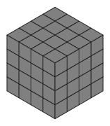
        <figcaption>Step 0</figcaption>
    </figure>
    <figure style='width: 25%; display: inline-block; margin: 0'>
        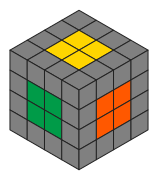
        <figcaption>Step 1. 各面のセンターキューブを揃える</figcaption>
    </figure>
    <figure style='width: 25%; display: inline-block; margin: 0'>
        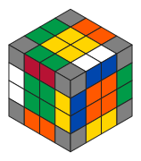
        <figcaption>Step 2. 各辺のエッジキューブを揃える</figcaption>
    </figure>

    <figure style='width: 25%; display: inline-block; margin: 0'>
        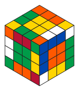
        <figcaption>Step 2'. ぐっと睨むと 3x3x3 に見えてくる</figcaption>
    </figure>
    <figure style='width: 25%; display: inline-block; margin: 0'>
        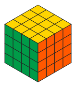
        <figcaption>Step 3. 3x3x3 として解く</figcaption>
    </figure>

<figure>
    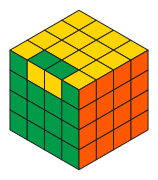
    <figcaption>Step 4. パリティを修正する</figcaption>
</figure>

4x4x4 以降のルービックキューブにはパリティエラーが存在する.
つまりエッジが反転した状態が発生しうる.
この場合は修正手順が追加で必要.

### センターキューブを揃える

$N$ が奇数の場合各面の中心のセンターキューブが正しい色として固定されていると見なせるので,
これを基準にして各面のセンターキューブを揃える.
偶数の場合はどの色を集めてきてしまえるのだが, 最後に 3x3x3 として解くときに不能な配置にもできるので注意.
例えば本来は白色の向かい面が黄色だが, ここに赤色を集めてしまうことも可能だが最終的には解けなくなってしまう.
3x3x3 のときの色の配置を覚えておいて, それに従ってセンターキューブを揃えること.

各面にセンターキューブは $(N-2) \times (N-2)$ あるがいきなり揃えるのではなく,
（奇数なら） $1 \times 1 \to 3 \times 3 \to \cdots \to (N-2) \times (N-2)$ と少しずつ育てていく.
奇数の場合は最初から $1 \times 1$ が, 偶数の場合は（見えないけど） $0 \times 0$ が揃っている状態からスタートする.

#### $k \times k$ が揃ってる状態から $(k+2) \times (k+2)$ を揃える

さらに 2 ステップからなる

    <figure style='width: 25%; display: inline-block; margin: 0'>
        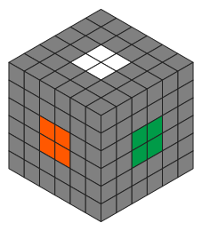
        <figcaption>k x k が既に揃ってる</figcaption>
    </figure>
    &rarr;
    <figure style='width: 25%; display: inline-block; margin: 0'>
        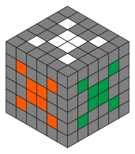
        <figcaption>(k+2)x(k+2) のコーナーを全部持ってくる</figcaption>
    </figure>
    &rarr;
    <figure style='width: 25%; display: inline-block; margin: 0'>
        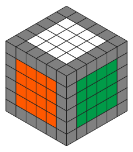
        <figcaption>(k+2)x(k+2) のエッジを全部埋める</figcaption>
    </figure>

##### $(k+2) \times (k+2)$ のコーナーを全部持ってくる

最終的に全面のコーナーを持ってくることが目的.
それまではどの面のどのコーナーを持ってきてもいい.

コミュテータ
$$[mr, U']$$
すなわち $mrU' - mr'U$ を使うことで自由に集める.

実際には $mr$ は $mR$ としても影響はない.
また, 手順の最後の $U$ は特に意味が無いので, 以下の例では省略している.

    <figure style='width: 25%; display: inline-block; margin: 0'>
        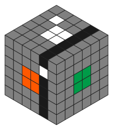
        <figcaption>黒色の層を mr とする</figcaption>
    </figure>
    &rarr;
    <figure style='width: 25%; display: inline-block; margin: 0'>
        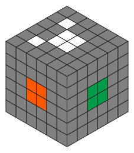
        <figcaption>mrU' - mr'</figcaption>
    </figure>

    <figure style='width: 25%; display: inline-block; margin: 0'>
        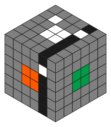
        <figcaption>黒色の層を mr とする</figcaption>
    </figure>
    &rarr;
    <figure style='width: 25%; display: inline-block; margin: 0'>
        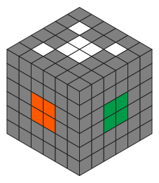
        <figcaption>mrU' - mr'</figcaption>
    </figure>

    <figure style='width: 25%; display: inline-block; margin: 0'>
        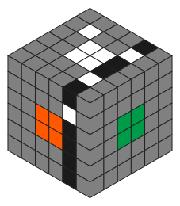
        <figcaption>黒色の層を mr とする</figcaption>
    </figure>
    &rarr;
    <figure style='width: 25%; display: inline-block; margin: 0'>
        
        <figcaption>mrU' - mr'</figcaption>
    </figure>

D面から持ってきたかったら $mr_2 U' - mr_2$ とすればいい.

##### $(k+2) \times (k+2)$ のエッジを全部埋める

コミュテータ
$$[mr, (U'kl'U)]$$
を使う
(実際には最後の $U$ は省く).

    <figure style='width: 25%; display: inline-block; margin: 0'>
        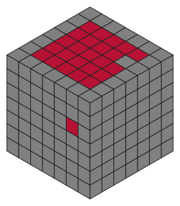
        <figcaption>F面の 2r 3u 層にある赤を上に持っていきたい</figcaption>
    </figure>
    &rarr;
    <figure style='width: 25%; display: inline-block; margin: 0'>
        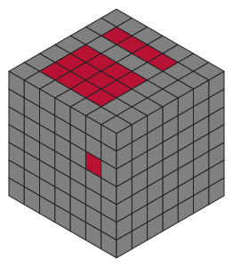
        <figcaption>2rU'3l'U</figcaption>
    </figure>
    &rarr;
    <figure style='width: 25%; display: inline-block; margin: 0'>
        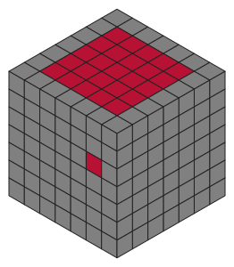
        <figcaption>2r'U'3lU</figcaption>
    </figure>

    <figure style='width: 25%; display: inline-block; margin: 0'>
        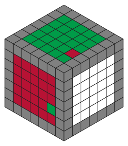
        <figcaption>F面の 2r 5u 層にある緑を上に持っていきたい</figcaption>
    </figure>
    &rarr;
    <figure style='width: 25%; display: inline-block; margin: 0'>
        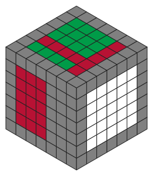
        <figcaption>2rU'5l'U</figcaption>
    </figure>
    &rarr;
    <figure style='width: 25%; display: inline-block; margin: 0'>
        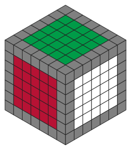
        <figcaption>2r'U'5lU</figcaption>
    </figure>

    <figure style='width: 25%; display: inline-block; margin: 0'>
        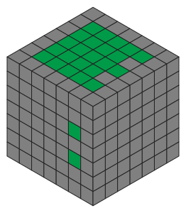
        <figcaption>複数あってもOK</figcaption>
    </figure>
    &rarr;
    <figure style='width: 25%; display: inline-block; margin: 0'>
        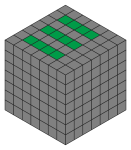
        <figcaption>2rU'(3l'+5l')U</figcaption>
    </figure>
    &rarr;
    <figure style='width: 25%; display: inline-block; margin: 0'>
        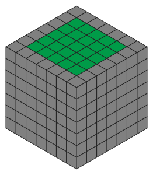
        <figcaption>2r'U'(3l+5l)U</figcaption>
    </figure>

### エッジキューブを揃える

#### エッジペアリング

F面の左にあるエッジキューブを右に持ってくるという **エッジペアリング** を繰り返すことでエッジキューブを揃える.

    <figure style='width: 25%; display: inline-block; margin: 0'>
        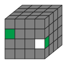
        <figcaption>このエッジのペアを</figcaption>
    </figure>
    &rarr;
    <figure style='width: 25%; display: inline-block; margin: 0'>
        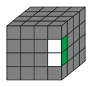
        <figcaption>くっつけたい</figcaption>
    </figure>

    <figure style='width: 25%; display: inline-block; margin: 0'>
        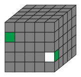
        <figcaption>このエッジのペアは</figcaption>
    </figure>
    &rarr;
    <figure style='width: 25%; display: inline-block; margin: 0'>
        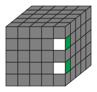
        <figcaption>同じエッジにいるべき</figcaption>
    </figure>

左の動かしたいエッジが U 面から見て $ku$ 層にあるとき, コミュテータ
$$[ku'R, U']$$
を使うことでペアリングできる.

    <figure style='width: 25%; display: inline-block; margin: 0'>
        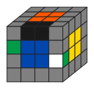
        <figcaption>黒色のペアは壊れるで注意</figcaption>
    </figure>
    &rarr;
    <figure style='width: 25%; display: inline-block; margin: 0'>
        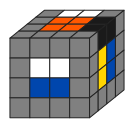
        <figcaption>2u'RU'</figcaption>
    </figure>
    &rarr;
    <figure style='width: 25%; display: inline-block; margin: 0'>
        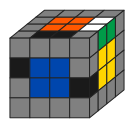
        <figcaption>R'2uU</figcaption>
    </figure>

    <figure style='width: 25%; display: inline-block; margin: 0'>
        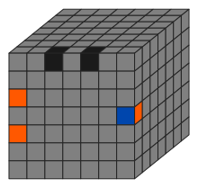
        <figcaption>黒色は壊れる</figcaption>
    </figure>
    &rarr;
    <figure style='width: 25%; display: inline-block; margin: 0'>
        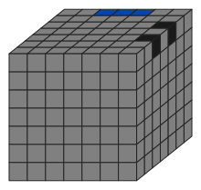
        <figcaption>(3u+5u)RU'</figcaption>
    </figure>
    &rarr;
    <figure style='width: 25%; display: inline-block; margin: 0'>
        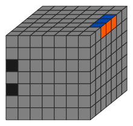
        <figcaption>R'(3u'+5u')U</figcaption>
    </figure>

ここで灰色は **壊れない** キューブを示し,
逆に黒色は **壊れる** キューブを示す.
つまり同じエッジにいた二つの黒色はこの手順を適用すると同じエッジにいられなくなってしまう.

つまりペアリングしたい二つのエッジと, 壊れてもいい一つのエッジを選ぶ必要がある.
よっぽど日頃の行いが良くない限りは, 最終的には一つまたは二つのエッジについてペアリングできない状態になる.
そこで以下に紹介する $N$ 点交換手順を使って最後のペアリングする.

#### 三点交換 - 時計回り

左から $k$ 層目と右から $k$ 層目のエッジの三点を交換する手順

<figure>
    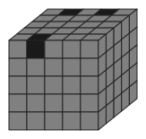
    <figcaption>この三点が時計回りに一個ずつ移動する</figcaption>
</figure>

$$\begin{align*}
[kl', U_2 krU_2 kr' U_2]
&= kl' U_2 krU_2 kr'U_2 - klU_2 kr U_2 kr'U_2 \\
\end{align*}$$

このとき向きが変わり, FU は UB になる.

#### 四点交換a - 反時計回り

左から $k$ 層目と右から $k$ 層目のエッジの四点を交換する手順

<figure>
    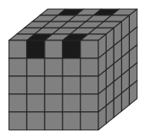
    <figcaption>この四点が反時計周りに一個ずつ移動する</figcaption>
</figure>

$$kr_2 E' - (kr' U_2)_4 kr' - E kr_2$$

ただしここで $E$ とは
$E = (2f + 3f + \cdots + (N-1) f)$
のこと.

#### 四点交換b - FU-BU

さっきと同じ四点を交換するが, F面の二つとD面の二つが交換される ($FU \leftrightarrow BU$).

<figure>
    
    <figcaption>手前の二つと奥の二つの交換</figcaption>
</figure>

$$[kr_2, F_2U_2] - kr_2$$

#### 四点交換c - FU-RU

ここで $N$ は偶数とする.
奇数の場合は使えない.

<figure>
    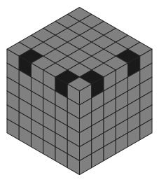
    <figcaption>FU の二つと RU の二つの交換</figcaption>
</figure>

$$(R'URU') - kr_2U_2 - \left( kr_2 (N/2)U_2 \right)_2 - (U' R'U'R)$$

$(N/2) U_2$ とはつまり（$N$ は偶数だとしたので）ちょうど真ん中より上の層全部を 180 度回すこと.

#### 二点交換 - FU-UF

FU左とFU右を交換する.
ここで向きも変わる (FU &harr; UF).

<figure>
    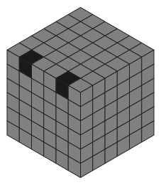
    <figcaption>FU の二つと RU の二つの交換</figcaption>
</figure>

専用の手順は無くて（知らない）, 既に紹介した二つを順に適用するだけ.

1. 四点交換a
    - $kr_2 E' - (kr' U_2)_4 kr' - E kr_2$
2. 三点交換
    - $kl' U_2 krU_2 kr'U_2 - klU_2 kr U_2 kr'U_2$

### 3x3x3 と見做して解く

一旦 F2L なりで自由に解く.
ギリギリまで解けると信じて解く.

$N$ が偶数のとき, 一定の確率でエッジが反転している状態になるえる.

<figure>
    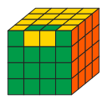
    <figcaption>ダメなエッジパリティ</figcaption>
</figure>

これはもう 3x3x3 としては解けないので次のパリティ修正のステップに進む.

### パリティを修正する

$N$ は偶数のはずなのでそのように仮定する.

#### エッジ反転

一個のエッジが反転してるパターン

<figure>
    
    <figcaption>エッジが反転している状態</figcaption>
</figure>

`二点交換 - FU-UF` を使う. すなわち

四点交換a
$$kr_2 E' - (kr' U_2)_4 kr' - E kr_2$$
を適用してから三点交換
$$kl' U_2 krU_2 kr'U_2 - klU_2 kr U_2 kr'U_2$$
を適用するとパリティが修正される.

    <figure style='width: 25%; display: inline-block; margin: 0'>
        
        <figcaption>FUエッジが反転してる</figcaption>
    </figure>
    &rarr;
    <figure style='width: 25%; display: inline-block; margin: 0'>
        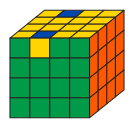
        <figcaption>四点交換a を適用</figcaption>
    </figure>
    &rarr;
    <figure style='width: 25%; display: inline-block; margin: 0'>
        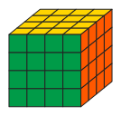
        <figcaption>三点交換を適用</figcaption>
    </figure>

4x4x4 なら以上で OK だが, 6 以上のときは

$$kr_2 \mapsto \sum_{k=2}^{N/2} kr_2 = 2r_2 + 3r_2 + \cdots + \frac{N}{2}r_2$$
$$kl_2 \mapsto \sum_{k=2}^{N/2} kl_2 = 2l_2 + 3l_2 + \cdots + \frac{N}{2}l_2$$

と読み替えれば同様にパリティを修正できる.

#### FU エッジと BU エッジの交換

U 面を揃えたら FU と BU のエッジが入れ替わっているパターン.

    <figure style='width: 25%; display: inline-block; margin: 0'>
        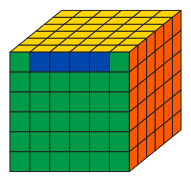
        <figcaption>表</figcaption>
    </figure>
    <figure style='width: 25%; display: inline-block; margin: 0'>
        
        <figcaption>裏</figcaption>
    </figure>

`四点交換b - FU-BU` を使う. すなわち

$$[kr_2, F_2U_2] - kr_2$$

ここで $kr_2$ を
$$\sum_{k=2}^{N/2} kr_2 = \left( 2r_2 + 3r_2 + \cdots + \frac{N}{2}r_2 \right)$$
と読み替える.

4x4x4 なら $k=2$ とすれば OK で

    <figure style='width: 25%; display: inline-block; margin: 0'>
        
        <figcaption>手前エッジ (FU) と奥エッジ (UB) の交換</figcaption>
    </figure>
    &rarr;
    <figure style='width: 25%; display: inline-block; margin: 0'>
        
        <figcaption>$2r_2 F_2 U_2 - 2r_2 U_2 F_2 - 2r_2$</figcaption>
    </figure>

6x6x6 なら $kr_2$ を $2r_2 + 3r_2$ と読み替えて

    <figure style='width: 25%; display: inline-block; margin: 0'>
        
        <figcaption>手前エッジ (FU) と奥エッジ (UB) の交換</figcaption>
    </figure>
    &rarr;
    <figure style='width: 25%; display: inline-block; margin: 0'>
        
        <figcaption>$(2r_2+3r_2) F_2 U_2 - (2r_2+3r_2) U_2 F_2 - (2r_2 + 3r_2)$</figcaption>
    </figure>

#### FU エッジと RU エッジの交換

隣のエッジが入れ替わっているパターン.

<figure>
    
</figure>

`四点交換c - FU-RU`

$$(R'URU') - kr_2U_2 - \left( kr_2 (N/2)U_2 \right)_2 - (U' R'U'R)$$

の $kr_2$ を
$$kr_2 \mapsto \sum_{k=2}^{N/2} kr_2 = \left( 2r_2 + 3r_2 + \cdots + \frac{N}{2}r_2 \right)$$
と読み替えて使う

    <figure style='width: 25%; display: inline-block; margin: 0'>
        
        <figcaption>$k=2$ で</figcaption>
    </figure>
    &rarr;
    <figure style='width: 25%; display: inline-block; margin: 0'>
        
        <figcaption>エッジパリティを修正</figcaption>
    </figure>

    <figure style='width: 25%; display: inline-block; margin: 0'>
        
        <figcaption>$k=2+3$ とすれば</figcaption>
    </figure>
    &rarr;
    <figure style='width: 25%; display: inline-block; margin: 0'>
        
        <figcaption>完成</figcaption>
    </figure>

