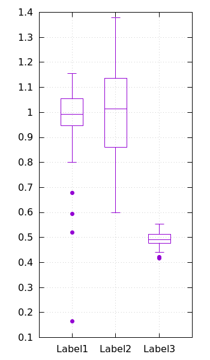

% 箱ひげ図 (boxplot, box-and-whisker plot)

## 参考

- [http://gnuplot.info/demo/boxplot.html](http://gnuplot.info/demo/boxplot.html)
- [箱ひげ図 - Wikipedia](https://ja.wikipedia.org/wiki/%E7%AE%B1%E3%81%B2%E3%81%92%E5%9B%B3)

## 概要

$\{ (\text{label}_i, z_i) \}_i$ $(z_i \in \mathbb{R})$ というデータ列から、
次の図のような、いわゆる箱ひげ図を作成する.



## data format

一列目にデータのラベル (またはカテゴリ) を文字列で与える.
これに関してソートする必要はない.
二列目にデータの実数値を与える.

```
Label_1 z1
Label_2 z2
:
Label_n zn
```

## `with boxplot`

```bash
plot ... using <x>:<z>{:<box_width>{:<label>}} with boxplot
```

| params         | default     |        value | explanation                |
|:---------------|:-----------:|:-------------|:---------------------------|
| `x`         | -- | (double)x | データ (箱ひげ) を置く x 座標                     |
| `z`         | -- | (double)z | データ (実数値)                                   |
| `box_width` | -- | (double)  | 箱の横幅サイズ                                    |
| `label`     | -- | (string)  | データのラベル. これを与えるとき `x` は無視される |

ラベルを与えるときは `x` は無視されて自動的に配置される.

先述の data format に合わせると

```bash
using (0):2:(1):1 with boxplot
```

などとなる.

## example

@[bash](2d.box.gp)

- [box.dat](2d.box.dat)


