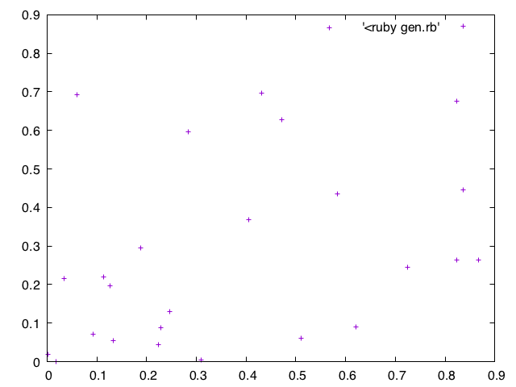
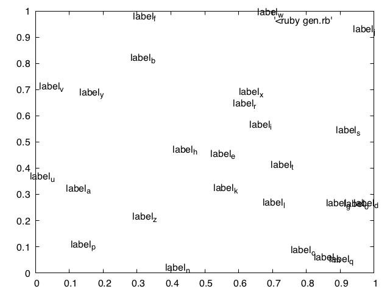
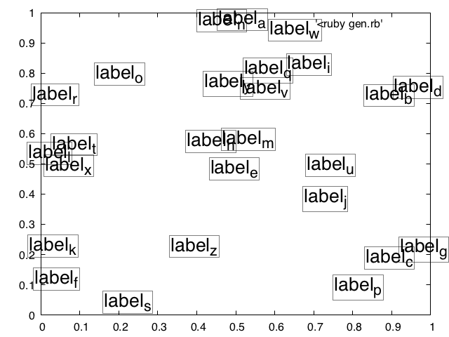
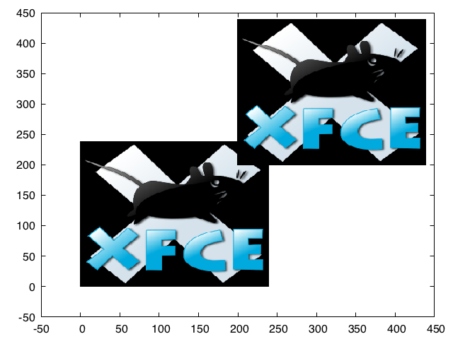

# 散布図

## 点の散布図



点をプロットするだけなら gnuplot で何も修飾しない `plot` によって実現できる.

```ruby
# gen.rb
N = 26
N.times do
  x = rand**2
  y = rand**2
  puts "#{x} #{y}"
end
```

```bash
plot '<ruby gen.rb'
```

## テキストの散布図 (ラベル付き点)



点の代わりにテキストを置くには `with labels` によって点をプロットすればよい.

```ruby
# gen.rb
N = 26
N.times do |i|
  x = rand
  y = rand
  puts "#{x} #{y} label_#{('a'.ord + i).chr}"
end
```

```bash
plot '<ruby gen.rb' with labels
```

ラベルといったテキストには "Enhanced Text Control Codes" が機能し、上の例では `_` によって下付き文字になっている.

### 装飾

`with labels` に対して
枠付きやフォント、フォントサイズの指定が出来る.



```bash
plot '<ruby gen.rb' with labels boxed font ",20"
```

## 画像の散布図

点の代わりに画像を置きたい.

- [gnuplotのグラフに画像を埋め込む - 米澤進吾 ホームページ](http://www.ss.scphys.kyoto-u.ac.jp/person/yonezawa/contents/program/gnuplot/enbed_figure.html)

できなくはないっぽい.
リンク先では 4.2.2 では png 等が扱えないとあるが 5.0 では png 画像でも問題なく埋め込めた.

```bash
plot '/tmp/tmp1.png' binary filetype=png array=100x100 origin=(0, 0) with rgbimage not, \
     '/tmp/tmp2.png' binary filetype=png array=100x100 origin=(200, 200) with rgbimage not,
```

`origin` を起点座標とし、`array` で指定したサイズ分だけを表示する.
`array` を省略すれば画像全体を埋め込み、
デフォルトでは画像 1x1px をグラフ中の 1x1 に相当させる (ここは `dx, dy` でスケールさせられる).
ただ場合によっては予め画像のサイズをリサイズしておいたほうが使いやすい.
またプロットする点の数だけ、`plot` コマンドを並べることになるので、あまり、散布図の作成に適してるとは言えないかも.

### 例

```bash
system("wget -O xfce.png https://gnulinux.guide/images/d/d1/XfceLogo.png")
plot 'xfce.png' binary filetype=png origin=(0, 0) with rgbimage not, \
     'xfce.png' binary filetype=png origin=(200, 200) with rgbimage not,
```



PNGの透過などは適切に処理されなかったりするので、あまり期待しすぎないほうがよさそう.
