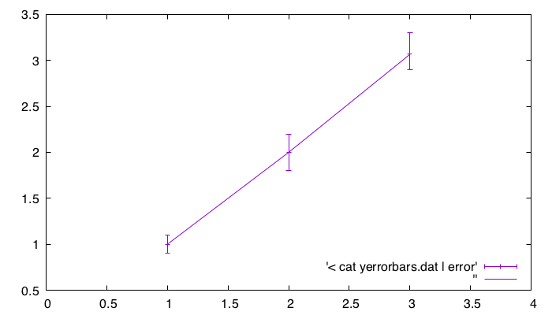

% 誤差付きプロット, yerrorbars

## 参考

- [http://dsl4.eee.u-ryukyu.ac.jp/DOCS/gnuplot/node158.html](http://dsl4.eee.u-ryukyu.ac.jp/DOCS/gnuplot/node158.html)

## 概要

y軸方向にエラーバーについたプロットをしたい.



## data format

```sh
x y y_low y_high
x y y_low y_high
:
```

## `with yerrorbars`

次のいずれか.

```bash
plot ... using {<x>:}<y>:<ydelta> with yerrorbars
plot ... using <x>:<y>:<ylow>:<yhigh> with yerrorbars
```

| params    | default       | value          | explanation                |
| :-------- | :-----------: | :------------- | :------------------------- |
| `x`       | --            | (double)x      | x 座標                     |
| `y`       | --            | (double)y      | エラーバーの中点 y 座標 |
| `ydelta`  | --            | (double)       | これのプラスマイナスを `ylow` `yhigh` とする |
| `ylow`    | --            | (double)       | エラーバーの下点 y 座標 |
| `yhigh`   | --            | (double)       | エラーバーの上点 y 座標 |

## script

フォーマット通りのデータがいつも手に入るとは限らない.

例えば

```sh
x y
x y
x y
:
```

というデータがあって、等しい `x` について `y` をグルーピングした上でその `ylow` `yhight` を手に入れる必要があるかもしれない.
次の Ruby スクリプトは等しい `x` を持つデータの中で、 `y` の平均、最小、最大を求めて上のデータフォーマットに合わせる.

```ruby
groups = {}
readlines.each do |line|
  x, y = line.chomp.split
  next unless x && y
  x = x.to_f
  y = y.to_f
  if groups[x]
    groups[x] << y
  else
    groups[x] = [y]
  end
end

groups.each do |x, ys|
  av = ys.inject(:+) / ys.size.to_f
  puts "#{x} #{av} #{ys.min} #{ys.max}"
end
```

@[sh](2d.yerrorbars.gp)
