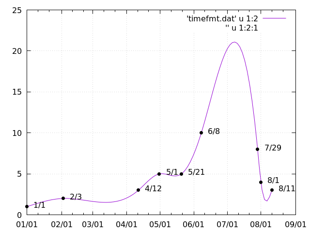

% 日付時刻データ

- [gnuplot demo script: timedat.dem](http://www.gnuplot.info/demo/timedat.html)

日付時刻をデータに使う.

```bash
set xdata time
set ydata time
```

で `x` または `y` が日付時刻であることを宣言する.
データのフォーマットはデフォルトでは `"%d/%m/%y,%H:%M"` である必要がある (`%-`指定子の意味は後述).

```bash
set timefmt <format>
```

を用いて自由にフォーマットを変更できる.

## timeformat `%-`指定子

| format   | explanation                |
| :------: | :-----------               |
| `%d`     | 日 (1-31)                  |
| `%m`     | 月 (1-12)                  |
| `%y`     | 年の下2桁 (0-99)           |
| `%Y`     | 年の4桁                    |
| `%j`     | day of the year (1-365)    |
| `%H`     | 時 (0-24)                  |
| `%M`     | 分 (0-60)                  |
| `%S`     | 秒 (0-60)                  |
| `%s`     | UNIX time                  |
| `%B`     | 月の英語表記               |
| `%b`     | 月の英語表記 (3文字省略形) |

## example

よくわからんけど時刻を使うときは `using 1:2` を明示しないと困惑するらしい.

@[bash](data.timefmt.gp)
@[dat](data.timefmt.dat)


