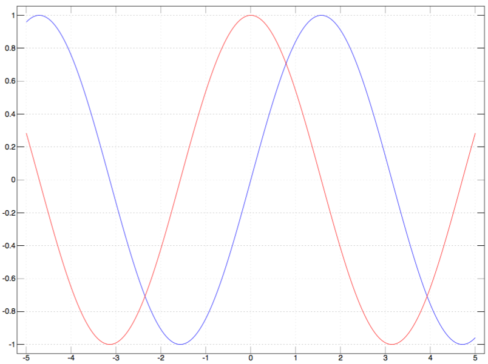
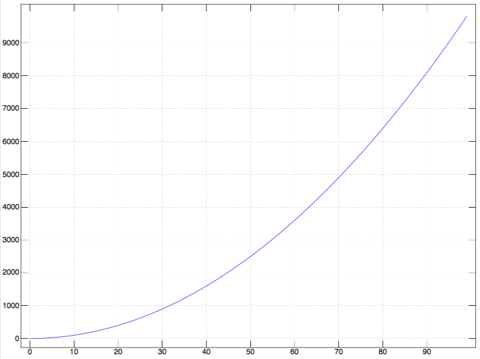

% J言語

## index

<span id='toc'></span>

## 超絶参考サイト

- [vipでプログラミング wiki / プログラミング言語 / J](http://vipprog.net/wiki/%E3%83%97%E3%83%AD%E3%82%B0%E3%83%A9%E3%83%9F%E3%83%B3%E3%82%B0%E8%A8%80%E8%AA%9E/J.html)
    - 基本文法が解説されていて最初に読むのにふさわしい
- [jsoftware/dictionary/vocabul](http://www.jsoftware.com/help/dictionary/vocabul.htm)
    - 語の辞書 (公式)

## Library (JAL, addons)

ライブラリまたはJALまたはアドオン

- [公式wiki](http://www.jsoftware.com/jwiki/Library)

### 基本パッケージのダウンロード

- 参考: [J701でのplot - niming538の日記](http://kquoe2.hatenablog.com/entry/20120703/p1)

```ruby
load 'pacman'
'update' jpkg ''
'showinstall' jpkg ''
'install' jpkg 'all'
```

`''` は意味のない仮の引数 (ユニットみたいな)

### require (いわゆるライブラリのロード) で読み込めない場合

自分は `j64-803` を `~/Tools` に置いて管理している
(`~/Tools/j64-803/bin/jconsole`)  
上のコマンドを実行すると
`~/Tools/j64-803/addons/`
以下に色々追加された

`require 'plot'`
すると
`addons/graphics/plot/plot.ijs`
が読み込まれるようである

`addons/games/minesweeper`
を見つけたので
`require 'minesweeper'`
すると見つからないと言われた  
`addons/games/minesweeper/minesweeper.ijs`
が無いと言っているようで
`addons/games/minesweeper/uiconsole.ijs`
ならあるので
`require 'games/minesweeper/uiconsole'`
とすると読み込めた

## グラフのプロット

### 区間と関数を与える

```ruby
load 'plot'
plot _5 5; 'sin,cos'
```

`sin` `cos` は plotアドオンを読み込むと定義される



### 点列を与える

```ruby
plot *: i.100
```



点と点の間は直線によって補完される.

- さらなるバリエーションは [http://japla.sakura.ne.jp/workshop/workshop/2009/primer_plot.pdf](http://japla.sakura.ne.jp/workshop/workshop/2009/primer_plot.pdf) に詳しい

## Hook, Fork

- 参考; [Forks, Hooks, and Compound Adverbs](http://www.jsoftware.com/help/jforc/forks_hooks_and_compound_adv.htm)

動詞同士を2つまたは3つ組み合わせて、新しい動詞として使うことが出来る.
ややこしい関数合成である.
2つの組み合わせを Hook、3つの組み合わせを Fork と呼ぶ.
4つ以上の組み合わせは Train と呼ばれるが、これは Hook と Fork との組み合わせに過ぎない.

組み合わせて出来た動詞をまた、monadic として使うか dyadic として使うかによっても、
意味が微妙に異なる.
これらを区別するために "monadic fork", "dyadic fork" などと言う.
注意すべき点として、実際に使われるまでは monadic とも dyadic とも決定付かない.
monadic または dyadic だと、定義の時に決定しておくには `:` を使う、と
[http://www.jsoftware.com/help/dictionary/d502.htm](http://www.jsoftware.com/help/dictionary/d502.htm)
に書いてあった.

`x,y,z` は名詞、
`f,g,h` は動詞 だとして書く.

### monadic hook

`(g h) y` $\Rightarrow$ `y g (h y)`

- `(+ *:) y` $\Rightarrow$ `y + *:y` $\Rightarrow y + y^2$

### dyadic hook

`x (g h) y` $\Rightarrow$ `x g (h y)`

- `x (+ *:) y` $\Rightarrow$ `x + (*:y)` $\Rightarrow x + y^2$

### monadic fork

`(f g h) y` $\Rightarrow$ `(f y) g (h y)`

- `(+/ % #) a` $\Rightarrow$ `(+/ a) % #a` $\Rightarrow \dfrac{\sum a}{\#a}$
- これはいわゆる平均を求めるためのイディオムである

### dyadic fork

`x (f g h) y` $\Rightarrow$ `(x f y) g (x h y)`

- `x ([ + ]) y` $\Rightarrow$ `(x [ y) + (x ] y)` $\Rightarrow$ `x + y`

### monadic noun fork

`(z g h) y` $\Rightarrow$ `z g (h y)`

名詞 `z` を渡しておくと部分適用のようなことができる

```ruby
   NB. ] は右辺恒等関数
   ] 1
1
   1 ] 2
2
 
   NB. 名詞 2 と ] を * で fork
   twice =. 2 * ]
   twice 3
6
   twice i.10
0 2 4 6 8 10 12 14 16 18
```

### dyadic noun fork

`x (z g h) y` $\Rightarrow$ `z g (x h y)`

- `2 (10 * +) 3` $\Rightarrow$ `10 * (2 + 3)`

### monadic capped fork

`([: g h) y` $\Rightarrow$ `g (h y)`

- Hook でも Fork でも `g` が常に dyadic であったことに注意すると、こういうのも必要なことに気づく
- `[:` は Cap と呼ばれる. 品詞はよくわからない. `g` の左辺に蓋を被せる、みたいなイメージ
- そしてこれはよく見ると、我々がよく知っている関数合成である

### dyadic capped fork

`x ([: g h) y` $\Rightarrow$ `g (x h y)`

```ruby
   sq_of_sum =: [: *: +
   1 sq_of_sum 10  NB. *: (1+10)
121
   sq_of_sum 10  NB. monadic として使っても意味は通じる (!)
100
```

## 接続詞

### Bond (`&`)

- `(f & g) y` $\Rightarrow$ `f (g y)`
    - monadic capped fork と同じやんけ
- `x (f & g) y` $\Rightarrow$ `(g x) f (g y)`

### noun Bond

名詞 `n` をとって

- `(f & n) y` $\Rightarrow$ `y f n`
- `(n & g) y` $\Rightarrow$ `n g y`
    - これもやっぱり部分適用だ

```ruby
   (^ & 3) 2  NB. cubic
8
   (, & 2) 1  NB. append 2
1 2
   (3 & ^) 2  NB. power of 3
9
   (1 & ,) 0  NB. cons 1
1 0
```

### Atop (`@`)

- `(f @ g) y` $\Rightarrow$ `f (g y)`
- `x (f @ g) y` $\Rightarrow$ `f (x g y)`

capped fork と完全に一致.

## 副詞

副詞は動詞に付与して使う.
動詞の意味を僅かに変更して新しい動詞を合成するものだと解釈できる.
合成されて出来た動詞もまた、monadic/dyadic とも使えたりするのでややこしい.

### Insert (`/`)

`/` は二項動詞を挿入する副詞として説明される.

二項動詞としての `+` に付与して動詞 `+/` を生成する.
`+/` は monadic/dyadic 両方として使える.

単項としての `+/` は容易である:

- `+/ 1 2 3` $\Rightarrow$ `1 + 2 + 3` $\Rightarrow$ `6`

```
   2 2 $ i.4
0 1
2 3
   +/ 2 2 $ i.4
2 4
```

二項としての `+/` はちょっとアレ.

```
   ] u =: i.3
0 1 2
   ] v =: 10 * i.5
0 10 20 30 40
   u +/ v
0 10 20 30 40
1 11 21 31 41
2 12 22 32 42
```

```
   (i.3) +/ (2 2$i.4)
0 1
2 3

1 2
3 4

2 3
4 5
```

二項 `+/` は
$n$ 次元 Array と $m$ 次元 Array から $n+m$ 次元 Array を返す.

## 動詞の定義

動詞の定義には大きく、暗黙的 (tacit) 定義と明示的 (explicit) 定義とがある.
明示的定義は動詞以外の語も定義できる.
(暗黙的定義では出来ないとは言ってない. 出来るんだろうか?)

### 暗黙的定義

暗黙的定義は前章で述べた Fork, Hook を組み合わせて動詞を作る方法である.
使いまわす為には名詞 (変数のこと) に代入しておけばよい.

```j
   mean =: +/%#
   mean i.10
4.5
```

罠としては、本当に期待する通りに monadic/dyadic として使われているかのデバグが困難なことである.
各々の Hook, Fork は実際に使われる際に初めて monadic/dyadic のどちらで解釈するかを決定する.

### 明示的定義

明示的定義は、やや奇妙なシンタクスを用いる.
公式のリファレンスとしては
[: Explict](http://www.jsoftware.com/help/dictionary/d310n.htm)
と併せて
[: Monad-Dyad](http://www.jsoftware.com/help/dictionary/d310v.htm)
を読むと良い.

次に示す複数の (奇妙な) シンタクスが存在すると __思えば__ 良い.

#### 1. 単項とも二項とも用いられる動詞

```
(動詞名) =: verb : 0
(単項の定義)
:
(二項の定義)
)
```

この間の `:` は正しく
[: Monad-Dyad](http://www.jsoftware.com/help/dictionary/d310v.htm)
の `:` である.

定義は、右辺が `y`、左辺が `x` だとして、自由に J言語の式を改行で区切って複数並べればよい.

例を示す:

```
   add =: verb : 0
y
:
x + y
)
   add 2
2
   1 add 2
3
```

#### 2. 単項の動詞

単項として用いられる動詞を定義する.
これの意味するところは、
二項として用いようとすると実行時エラー (domain error) を吐く、という意味である.
二通りのシンタクスがある.

```
(動詞名) =: monad : (定義を書いた文字列)
```

```
(動詞名) =: monad : 0
(定義)
)
```

1つめはやや奇妙であるが定義本体が文字列である.
一つのJ言語で書かれたステートを文字列として (つまりシングルクオートで括って) 書く.
複数文からなる定義ならば、後者のが便利である.
キーワード `monad` は実の所 `verb` でいいのだけど `monad` のが可読性があるでしょ.

まとめて例を示す:

```
   f =: monad : '- 2 ^ y'

   f 10
_1024

   f
3 : '- 2 ^ y'


   f =: monad : 0
a =. 2 ^ y
- a
)

   f 10
_1024

   1 f 10
|domain error: f
|   1     f 10

```

#### 3. 二項の動詞

二項としてのみ用いられる動詞はキーワード `dyad` で定義する.

```
(動詞名) =: dyad : (定義を書いた文字列)
```

```
(動詞名) =: dyad : 0
(定義)
)
```

`monad` の場合と全く同様に用いる.
例を示す:

```
   add =: dyad : 'x+y'

   add
4 : 'x+y'

   1 add 2
3

   add 2
|domain error: add
|       add 2


   add =: dyad : 0
x + y
)

   add
4 : 'x + y'

   1 add 2
3

   add 2
|domain error: add
|       add 2
```

他のページでは大抵、キーワード `verb` `monad` `dyad` などとは書かず、
数字が書かれる. それぞれ 3 3 4 が当てはまる.
実の所、そういった名詞がはじめからあって数値が代入されているだけである.
そんでもって `verb = monad` である.

#### 4. 明示的な暗黙的定義 (tacit definition)

`verb` のところに 13 を使うだけ.

```
   tacit =: 13
   f =: tacit : 'x ^ (+: y)'
   f
[ ^ [: +: ]
```

普通に `verb` だと思って読めば良く、そのように動く.
しかしながら、
上の例にあるように、
(可能ならば) 暗黙的定義に書きなおしてくれる.

J言語を書く動機なんて、可読性を無視してとにかく短く書くことであるし、
暗黙的定義こそ、J言語の華だと思う.
tacit definition は、
(恐らく)
(そこまで)
複雑な書き換えルールを用いてるわけではないっぽいけど、
偶に気附きを与えてくれる.

