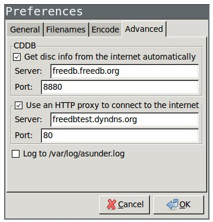

% Debian GNU/Linux

## INDEX

<div id=toc></div>

## 外部デバイスの設定

### 認識されてるデバイスの確認

```
   xinput
⎡ Virtual core pointer                          id=2    [master pointer  (3)]
⎜   ↳ Virtual core XTEST pointer                id=4    [slave  pointer  (2)]
⎜   ↳ Sony Vaio Jogdial                         id=8    [slave  pointer  (2)]
⎜   ↳ SynPS/2 Synaptics TouchPad                id=12   [slave  pointer  (2)]
⎣ Virtual core keyboard                         id=3    [master keyboard (2)]
   ↳ Virtual core XTEST keyboard               id=5    [slave  keyboard (3)]
   ↳ Video Bus                                 id=6    [slave  keyboard (3)]
   ↳ Sony Vaio Keys                            id=7    [slave  keyboard (3)]
   ↳ Power Button                              id=9    [slave  keyboard (3)]
   ↳ USB2.0 Camera                             id=10   [slave  keyboard (3)]
   ↳ AT Translated Set 2 keyboard              id=11   [slave  keyboard (3)]
```

左に表示されてる "SynPS/2 Synaptics TouchPad" がデバイス名、その右に id が数字で表示される.
どちらかを指定して、設定を行える.

### 設定できる項目

```
   xinput list-props "SynPS/2 Synaptics TouchPad"
Device 'SynPS/2 Synaptics TouchPad':
Device Enabled (139):   1
Coordinate Transformation Matrix (141): 1.000000, 0.000000, 0.000000, 0.000000, 1.000000, 0.000000, 0.000000, 0.000000, 1.000000
Device Accel Profile (262):     1
Device Accel Constant Deceleration (263):       3.000000
Device Accel Adaptive Deceleration (264):       1.000000
Device Accel Velocity Scaling (265):    12.500000
Synaptics Edges (287):  1493, 5447, 1352, 4502
Synaptics Finger (288): 25, 30, 0
Synaptics Tap Time (289):       180
Synaptics Tap Move (290):       258
Synaptics Tap Durations (291):  180, 100, 100
Synaptics ClickPad (292):       1
Synaptics Middle Button Timeout (293):  0
Synaptics Two-Finger Pressure (294):    282
Synaptics Two-Finger Width (295):       7
Synaptics Scrolling Distance (296):     117, 117
Synaptics Edge Scrolling (297): 1, 0, 0
    (中略)
Synaptics Move Speed (299):     1.000000, 1.750000, 0.034037, 0.000000
Synaptics Off (300):    0
    (略)
```

例えば

```bash
xinput --set-prop "SynPS/2 Synaptics TouchPad" "Synaptics Off" 1
```

などとすることで、設定ができる.
ちなみに "Synaptics Off" はそのデバイスを無効化する項目.

```bash
xinput --set-prop "SynPS/2 Synaptics TouchPad" "Synaptics Off" 0
```

で解除する.

## Debian への Flash インストール/アップデート

```
sudo apt-get update
sudo apt-get install flashplugin-nonfree
sudo update-flashplugin-nonfree --install
```

## フォントの追加

```bash
mkdir ~/.fonts
cp *.ttf ~/.fonts
fc-cache -fv # 単に fc-cache でもいいし、放っておいても、いつか勝手に認識される
fc-list # check
```

## CD からの音楽ファイルの取り込み

### CDからのインポート

`Asunder` を使う.
適切なデータ・ベース (CDDB) を併せて使うことで、曲を取り込む際に適切なタグを振ってくれる.
日本語CDDB として名前があるのが [freedb 日本語](http://freedbtest.dyndns.org/)
(公開して下さっている `piro77`氏に感謝します).

```bash
sudo apt-get install asunder
sudo apt-get install lame
```

次のように、URLとポートを指定する.
1つ目の `freedb.freedb.org:8880` はデフォルトのもので、
2つ目の `freedbtest.dyndns.org:80` は自分で追加したもの.



日本語のアニソンでも問題なく.


### ID3タグ

曲タイトル、アルバム名、アーティスト名といったタグ付けは
`id3lib` パッケージ (`apt-get install id3lib`) にある
`id3tag` コマンドで行う.

しかしながら、
`id3tag` ではジャケット画像 (artwork) のタグ付けが出来ないので、
そちらには [eyeD3](http://eyed3.nicfit.net/#installation)
(`pip install eyeD3`) を使う.
`eyeD3` でもタイトルやアルバム名のタグ付けは可能だが、日本語に対応していない
(Pythonで書かれたスクリプトファイルなのでどうにかなりそうだけど).


```bash
id3tag -s 'Music Title' -A 'Awesome Album' -a 'Our Artist' music.mp3
id3info music.mp3
eyeD3 --add-image=A.jpg:FRONT_COVER music.mp3
```

