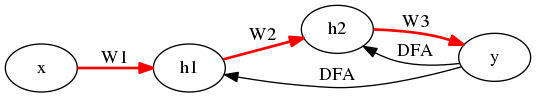
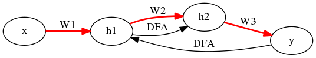

% Direct Feedback Alignment Provides Learning in Deep Neural Networks
% https://arxiv.org/abs/1609.01596
% 深層学習

NNs における逆伝播 (BP) は、出力の誤差から始まってその偏微分式に従って、ちょうど順伝播の逆順に計算される.
すなわち、各層の誤差は厳密には、その層の重みと、次の層 (出力方面) での誤差に依存する.
依存関係故に、順伝播の逆順に計算する必要がある.

[Feedback Alignment (FA)](https://arxiv.org/abs/1411.0247) ではこの誤差の計算の際に、層の重みを用いない.
普通、重みはランダムに初期化するわけだが、その依存性を少なくすることで学習の安定性を図る.

本論文で提案される Direct Feedback Alignment (DFA) は、FA 同様に層の重みを用いないことに加えて、
次の層での誤差の代わりに最終層の誤差を用いる.
数値計算上の発散や、初期層での誤差が薄れてしまうことを防ぐ.
もはや順伝播の逆順に計算する必要すらないため、自由なルートを辿る逆伝播が可能になる.
それを Indirect Feedback Alignment (IFA) と呼ぶ.

## 方法

NNs は、例えば次のようなもの:

- $a_1 = W_1 x + b_1$
    - $h_1 = f(a_1)$
- $a_2 = W_2 h_1 + b_2$
    - $h_2 = f(a_2)$
- $a_y = W_3 h_2 + b_3$
    - $\hat{y} = f(a_y)$

$\hat{y}$ と真の $y$ との差から、各層での誤差
$$\delta a_y = \hat{y} - y, \delta a_2, \delta a_3$$
を求めるとともに、
層の重みの更新を例えば次のようにやる (実際には学習率とか色々あるが):
$$\delta W_1 = - x' \delta a_1, \delta W_2 = - h_1' \delta a_2, \delta W_3 = - h_2' \delta a_y$$
以上を以って学習の1ステップとする.

### BP (逆伝播)

普通に、$a_2$, $a_1$ に関して誤差を偏微分したら、次が導出されるハズ.

- $\delta a_2 = (W_3'~\delta a_y) \bigodot f'(a_2)$
- $\delta a_1 = (W_2'~\delta a_2) \bigodot f'(a_1)$

ここで $\bigodot$ は同じ型の行列またはベクトル同士について要素ごとの積を取る二項演算子.

### FA (Feedback Alignment)

- $\delta a_2 = (B_2~\delta a_y) \bigodot f'(a_2)$
- $\delta a_1 = (B_1~\delta a_2) \bigodot f'(a_1)$

$B_2, B_1$ は各層に関して固定されたランダム行列.

### DFA (Direct-)

Direct バージョンは次の層の誤差ではなく直接出力層の誤差に影響させる.

- $\delta a_2 = (B_2~\delta a_y) \bigodot f'(a_2)$
- $\delta a_1 = (B_1~\delta a_y) \bigodot f'(a_1)$

### IFA (Indirect-)

Indirect バージョンは自分で自由に誤差の依存関係を作ることで逆伝播を設計する.

例えば

とするには、

- $\delta a_2 = (B_2~\delta a_1) \bigodot f'(a_2)$
- $\delta a_1 = (B_1~\delta a_y) \bigodot f'(a_1)$

手法としては以上.

## 実験

BP/FA/DFA を MNIST/CIFAR-10/CIPHAR-100 で比較する.
性能は

$$BP > DFA > FA$$

に見える.
