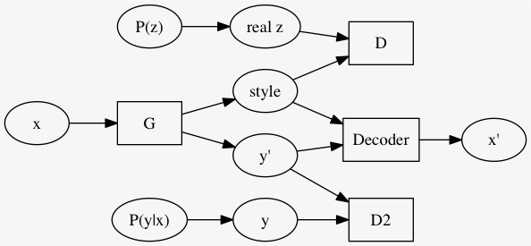
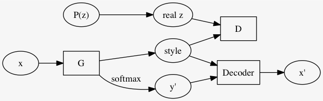

% Adversarial Autoencoders (AAEs)
% https://arxiv.org/abs/1511.05644
% 深層学習 オートエンコーダ クラスタリング

## 概要

GAN を用いた確率的自己符号化器

## GAN (復習事項)

- ある本物事例 $\{ x_i \}_i$ がある
- 2つの機械 $G$ 及び $D$ を NNs で構成する
- 適当な確率分布 $Pr(z)$ からランダムなノイズ $z$ をサンプリング
- $G$ はそのような $z$ から本物そっくりの偽物事例 $x'$ を出力する
    - $x' = G(z)$
- $D$ は入力 $x$ が本物 (現実の事例) か偽物 ($G$ によって生成されたもの) かを識別する
    - 本物だとする確率を $D(x)$ とする

目的関数は

$$\min_G \max_D
\left[
\mathbb{E}_{x \sim \text{real}} \log D(x)
+ \mathbb{E}_{z \sim Pr(z)} (1 - \log D(G(z)))
\right]$$

## AAE

GAN と同様に $G$ 及び $D$ を構成する

- 適当な分布 $Pr(z)$ からサンプリングした $z$ が **本物** 事例
- $G$ は入力 $x$ から **偽物** 事例 $z$ を出力する
    - オートエンコーダーにおける符号化
- $D$ は入力 $z$ が $Pr(z)$ 由来であるか、 $G$ 由来であるかを識別する
    - 回帰で解くより 2-class 分類として解く (最後softmaxする) 方が良い
    - 前者である確率を $D(z)$ とする

先ほどの GAN の説明と、$x$ と $z$ とが入れ替わってることに註意.
従って目的関数は次のようになる.

$$\min_G \max_D
\left[
\mathbb{E}_{z \sim Pr(z)} \log D(z)
+ \mathbb{E}_{x \sim \text{examples}} (1 - \log D(G(x)))
\right]$$

以上で学習した
$$G: x \mapsto z$$

を自己符号化器として AAE と呼ぶ.

## 応用例

### Supervised AAE

Autoencoders は教師ナシ学習の一種だが、
データ $x$ にラベルが着いてるのならばそれも有効に使いたい.

論文では MNIST と SVHN を材料に、AAE と普通の自己符号化器をあわせたようなモデルで学習させた.

$(x, y)$ について

手書き文字画像 $x$ を例に取ると、
$G$ は $x$ から何かしら $\text{fake }z = G(x)$ を生成し、
ラベル $y$ (例えば one-hot ベクトルとする) と結合したものから
Decoder は元の画像 $x$ を復元しようとする.
書くべき数字はラベルから分かるので、 $G(x)$ はその他の成分、style と言われる.

### Semi-supervised AAE

style を求める $G$ にクラス予測も一緒にさせる.
つまり、$(\text{style}, y') = G(x)$ とする.
ただしクラス予測は MSE とか取るんじゃなくて、何故か知らんけどここも、$P(y|x)$ から取った $y$ と識別させるようにする. つまり全体として GAN 2つをくっつけた.

だんだんゴツくなってきたな...

### Unsupervised Clustering with AAE

$m$ クラスにクラスタリングしたいとき、
$y' \in \mathbb{R}^m$ になるように次のようなモデルを使う.

元論文では MNIST を 16 classes (10 ではなく) にクラスタリングした結果を示している (Figure 9).
