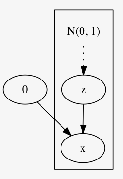
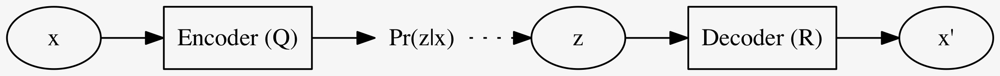
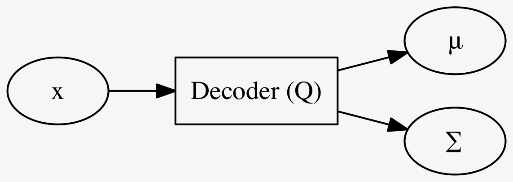

% Variational Autoencoders (VAEs)
% https://arxiv.org/abs/1606.05908
% 深層学習 オートエンコーダ 生成モデル VAE

## index

<div id=toc></div>

## 参考文献

- [1] [[1406.5298] Semi-Supervised Learning with Deep Generative Models](https://arxiv.org/abs/1406.5298)
    - オリジナル論文 (2014)
- [2] [[1606.05908] Tutorial on Variational Autoencoders](https://arxiv.org/abs/1606.05908)
    - 再解釈論文 (2016)
- [3] [Semi-Supervised Learning with Deep Generative Models [arXiv:1406.5298] - ご注文は機械学習ですか？](http://musyoku.github.io/2016/07/02/semi-supervised-learning-with-deep-generative-models/)
    - [1] の解説ブログ. chainer による実装もアリ

## 概要

VAEs (Variational Autoencoders; 変分自己符号化器) は [1] で提案されたものだが、
[2] ではこれに別な解釈を与え直したもので、今回は主にこちらを参考にしている.
(ていうか [1] の説明がいちいち雑すぎる.)

[2] によれば VAE とは生成モデルの枠組みで自己符号化器 (Autoencoders) を解釈したもので、
生成モデルで言う潜在変数を観測データの符号と見做す.
すなわち、観測データから潜在変数を推定する手続きが符号化であり、その逆が復号化である.

[1] では大きく二通りのモデルが提案されており、1つはシンプルな M1、2つめはこれに条件を加えた M2.
M1 のことをスタンダードな VAE 、M2 を Conditional VAE (CVAE) として紹介する.
[1] ではさらにこの2つのハイブリッドモデルも示されている.

## VAE (M1)

次のような単純な生成モデルを考える.

観測されるデータ $x$ はある潜在変数 $z$ があって生成されるものだというモデルを考える.

<center>

</center>

ここで、次を仮定する

- $z \sim \mathcal{N}(0, 1)$ を仮定
- $z|x \sim \mathcal{N}(\mu(x), \Sigma(x))$ を仮定

### Standard VAEs の確率予測

生成モデルなので確率分布がエンコーダー・デコーダーとなる:

- エンコーダー
    - $Pr(z|x)$
- デコーダー
    - $Pr(x|z)$

これら2つをそれぞれ NNs で構成した

- エンコーダー
    - $Q(z|x)$
- デコーダー
    - $R(x|z)$

で近似する.

エンコーダー $Q$ の学習を考える.
$Q$ は $Pr(z|x)$ を近似するためのものだから、これら2つの KL 距離を最小化すればよい.

$$\begin{eqnarray}
\text{KL}(Q(z|x) \| Pr(z|x))
  & = & \mathbb{E}_{z \sim Q(z|x)} \left[ \log Q(z|x) - \log Pr(z|x) \right] \\
  & = & \mathbb{E}_{z \sim Q(z|x)} \left[ \log Q(z|x) - \log Pr(x|z) - \log Pr(z) \right] + \log Pr(x) \\
  & = & \text{KL}(Q(z|x) \| Pr(z)) - \mathbb{E}_{z \sim Q(z|x)} \left[ \log Pr(x|z) \right] + \log Pr(x) \\
\iff \text{KL}(Q(z|x) \| Pr(z|x)) - \log Pr(x)
  & = & \text{KL}(Q(z|x) \| Pr(z)) - \mathbb{E}_{z \sim Q(z|x)} \left[ \log Pr(x|z) \right]
\end{eqnarray}$$

左辺の
$\text{KL}(Q(z|x) \| Pr(z|x)) (\geq 0)$
を最小化することは $Q$ を学習すること.
左辺に移行した
$- \log Pr(x) \geq 0$
は、観測データ $x$ を観測する対数尤度のマイナスであるので、これを最小化することは、
自己符号化器全体 (すなわち $Q, R$) を訓練すること.

そういうわけで、最後の式を最小化することを目指せばよい.

> 註意すべき点として、左辺は未知の確率分布 $Pr(z|x)$ との KL 距離だったものが、
> 右辺では $Pr(z)$ との KL 距離になっていて、
> 今 $Pr(z) = \mathcal{N}(0,1)$ と仮定しているので、既知の確率分布との KL 距離になっている.

そういうわけで右辺値を目的関数とする.

$$\begin{eqnarray}
\mathcal{L}(x; Q,R)
 & = \text{KL}(Q(z|x) \| Pr(z|x)) - \mathbb{E}_{z \sim Q(z|x)} \left[ \log Pr(x|z) \right] \\
 & = \text{KL}(Q(z|x) \| \mathcal{N}(0, 1)) - \mathbb{E}_{z \sim Q(z|x)} \left[ \log Pr(x|z) \right]
\end{eqnarray}$$

<center style="margin:20px">

</center>

### 計算のトリック

#### $Q(z|x)$ の構成法

$Q$ を適当な NNs で実現するわけだが、出力は確率分布で、しかも $\mathcal{N}$ と仮定している.
従って直接的には、その平均 $\mu(x)$ と分散 $\Sigma(x)$ とを予測する.



$\text{KL}(Q(z|x) \| \mathcal{N}(0, 1))$ の計算も、正規分布同士の計算なのでまあ頑張れば出来る.

$R$ も、まあ大体同様にして学習すればよい.

#### サンプリング (reparametarization trick)

$\mathbb{E}_{z \sim Q(z|x)} \left[ \log Pr(x|z) \right]$
をどうやって計算するか.
ある確率分布に沿った期待値を本当に計算したいのだが、
簡単な近似法としては、
適当回数 $Q(z|x)$ から $z$ をサンプリングし、
$\log R(x|z)$
の平均を取れば良い.

ただし一度の順伝播・逆伝播で $Q$ も $R$ も学習出来るのが本当は理想.
そのためにサンプリングの回数は一度だけとする.
そして、$\mathcal{N}(\mu, \Sigma)$ からサンプリングという手続きは一般には逆伝播が出来ない計算である.
次のように言い換えることで逆伝播が出来る.

1. $e \leftarrow \mathcal{N}(0, 1)$ をランダムサンプリング
1. $z = \mu(x) + e \Sigma(x)$ (ここで $e$ は定数)

#### まとめ

以上をまとめると VAE の学習は以下の通り

- 事例 $x$ について
    1. $Q$ の順伝播から $\mu(x), \Sigma(x)$ を求める
    1. $e \leftarrow \mathcal{N}(0, 1)$ をランダムサンプリング
    1. $z = \mu(x) + e \Sigma(x)$
        - これは $\mathcal{N}(\mu, \Sigma)$ からのサンプリングと等しい
    1. $\log R(x|z)$ を計算
    1. $\text{KL}(Q(z|x) \| \mathcal{N}(0, 1)) - \log R(x|z)$ を損失だとして逆伝播する

<center style="margin:20px">

</center>

### 古典的 Autoencoders との比較

特に何の制約もないただの Autoencoders が何をするかと言うと、
出来るだけ同じ変数名を用いて説明すると

- 事例 $x$ について
    1. $Q$ の順伝播から $z$ を求める
    1. $R$ の順伝播から $x$ を求める
    1. $- \log R(x|z)$ を損失だとして逆伝播する

大きく違う点としては、エンコードして出来た $z$ に
$\text{KL}(Q(z|x) \| \mathcal{N}(0, 1))$
という正則化項を加えるかどうかだけである.

### Testing

訓練した VAE をテストするには
適当なノイズ $z \sim \mathcal{N}(0, 1)$ を
Decoder $R$ に入れるだけで良い.

とは言え、適当なノイズを入れただけではやはり平均的な、
例えば MNIST ならボヤケた画像が、出て来るだけになる.

## Conditional Variational Autoencoders (CVAE, M2)

データ $x$ にラベル $y$ があるとしてそれを活用したい.

次のグラフィカルモデルを用いる.
すなわち、今までは単に潜在変数 $z$ から生成されるとしていたが、それに条件 (condition) $y$ を与える.

```dot
digraph {
    rankdir=TB;
    bgcolor=transparent;
    subgraph cluster_A {
        N -> z [style=dotted];
        {z y} -> x;
        N [label="N(0, 1)" shape=plaintext];
    }
    theta -> x;
    theta [label="θ"];
}
```

先程と同様にエンコーダ $Q$ とデコーダ $R$ を用意する.
ただしそれぞれは条件 $y$ が与えられたときの確率分布を表す.

```dot
digraph CVAE {
    rankdir=LR;
    bgcolor=transparent;
    subgraph cluster_CVAE {
        graph [label="CVAE"];
        {x y} -> Encoder -> Pr;
        Pr [label="Pr(z|x,y)"];
        Pr -> z [style=dotted];
        {z "y'"} -> Decoder -> "x'";
        Encoder [shape=rect label="Encoder (Q)"];
        Decoder [shape=rect label="Decoder (R)"];
        {rank=same x y}
        {rank=same z "y'"}
        "y'" [label=y];
    }
}
```

すなわち、

- $Q(x, y) \approx Pr(z | x, y)$
- $R(z, y) \approx Pr(x | z, y)$

を目指す.
テストをするには、適当に $\mathcal{N}$ からサンプリングして得たノイズ $z$ を $y$ と併せて $R$ に入れることで $x$ を生成することで試す.

```dot
digraph CVAE {
    rankdir=LR;
    bgcolor=transparent;
    subgraph cluster_test {
        graph [label="(testing mode)"];
        Normal -> z [style=dotted];
        {z y} -> Decoder_t -> "x'";
        Decoder_t [shape=rect label="Decoder (R)"];
        Normal [label="N(0, 1)"];
    }
}
```

損失関数は先ほどのやつに $y$ を適切に入れればよくて、

$$\begin{align*}
\mathcal{L}(x, y; Q,R)
 & = \text{KL}(Q(z|x,y) \| Pr(z|x,y)) - \log Pr(x|y) \\
 & = \text{KL}(Q(z|x,y) \| Pr(z|x)) - \mathbb{E}_{z \sim Q(z|x,y)} \left[ \log Pr(x|z,y) \right]
\end{align*}$$

となる.
ここで $z$ は他の変数とは独立なノイズで、
$$Pr(z|x) = Pr(z) = \mathcal{N}(0,1)$$
である.
これを代入しておくと、
損失関数は改めて書くと
$$\mathcal{L}(x, y; Q,R)
  = \text{KL}(Q(z|x,y) \| \mathcal{N}(0, 1)) - \mathbb{E}_{z \sim Q(z|x,y)} \left[ \log Pr(x|z,y) \right]$$
とし、この最小化を目指す.

### 半教師アリ学習としての CVAE (M2)

参考文献 [2] には CVAE (M2) で半教師アリ学習をすることについては触れられていなかったので、 [1] で該当場所を読んで補足、、、
したいのだが、本当に説明が雑すぎる.
[3] も併せて読む.

ラベル付きデータ $(x,y)$ については上の $\mathcal{L}(x,y)$ を用いる.
ラベルなしデータ $(x, \bot)$ については、仕方ないので $Pr(y|x)$ を学習し、その上の $y$ を使う.

ということで、以下を目指すような新たにニューラルネット $q$ を1つ追加する.
$$q(x) \approx Pr(y|x)$$

$\mathcal{L}$ の中の
$$\mathbb{E}_{z \sim Q(z|x,y)} \left[ \log Pr(x|z,y) \right]$$
の部分を
$$\mathbb{E}_{y \sim q(x)} \mathbb{E}_{z \sim Q(z|x,y)} \left[ \cdots \right]$$
で置き換えたものを
$$\mathcal{U}(x)$$
とし、ラベルなしデータのための損失関数とする.

結局
$$\mathcal{J} = \mathcal{L}(\mathcal{D}) =
\sum_{\text{labeled} \mathcal{D}} \mathcal{L}(x,y) +
\sum_{\text{unlabeled} \mathcal{D}} \mathcal{U}(x)$$
を全体の損失関数に使う.

### 半教師アリ分類学習への適用

副作用的に $q(x) = Pr(y|x)$ が手に入ったので、これを使って $x$ からラベル $y$ を予測できる、ようになるが、
先ほどの損失関数だと、$q$ はラベルなしの $\mathcal{U}$ の方にしか登場しない.
つまり、ラベルなしデータのみから学習してるわけだが、普通に考えて雑魚なので、ラベルありデータからも学習するように、
$$\mathcal{J} - \alpha \cdot \mathbb{E}_{\text{labeled} \mathcal{D}} \log q(x)$$
のようにする.
[3] では、$\mathcal{J}$ の学習と、ラベルデータからの $q$ の学習を完全に分けて行ったが上手く行ったそう.

## MNIST 実験

このチュートリアルでは MNIST で VAE 及び CVAE を訓練した実験結果を述べている.

ゼロから学習させずにどっかに落ちているという MNIST で訓練したプレーンな自己符号化器の重みを流用したらしい.

興味深いテクニックを一つ使っている.
MNIST なので、入力は 28x28 の行列で各成分は整数値 $[0, 255]$.
これを普通はまず 255 で割り算して $[0,1]$ 範囲の実数値だと見なしてから使うだろう.
そこまでは同じだが、この実験ではその値を確率だと見なして、$\{0,1\}$ に二値化する.
つまり、各ピクセルについて独立に、その確率で $1$ さもなくば $0$ にする.
これは画像を NNs に流すタイミングで毎回サンプリングするので、データ水増し的な意味合いもある.

    (Figure 7)

まず VAE の結果.
$x$ は先のテクニックで二値化した $\{0,1\}^{28 \times 28}$.
ただし VAE の出力 (デコード) $x'$ は $[0,1]^{28 \times 28}$.
テストではデコード部分だけを動かす.
ランダムなノイズをデコーダーに入力して、それらしい手書き文字がランダムに出力される.
"7" と "9" の中間っぽい文字が出力されており、入力ノイズの空間が連続であることが示唆される.

    (Figure 8a)

次に CVAE の結果.
こちらは、画像の右半分 (左半分?) を $x$ としている.
$y$ は VAE での $x$ (すなわち $\{0,1\}^{28 \times 28}$).
テストではやはりデコード部分だけを動かすのだが、
今度はランダムなノイズと、画像の半分をデコーダーに入れると、画像の全体が出力される.
まあ、それらしいのが動いてるなあという感じ.

