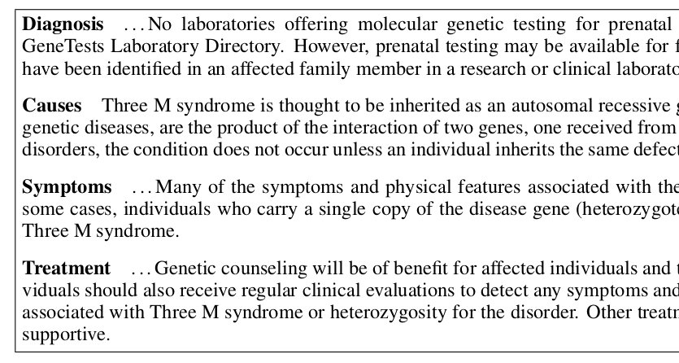
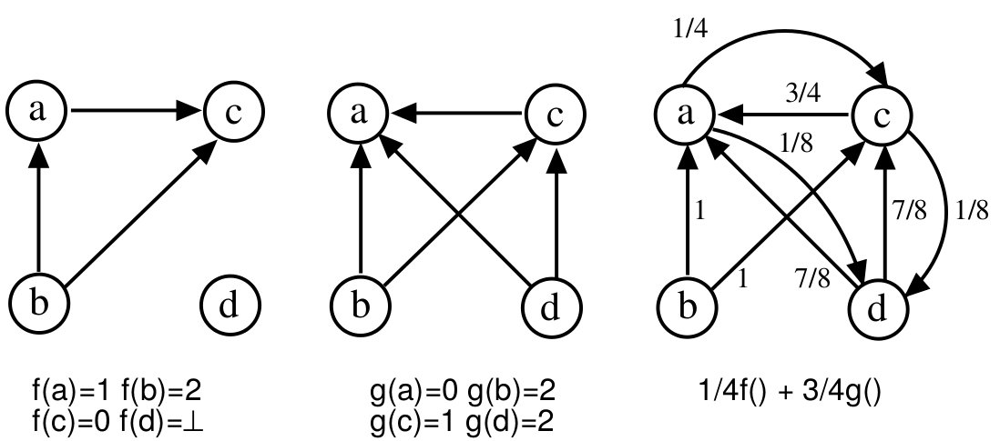
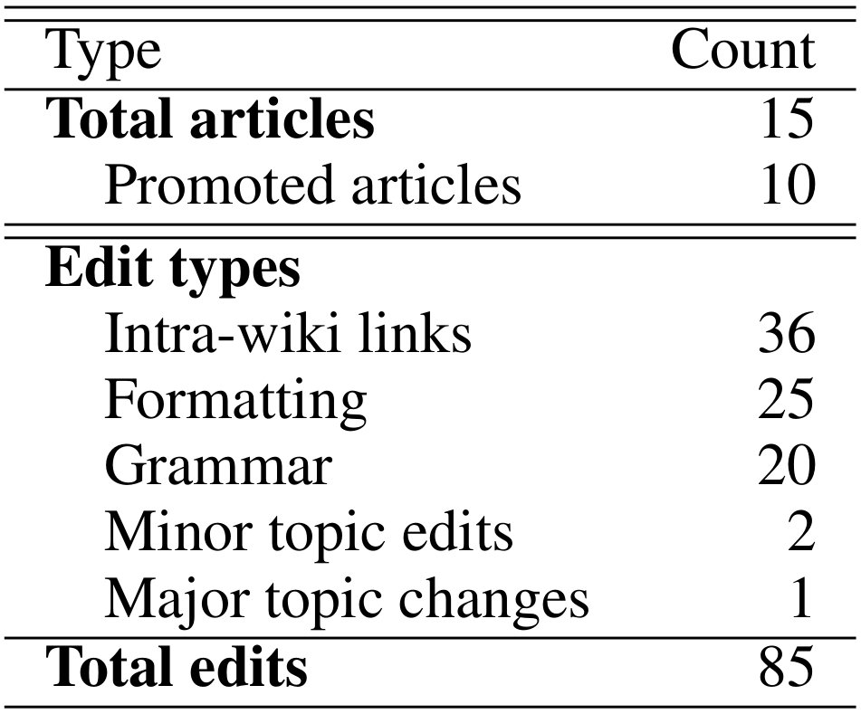

% Automatically Generating Wikipedia Artciles: A Structure-Aware Approach (Sauper+, 2009)
% http://www.aclweb.org/anthology/P09-1024
% 自然言語処理 自然言語生成 wikipedia 順序学習

##repo

- [https://github.com/csauper/wikipedia](https://github.com/csauper/wikipedia)

## Goal

タイトルを入れると完全なWikipedia記事を生成する:

"3-M Syndrome" $\mapsto$ complete article for Wikipedia

## 感想

- "template-based" とあったから読んでみた
- 思ってたのと違った

## Overview

- entity の複数段落の要約 (overview)
    - 原文 (段落) を `Yahoo!` からたくさん拾ってきて並べる
- `+` content planning
    - テンプレートとして学習する
- content に最適な文章を
    - perceptron ranking algorithm で学習
    - 整数線形計画法で選択

## Content Planning

"Diseases" の content planning の例 (Figure 1):

template = topicの列:

$$\text{[Diagnosis, Causes, Symptoms, Treatment]}$$

## 生成物

- [Automatically generated Wikipedia articles: http://people.csail.mit.edu/csauper/?page_id=64](http://people.csail.mit.edu/csauper/?page_id=64)
- 例えば
    - [3-M Syndrome: https://en.wikipedia.org/wiki/3-M_syndrome](https://en.wikipedia.org/wiki/3-M_syndrome)

## 生成物

記事のフレーズでググるとまんまの文章が別なページから引っかかる (拾ってきてる)

## 

生成したい文章に必要な文はネットのどこかにあると仮定する.
ただし、

1. 複数のページに散らばっている
1. ノイズな文も含まれうる

だから content planning が必要.

## Method Overview

1. 前処理
    - 同じドメインの事例からテンプレート (トピックの列) の学習
    - Search: 原文を集める
1. Selection Model: 原文を選ぶ
1. 選んだのを組み合わせる

## Method::前処理::訓練事例

訓練データとする文章をネットから集める

- 生成したい記事と近いドメインのもの
- 実験では "Diseases" というドメインの他のWikipedia記事を用いた

$$\mathcal{D} = d_1, d_2 ~..~ d_n$$
文章 $d_i$ は複数段落 $s$ (`
`) からなり、段落には見出し $h$ (`<h*>`) がついてる.
$$d_i = \left( h_i^j, s_i^j \right)_{j=1 .. m_i}$$

## 事前処理::テンプレート学習 (Section 3.1)

見出しの列

- $h_1^1 \rightarrow h_1^2 \rightarrow \ldots \rightarrow h_1^m$
- $h_2^1 \rightarrow h_2^2 \rightarrow \ldots \rightarrow h_2^m$
- $~~~~~~~~~~~\vdots$

というのを template (topic列) だと見なして、
これを学習したい.

## 事前処理::テンプレート学習 (Section 3.1)

全見出し
$\{ h_i^j | i, j \}$
をクラスタリング
$(t_1, t_2 .. t_k .. )$
して、
一つのクラスタ (多重集合) を topic とする.

- $t_1 \rightarrow t_3 \rightarrow \ldots \rightarrow t_m$
- $t_2 \rightarrow t_3 \rightarrow \ldots \rightarrow t_{m'}$
- $~~~~~~~~~~~\vdots$

みたいな列ができる.

1. この列の長さ$k$ (平均長) の
majority-order
を計算して
(majority ordering algorithm [Cohen+, 98])、
template
とする.
1. クラスタ $t_j$ の要素の最頻の見出し $h$ をクラスタの見だしとして用いる.

## 事前処理 (誰か読んで)

- Repeated Bisectioning Algorithm [Zhao+, 05]
    - 文章同士 $(s_i, s_j)$ のコサイン類似度を距離とした階層クラスタリング
- Majority Ordering Algorithm [Cohen+, 98]
    - 有向辺に遷移確率ぽい何かをつけた順序の最適化

## 事前処理::Search: 作ったテンプレート毎に excerpts (抜粋) を拾う (Section 3.1)

トピック $t_j$ 毎に、できるだけたくさん excerpts を拾う

1. "記事タイトル (entity) + 見出し $h$ ($h \in t$)" で `Yahoo!` でググる
    - e.g. `"3-M Syndrome"+diagnosis`
1. 上位10ページ採用
1. 見出しと段落のペアを一つの excerpts として抽出

平均で 6 excerpts/topic 取れた

## ここまで

ドメイン (e.g. "Diseases") に対して、
テンプレート $t_1 ... t_k$.
トピックごとに候補となる抜粋

- $t_1$: $e_{11}, e_{12} ~...~ e_{1r_1}$
- $t_2$: $e_{21}, e_{22} ~...~ e_{2r_2}$
- $~~~~~\vdots$
- $t_k$: $e_{k1}, e_{k2} ~...~ e_{kr_k}$

抜粋 を一つずつ選択していくことで、
最終的な記事を生成する.
ただし、

1. coverage and redundancy のバランス
1. ノイズを上手く避ける必要

## Selection Model (Section 3.2.1)

候補 excerpts から一つずつを選択するモデル

- 入力
    1. 記事タイトル
    1. トピックの列 $(t_1, \ldots,  t_k)$
    1. トピック $t_j$ に対して候補 $(e_j^k)_{k=1..r}$
- パラメータ
    1. 素性 $\phi : e \mapsto \phi(e) \in \mathbb{R}^n$ (天から与えられる)
    1. $t_j$ に対応する重み $w_j \in \mathbb{R}^n$ (学習する)

## 推定と学習

- $w_j$ の学習: perceptron ranking algorithm
    - ドメイン-トピックに依存した重み
- 推定: 整数線形計画法 (ILP)

## 推定::Ranking

トピック $t_j$ に対して、excerpt $e$ のスコアを
$$score(e) = \phi(e) \cdot w_j$$
で与える.
候補 $(e_1, e_2, \ldots, e_r)$
を、この score の高い順で並び替える.
$$Rank(e_1 ~..~ e_r; w_j) = (e_1 ~..~ e_r)$$
($e_\ell$ は $\ell$ 番目に良い).

## 推定::最適化

ランキングで並び替えした後

- $t_1$: $e_{11}, e_{12} ~...~ e_{1r_1}$
- $t_2$: $e_{21}, e_{22} ~...~ e_{2r_2}$
- $~~~~~\vdots$
- $t_k$: $e_{k1}, e_{k2} ~...~ e_{kr_k}$

$$\min \sum_j \sum_\ell \ell \cdot x_{j\ell}$$

インディケータ $x_{j\ell}$ は $e_{j\ell}$ を選択するとき $1$、さもなくば $0$.

制約 (ちょうど一つだけ選択すること):
$$\sum_\ell x_{j\ell} = 1 ~ \forall j$$

## 推定::最適化::Redundancy Constraints

内容の冗長性をできるだけ取り除く為の制約:
$$(x_{j\ell} + x_{j' \ell'}) \cdot sim(e_{j\ell}, e_{j' \ell'}) \leq 1$$
を加える.

ここで、
$sim$ は文章同士の cos 類似度.

## 推定::最適化::Solving the ILP

- `lp_solve` は厳密解を与える (NP-hard)
- 近似アルゴリズム: knapsack problem [McDonald, 07]

## $w_j$ の学習

perceptron ranking algorithm に基づく.

## Perceptron Ranking Algorithm [Collins, 02] (蛇足)

- Max-Ent によるPOSタグ付け
- 最上位のものを出力する代わりに
    - 上位20を取って re-rank していくビームサーチ
    - 複数の候補から一番良いものを学習する

## The perceptron training for ranking

- 入力
    - 答え $x_1$, 他の候補 $x_2, x_3 ~..~ x_k$
    - 素性 $\phi: x \mapsto \phi(x) \in \mathbb{R}^s$
    - スコア $score(x,w) = w \cdot \phi(x)$

\pause

- 初期化
    - $w^0 = 0 \in \mathbb{R}^s$
- For $i=1,2 ~..~ n$
    - $j = \text{argmax}_j ~ score(x_j, w^{i-1})$
    - If $j=1$
        - Then $w^i = w^{i-1}$
        - Else $w^i = w^{i-1} + \phi(x_1) - \phi(x_j)$

## Update

$score(x_1, w) < score(x_j, w) (j\ne 1)$ のとき (Else節)、
$$score(x_1, w) - score(x_j, w) = w \cdot (\phi(x_1) - \phi(x_j))$$
を大きくすればよい.

- Else $w^i = w^{i-1} + \phi(x_1) - \phi(x_j)$

## voted perceptron (もっと蛇足)

学習の経過で作られた
$w^1, w^2 ~..~ w^n$
を全て用いる.

- 入力
    - $x_1, x_2 ~..~ x_k$
    - 同じ素性 $\phi: x \mapsto \phi(x)$
- 初期化
    - 長さ $n$ の配列 `V[] = [0, 0, .. 0]`
- For $i=1,2,..n$
    - $w^i$ で score が最上位の $j = \text{argmax}_j score(x_j, w^i)$
    - `V[i] += 1`
- 出力 $x_j$ where $j = \text{argmax}_j V[j]$

## 学習::Ranking Perceptron

テンプレートを作る元文章からゴールドデータ
$s_1, s_2 ~..~ s_k$
を正解として用いる.

- $t_1$: $s_1$; $e_{11}, e_{12} ~..~ e_{1r_1}$
- $t_2$: $s_2$; $e_{21}, e_{22} ~..~ e_{2r_2}$
- $~~~~~\vdots$
- $t_k$: $s_k$; $e_{k1}, e_{k2} ~..~ e_{kr_k}$

\pause

1. Rank with $w_j \mapsto (e_{j1} ~..~ e_{jr}) ~ \forall j$
1. Optimize as a ILP $x_j = Opt(e_{j1} ~..~ e_{jr}) ~ \forall j$
1. If $sim(s_j, x_j) \geq 0.8$
    - Then $w_j$ を更新しない
    - Else $w_j = w_j + \phi(s_j) - \phi(x_j)$

## 評価

1. ROUGE-1
    - テストデータ (Wikipedia記事として既にあるもの) を訓練データ (Wikipedia記事)+Yahoo!(該当記事を参照しない) で生成してROUGEで比較
1. REACTIONS
    - 実際にWikipediaに投稿してみんなの反応を見る

## データ

- ドメイン:
    - American Film Actors: 2150 articles in Wikipedia
    - Diseases: 523
- 各ドメインの90\% の文章を訓練とする.
- 残り10\%をテストとする
    - 生成する際は、記事のタイトルだけを参照する
- 平均 4 topic (段落)
- Search 手続き (Yahoo!) 中ではテストデータ自体を参照しないようにする

## Baselines

1. Search
    - パーセプトロンでランキングせずに、検索結果で引っかかった順にランク付けを行う
    - 1ページから$k$段落拾ってきた場合には、それをそのまま候補として用いる
    - 大抵、ページの一番初めの段落は comprehensive overview であるので summary としては優秀
2. NoTemplate
    - テンプレート (トピック列) を気にしない
    - Search では、記事のタイトルだけで検索する (full model では記事タイトル+見出し)
    - 文の組合せ方は既存手法に従う [Zhou 04; Biadsy 08]
3. Disjoint
    - ILPを行わない
    - ランキングの後、各トピックから1位のものだけを選択して組み合わせる
4. Oracle
    - 候補からテストデータとコサイン類似度が高いものを選択する
    - 生成すべきテストデータを参照する上にROUGEで評価するので
    - ランキングアルゴリズムに関する精度の上限を与えると考える

## ROUGE-1 結果 (Table 3)

- Oracle は上限
- No Template は一つのトピックに集中してしまう
- FullModel と Disjoint との差がランキングの良さ
- Search はまちまち. 良い記事を引けば良い

## REACTIONS

15の記事を投稿、5-11ヶ月放置

- 10 promoted from stubs to regular entries
- 全ての記事が人手で編集された
- 削除がなされた記事は無い
- 記事中の三箇所 (1 section + 2 smaller pieces) が削除された

- The most common changes were small edits to formatting and introduction of links to other Wikipedia articles
