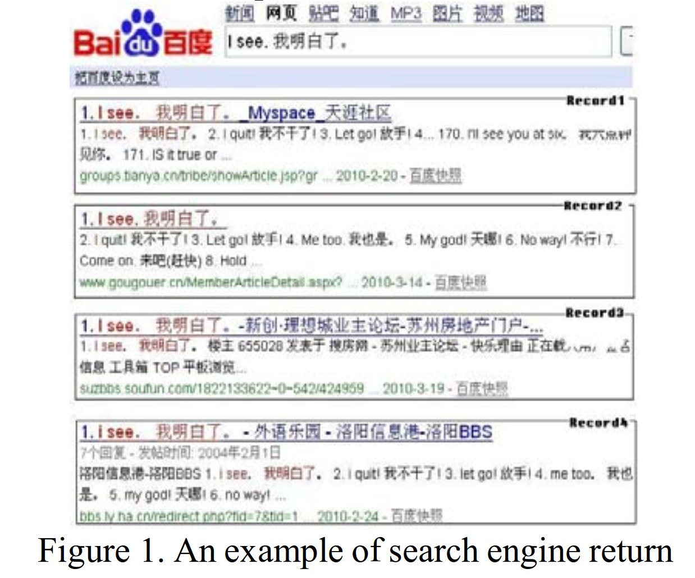
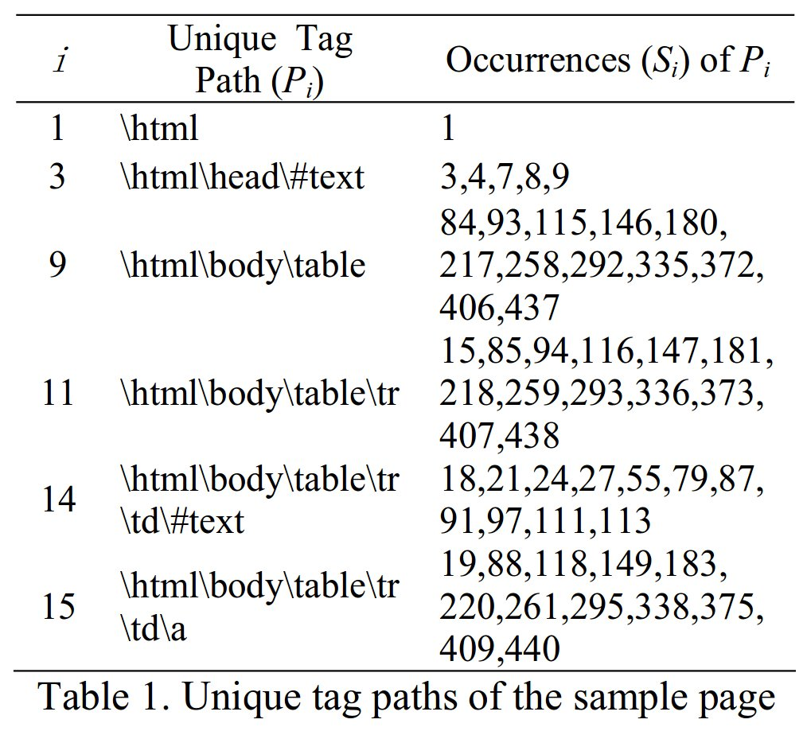

% A Novel Method for Bilingual Web Page Acquisition from Search Engine Web Records
% http://dl.acm.org/citation.cfm?id=1944600
% 自然言語処理 自動翻訳

検索エンジンを使って bilingual web page を探す

## Introduction

- パラレルコーパスみたいなのを作るのにwebページを利用したい
- 1つのページの中でバイリンガルなのがある
    - ニュースページ
    - 英語学習のサイト

こういうのを使って有益なパラレルコーパスを作る既存研究がある (Jiang, 2009)

既存研究だとweb page を決め打ちで使ってるだけなので、
検索エンジンを用いて手広く蒐集したい

## Overview

1. Baidu を使う
1. parallel sentence pairs で検索
    - "I see." : "我明白了。"
1. ヒットしたページについて、HTMLタグ奇麗に取り除いてそれっぽいテキストを抜き出す
    - HTML構造についてのパターンを使ってクラスタリング (?)
1. ちゃんと bilingual になってるかどうかを判定 (分類)

## Clustering with Path Similarity

HTMLタグのパスで欲しいテキストを抽出する

- パス ($P$) についてクラスタリングをする
    - パスの類似度を定める必要
    - パスが指す要素の最短距離と定める

- $P_11$ の位置 $=227$ (出現位置の平均)
- $P_15$ の位置 $=215$
- $distance(P_11, P_15) = abs(227 - 215)$

一つのパスによって表現されるHTML要素は、大体一つのページにおいては一箇所に固まっていて、
その重心をもってパスが指す座標 (一次元) とする.
web page の上で近い位置にあるものは、似たクラスにあるテキストだろう.

## Data Record Extraction

## Bilingual Web Page Verification

## Experiments and Results

### Dataset

### Evaluation

## Conclusion
