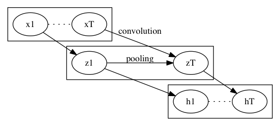

% Quasi-Recurrent Neural Network (QRNN)
% https://arxiv.org/abs/1611.01576
% 深層学習

RNN と言えば LSTM だが、とにかく学習 (1回の逆伝播) が遅い.
また、ユニットの状態を見て一体どんな特徴を捉えているのかの分析も難しい.
QRNN はこれら2つを解決する.

## 手法

入力は系列:

$$x_1, x_2, \ldots, x_t, \ldots, x_T$$

各 $x_i$ はベクトル $\mathbb{R}^n$.

次のようにして、LSTMライクなことをする.

1. Convolution
    - 画像の畳込み同様に $x_1, x_2, \ldots, x_t, \ldots, x_T$ から次の最大 4 つのパラメータを作る
        1. $z_1, z_2, \ldots, z_t, \ldots, z_T$ $(\tanh)$
        1. $i_1, i_2, \ldots, i_t, \ldots, i_T$ $(\sigma)$ (optional)
        1. $f_1, f_2, \ldots, f_t, \ldots, f_T$ $(\sigma)$
        1. $o_1, o_2, \ldots, o_t, \ldots, o_T$ $(\sigma)$ (optional)
    - 括弧内は最後の活性化層
    - 実際の畳み込み方はバリエーションが考えられる
        - 元論文の例では、 $z_t, i_t, f_t, o_t$ を $x_t, x_{t-1}$ から作る
    - $i_t, o_t$ は省略可 (後述)
    - 注意点としてこの計算 (逆伝播含めて) は並列化可能であること
1. Pooling
    - 系列 $(z_1, i_1, f_1, o_1), \ldots$ から $h_t$ を作る
    - 内部状態 $c_t$ を持ち、$h_t$ を出力する
    - 適当な初期値 $c_0$ を以って、次の式を以って系列に沿って計算する

$$c_t = f_t \odot c_{t_1} + i_t \odot z_t$$
$$h_t = o_t \odot c_t$$

- $i_t$ を省略する場合、$i_t = 1 - f_t$ とする
- $o_t$ を省略する場合、$o_t = 1$ $(c_t = h_t)$ とする

どれを省略するかによって、$f$-pooling, $fo$-pooling, $ifo$-pooling と呼ぶ.

系列に沿った逆伝播は pooling のところだけだけど、LSTM と異なってただの掛け算だけなので、
マシな計算量で済むのが特長.

### Dropout

$f_{tj} = 1, i_{tj} = 0$ なる要素があれば、時刻 $t$ の成分 $j$ は落ちる.
