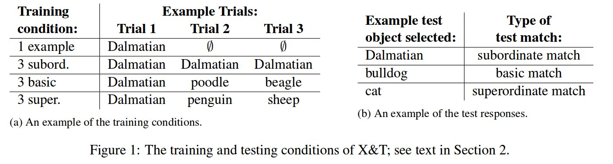
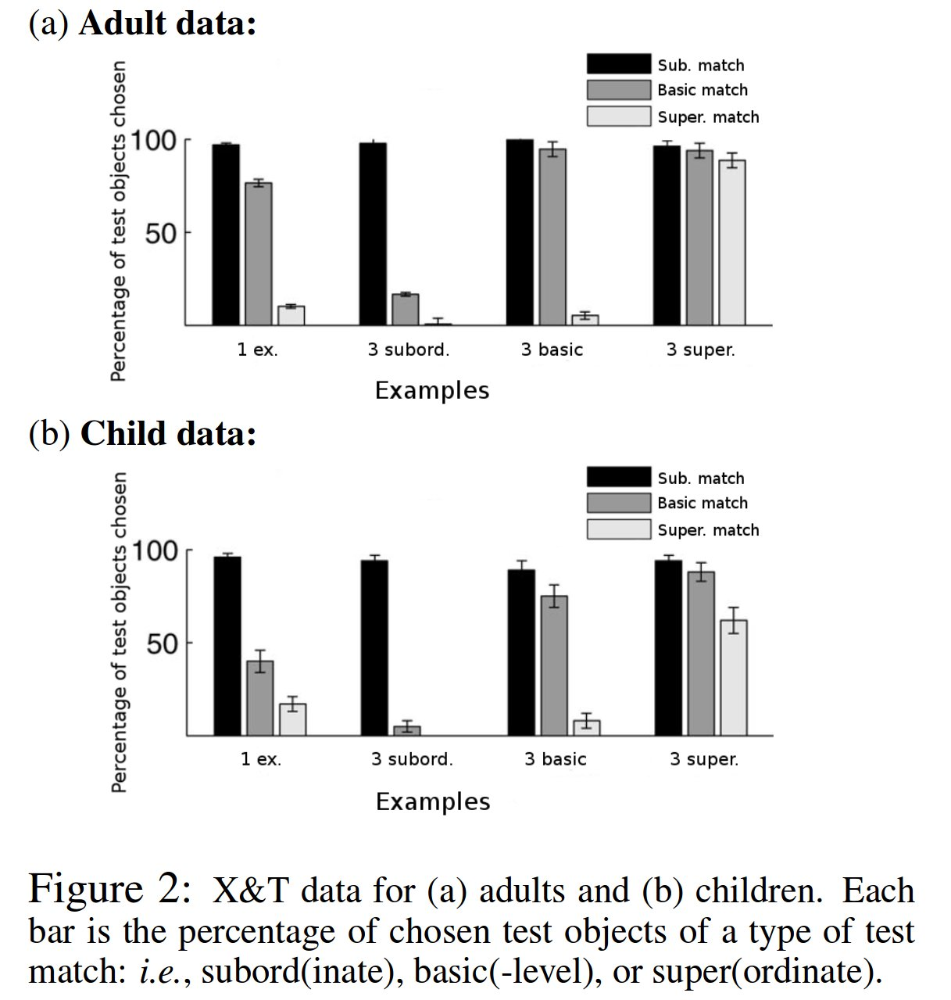

% A Computational Cognitive Model of Novel Word Generalization
% http://citeseerx.ist.psu.edu/viewdoc/summary?doi=10.1.1.697.2491
% 自動獲得 自然言語処理

```
@MISC{Nematzadeh_acomputational,
  author = {Aida Nematzadeh and Erin Grant and Suzanne Stevenson},
  title = {A Computational Cognitive Model of Novel Word Generalization},
  year = {2015}
}
```

- 語彙獲得とかいうやつ
- 未知語と、それを例示する写真とから、その語について何かしら理解したい

## Introduction

### Quine, 2016

白いうさぎが周りを飛び跳ねてるのを見ながら
"dax"
という言葉を聞いたとしたら、
"dax" とは、白いうさぎ、ウサギ、動物、可愛い、などといったことを意味するすると考えるだろう

どうやって、本当の意味を知るか

- その言葉が出現した状況の共通部分 (Pinker, 1989)
    - これを再現することによる語彙理解に cross-situational learning ってのがある

適度な汎化が必要である

- "dog" という言葉が特定の犬種を指すわけでなくあらゆる種類の犬を指すと理解しないといけない
- しかしながら、汎化しすぎると、動物を意味すると理解しかねない

適切な category level へ汎化することを "word generalization" と呼ぶことにする

### 既存研究: basic-level assumption (Markman,1991; Golinkoff,1994)

子供の語彙獲得についての、次のような仮説:

- 語には basic-level があって、それを好んで使う
    - 「犬」
- より下位の概念は滅多に使わない
    - 「ダルメシアン」

## 既存研究: Xu and Tenenbaum (X&T), 2007

子供、大人それぞれが、語彙獲得するモデルをベイズ推定として記述

### Novel Word Generalization in People: 人間に対しての実験

X&T による調査

1. 訓練フェーズ
    1. 被験者に、未知語 (e.g. "fep") という語と、事例をいくつか見せる
        - 大人に対しては写真を
        - 子供に対しては実際の物 (玩具) を 事例とする
    1. 異なるレベルの事例も見せる
        - 犬に対しての、ダルメシアン、動物
1. テストフェーズ
    1. 色んな事例を見せて、先の語 ("fep") に相当するものを選ばせる
    1. 訓練フェーズで用いたものは含まない

実際には、動物、自動車、野菜を事例として用いた

- 訓練に選択する事例は次の4パターン (Fig 1 (a)).
- テストで選ばれた事例を次のように区分する (Fig 1 (b)).
    1. subord. match: 犬種レベルでの正解
    1. basic match: 犬
    1. super. match: 動物



結果は次の通り:



縦軸は、テストフェーズで見せた事例の内の再現率

- 1つダルメシアンを見せられた大人 (Adult; 1 ex)
    - ダルメシアンを選ぶしかない
    - 他の犬種も選ばれる
- 3つダルメシアンを見せられた大人 (Adult; 3 subord)
    - ダルメシアンしか選ばれない
- (Adult; 3 basic)
    - 1 ex より少し汎化
- (Adult; 3 super)
    - 動物が何でも選ばれる

大体予想どおり

子供の場合は、 basic match が減る傾向がある.

## The Word Learning Framework

Fazlyらによる
cross-situational word learner モデルである
FAS (Fazly, 2010)
をベースに用いる
