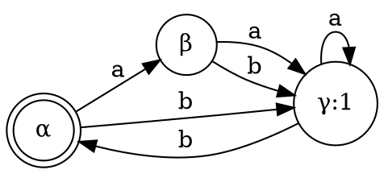
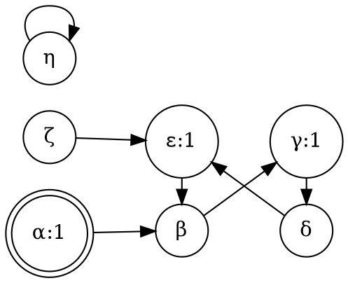
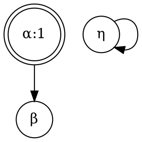
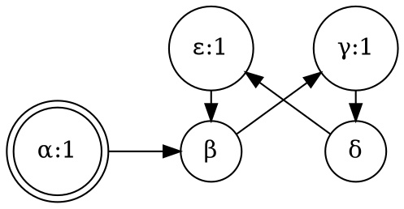

% Preliminares

## 有限機械

有限オートマトン、Moore machine とも.

有限機械 $M$ とは次の要素からなる:

1. 有限集合 $S = S(M)$: 状態 (statuses) と呼ぶ
1. 有限集合 $I = I(M)$: 入力 (inputs) と呼ぶ
1. 有限集合 $O = O(M)$: 出力 (outputs) と呼ぶ
1. 関数 $t: S \times I \rightarrow S$: 遷移関数 (transition function) と呼ぶ
1. 関数 $o: S \rightarrow S$: 出力関数 (output function) と呼ぶ
1. ある一つの状態 $\iota$: 初期状態 (initial state) と呼ぶ

この本では状態にはギリシア文字 ($\alpha, \beta, \ldots$) を用い、
入力には $a,b,c,\ldots$、
出力には $i, j, k$ を用いる.
また、$t(\alpha, a)$ を $\alpha_a$ と略記する.

有限機械はある時点である状態 $\alpha$ を持ち、
連続的に出力 $o(\alpha)$ を吐き続ける.
何か入力のシグナルを受け取るまでは状態 $\alpha$ であり続け、
入力 $a$ を受け取ると瞬時に状態を $\alpha_a$ に買える.
そうして $o(\alpha_a)$ を吐き続ける.
何の入力シグナルを受け取ったことのない時点での状態は $\iota$ である.

他の有名な有限機械の形式化として、 Mealey machine があり、これは基本的には Moore machine と同様だが、
出力関数が $o: S \times I \rightarrow O$ となっていて、やや複雑化されている.
しかし実際これは、Moore machine と等価である.
Moore machine において、状態 $S$ を $S \times I$ に変えて、前回の入力を覚えておくことにすれば、模倣することが可能だからである.

本書は Kleene 理論を解説することが目的なので、それに当たって十分シンプルな Moore machine を有限機械として扱うのである.

## 状態遷移図

有限機械 $M$ について 状態遷移図 (state diagram) を書く.
これは、状態をノード、遷移をエッジ (入力をエッジのラベルとする) と対応付けた有向グラフである.
例えば $\alpha_a = \beta$ のとき、$\alpha \rightarrow^a \beta$ という有向枝を加える.

ノードにはどの状態を対応付けたかを記すためのラベルを付与する.
通常、ラベルはただ単に状態の名前であるが、ここに出力 $o(\alpha)$ も一緒に書いて $\alpha:o(\alpha)$ と書く.

また、通常のノードは丸で囲んで記すが、初期状態に対応するノードは二重丸に囲むことにする.

出力が $O(M) = \{0, 1\}$ であるような機械をバイナリ機械 (binary machine) という.
この場合には、ノードのラベル全てに ":0" ":1" を書かなくても 1 を出力するときにだけ ":1" を書くことにすれば、
書いてないものは ":0" だと分かるので、省略することにする.

次は状態を3つ持つバイナリ機械の例.

これは

1. $S(M) = \{\alpha, \beta, \gamma\}$, $I(M) = \{a,b\}$, $O(M) = \{0,1\}$
1. 初期状態は $\alpha$
1. $t(\alpha, a) = \beta, t(\beta, b) = \gamma, \ldots$
1. $o(\alpha) = o(\beta) = 0$, $o(\gamma) = 1$

といった機械である.

## 語法

語をいくつか用意する.
入力を有限個並べて出来る列を語 (word) という.
すなわち入力全体 $I$ に対して語全体は $I^*$ である.
列の長さを語の長さ (length) という.
長さがゼロの語を許容する.
これを空語 (empty word) といい、 $1$ と書く.

状態 $\alpha$ の状態に語 $w = ab\ldots k$ を受け取るとは、入力 $a, b, \ldots, k$ を逐次的に受け取ることである.
$t(\alpha, a)$ を $\alpha_a$ と書いていたが、これを語に拡張して
$$\alpha_w = t(\ldots t(t(\alpha, a), b), \ldots, k)$$
と書く.
また出力関数を拡張して
$f_\alpha(w) = o(\alpha_w)$
を定める.

自明に $\alpha_1 = \alpha$ である.

状態 $\alpha$ からある語 $w$ を受け取って状態 $\beta$ に遷移するとき、$\beta$ は $\alpha$ から到達可能 (accessible) である、という.
初期状態 $\iota$ から到達可能のとき、単に$\beta$ は到達可能だという.

2つの状態 $\alpha$, $\beta$ について、任意の語 $w$ を以って
$o(\alpha_w) = o(\beta_w)$
が常に成り立つとき、
$\alpha$ と $\beta$ とは区別不能 (indistinguishable) であると言い、
其の逆、即ち、ある語によって出力が異なるとき、区別可能 (distinguishable) であるという.

2つの機械 $M$, $M'$ について、それぞれ入力と出力が同じ領域であって ($I(M)=I(M')$, $O(M)=O(M')$)、
$M$ の状態 $\alpha$ と $M'$ の状態 $\beta$ とを適当に対応付けることで、区別不能にできるとき、
$M$ と $M'$ は同じ挙動である (have same console) という.

しばしば、ある特定の挙動をする機械は複数ありえる中で、単純な機械を設計することが目的となるため、この概念が重要となる.

## 区別不能性による商 (quotrient by indistinguishablity)

機械 $M$ から次の手順に依って $M^{\div}$ を構成することを考える.

1. $M$ の状態 $\alpha$ に対して $M$ の中で $\alpha$ と区別不能な状態のクラスを $\bar{\alpha}$ と書いてこれを $M'$ の状態とする (区別不能に関する商集合)
1. $I(M') = I(M)$, $O(M') = O(M)$
1. $M'$ の遷移関数 $t$ を $t(\bar{\alpha}, a) = \bar{\beta}$ where $t(\alpha, a) = \beta$ で定める
1. $o(\bar{\alpha}) = o(\alpha)$
1. $\bar{\iota}$ を初期状態とする

$M^\div$ は $M$ と区別不能.

### Example

次の機械 $M$ を考える.
入力はただ一つしかないとして略す.

例えば $\beta, \delta$ は区別不能であることが確認できる.
結局、$M^\div$ は次のようになる.

## 到達可能性による切り捨て (truncation by accessiblity)

機械 $M$ に対して次のようにして $M^-$ を構成する.

1. $M$ の初期状態 $\iota$ は $M^-$ の初期状態
1. $M$ において $\iota$ から到達可能な状態全てが $M^-$ の状態
1. 遷移関数はそのままだが、$M^-$ にもある状態に制限
1. 出力関数も同様に制限

やはりこの $M^-$ も $M$ と区別不能である.

### Example

先ほどの $M$ を用いれば $M^-$ は次のようになる.

ちょうど、$\zeta, \eta$ が消え、そこに入る、または出る枝が削除されたものになる.

## 極小機械 (minimal machine)

機械 $M$ が極小であるとは、全ての状態が到達可能で、全ての状態が区別可能であることを言う.

また、2つの機械 $M, N$ が同じ挙動 (behavior) であるとは、初期状態が同じで、状態遷移図についてグラフ同型であることを言う.

### Thm. 3

$M^{-\div}$ 及び $M^{\div -}$ は極小機械であって同じ挙動をする.
