% 圏 (category)

## 圏の定義

次の4つの構成要素があって、後に述べる公理を満たすものを圏という.

1. 対象 (object) の集合: $A,B,C$ って書くことにする
2. 射 (morphism) の集合: $f,g,h$ って書く
3. $dom, cod$ なる射から対象に写す関数
4. 2つの射をとって新しい射を作る二項演算子 $\circ$

### notation

$dom(f) = A, cod(f) = B$ のとき
$$f: A \rightarrow B$$
あるいは
$$A \rightarrow^f B$$
と書く.

$\circ$ については  
$dom(g) = cod(f)$ なるときにのみ、$g \circ f$ を定義して新しい射となる.
$g \circ f$ を $gf$ とも書く.

### 圏の公理群
圏は次の3つを満たさねればならない.

1. $g \circ f$ が定義されるとき
$$dom(gf) = dom(f), cod(gf) = cod(g)$$

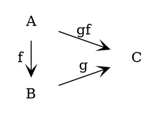

2. 演算子 $\circ$ の結合律:
$$k \circ (g \circ f) = (k \circ g) \circ f$$

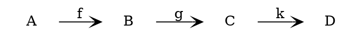

3. 任意の対象 $B$ について 射 $id_B$ が存在して次を満たす.

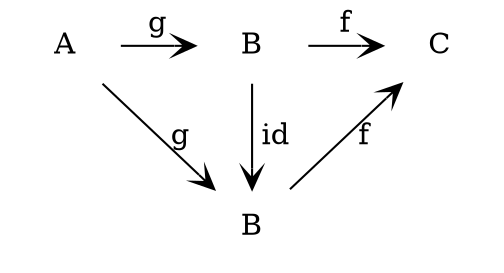

「図を満たす」とは「その図式が可換図式であること」、「任意のパスが可換であること」
であって、今の場合
$$g = id_B \circ g$$
$$f = f \circ id_B$$
を言う.

> 圏における射は明らかに関数の抽象化だけど、
> 層における射よりもずっと抽象的なものである.
> たとえば $id$ は恒等な何かを言うわけではない.
> 圏における射は、あくまでも、
> 公理を満たすような cod, dom というデータだけを持っていさえすればよい.

## 圏の例

1. Sets: 対象を集合、射を関数としたもの
2. Gr: 対象は群. 射は準同型
3. Ab: 対象はAbel群. 射はやはり準同型

4. 直積圏

圏 $\Cat_1, \Cat_2$ の直積として新しい圏
$\Cat_1 \times \Cat_2$
を次のように定義できる.

対象全体の集合:
$$\{(A,B) : A は \Cat_1 の対象, B は \Cat_2 の対象 \}$$

射全体の集合:
$$\{(f,g) : f は \Cat_1 の射, g は \Cat_2 の射 \}$$

で、あとは $dom, cod$ の整合性さえ作ればよくて:
$$(f,g): (dom(f), dom(g)) \rightarrow (cod(f), cod(g))$$
とすればよい.

5. 双対圏 $\Cat^o$

圏 $\Cat$ に対して、
対象も射も $\Cat$ と同じだけど、$dom, cod$ だけを入れ替えたものを
$\Cat^o$
とする.

$$f:A \rightarrow B \in \Cat \iff
f:B \rightarrow A \in \Cat^o$$

6. $Top(X)$

$X$ の上の層を対象として、
層から層への射を圏における射とする.
これも圏である.

### notation

圏 $\Cat$ における $A \rightarrow B$ という射全体を
$$\Cat(A,B), Hom(A,B)$$
などと書く.

## mono

射 $m: A \rightarrow B$ が mono である (being monic) とは

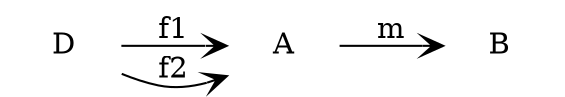
について
$$m f_1 = m f_2 \Rightarrow f_1 = f_2$$
とあること.

`A >-> B`
とか書くらしい.
[wikipedia](https://en.wikipedia.org/wiki/Monomorphism)
的には
`A ↪ B`
と書くらしい.
でも常識的に考えてこんな矢印の形状を覚えるなんて無駄なことはしたくないので使わないことにする.

## 同等な対象

2つの対象 $A, B$ について
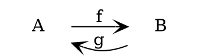
とあって、
$gf = id_A, fg = id_B$
が成立してるとき、
$A, B$ は同等であるという.

## 対象の直積

圏 $\Cat$ の対象 $A, B$ について、
対象 $A \times B$
が $\Cat$ の中に存在してかつ、
次に述べる2つの性質を満たすとき、$A$ と $B$ との直積という.

1. 射 $\pi_1, \pi_2$ が存在して:

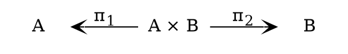

2. 任意の $(C,f,g)$ について $h$ が唯一存在すること:

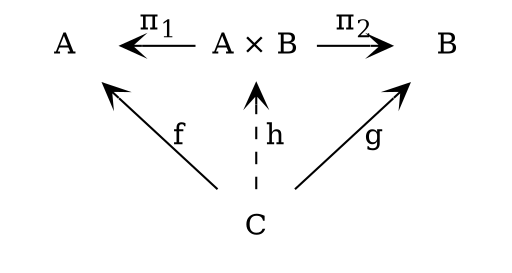

$h$ は $(C,f,g)$ から一意に定まるが、
$C$ というデータは $dom(h)$ に含まれるので、
$h$ を $\< f, g \>$ と書いて表すことにする.

以上で定義した直積は集合や層の直積の定義と矛盾しない.

### Prop.

圏 $\Cat$ に
6つの対象 $A, B, A \times B; C, D, C \times D$ が存在して、
$$f: C \rightarrow A$$
$$g: D \rightarrow B$$
があるとき、次を満たす
$h$
が唯一存在する.

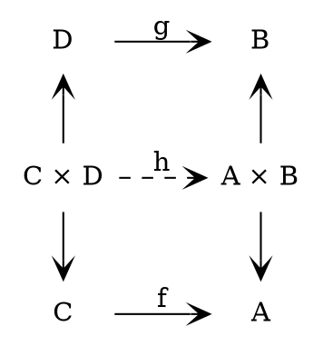

labelを附けてないが、
$$\pi_1: C \times D \rightarrow C$$
$$\pi_1: A \times B \rightarrow A$$
であって、この2つの射は同じ記号を当てているが圏においては別物である.

証明は略. $A \times B$ が直積であることを意識すれば自明.

## イコライザー (equaliser)

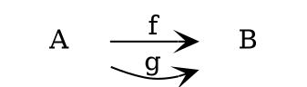
について、

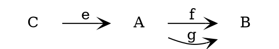

とある射 $e$ が $f$ と $g$ とのイコライザーであるとは次の2つが満たされること.

1. $fe= ge$
2. 任意の $(D,h)$ について $k$ の唯一性:

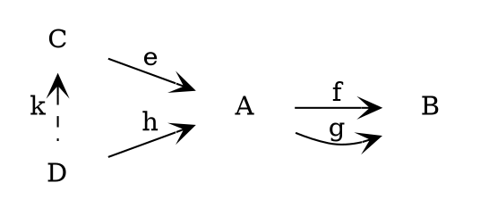

## プルバック (pullback)

可換図式:

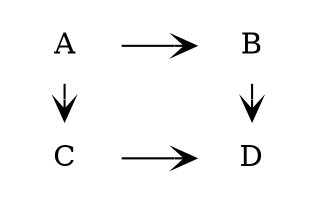

がプルバックであるとは、  
任意に対象 $X$ と射2つを付け足すと、
射 $e: X \rightarrow A$ が唯一存在すること:

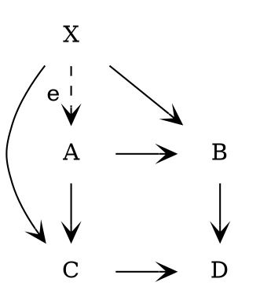

### 定理
<fieldset><legend>定理</legend>
イコライザー $e$ はmonoである.
</fieldset>

イコライザーであるとは:

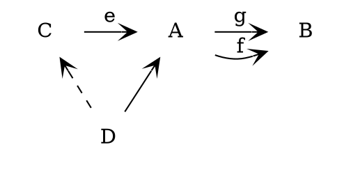

とあること.

任意の異なる射 $h, k: D \rightarrow C$ について、
$$eh = ek$$
を仮定する.

$$feh = geh = gek = fek$$

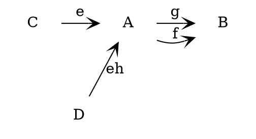

この図式の上で可換にする $D \rightarrow C$ は唯一存在する.
今見たように $h$ は可換にする.
でも $k$ も可換にする.
でも存在は唯一.
従って:
$$k = h.$$

### 定理

<fieldset><legend>定理</legend>
対象の直積への射 $\< f,g \>$ は $f$ が mono なら mono である.
</fieldset>

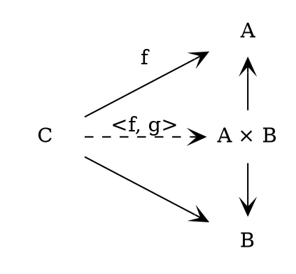

$k,h$があって次を仮定する.
$$\<f,g\> k = \<f,g\> h$$
とすると、
$$\pi_1 \<f,g\> k = \pi_1 \<f,g\> h$$
$$f k = f h$$
$$k = h ~ \text{(since f is monic)}$$

同様にして if $g$ is monic, then $\<f,g\>$ is monic であるな.

### 定理

プルバック:

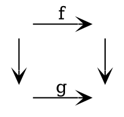

について、$g$ が mono ならば、$f$ も mono である.

### 定理

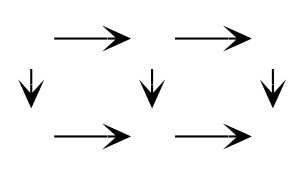
において、小さい正方形2つのそれぞれが
プルバックであるなら、
外側の大きい長方形もまたプルバックである.

## 関手 (functor)

