% 層

## ペア

ペアとは順序のある2つの数からなる組みのことで
$a, b$ からなるペアを $\< a, b \>$ と記述する.

$$\< a,b \> = \< c,d \> \iff a=b \land c=d$$

## 関数

2つの集合 $A, B$ について
関数 $f: A \rightarrow B$ とは
$\{ \< a, b \> : a \in A, b \in B \}$
という集合であって、次の2つを制約として満たすもののことである.

1. $a \in A$ について $\< a, b_1 \> \in f$ かつ $\< a,b_2 \> \in f$ ならば $b_1 = b_2$
(ただ一つに写すこと)
1. $\forall a \in A$ について $\exists b. \exists \< a, b \> \in f$
(total であること)

$$f(a) = b \iff \< a,b \> \in f$$

特殊な場合として、 $f: \emptyset \rightarrow B$ とは $f = \emptyset$ である.

### 関数の制限

$f: A \rightarrow B$ を $A\prime \subseteq A$ で制限した関数を次のように定義する.

$$f \lceil A\prime (: A\prime \rightarrow B) = \{ \< a,b \> : a \in A\prime, b = f(a) \}$$

## 前層 (presheaf)

位相空間 $X$,
$X$の開集合全体 $\mathcal{O}(X)$

二通りの前層の定義を与える.
次にその2つが同等であることを見ていく.

### 第一の定義

$X$ の上の前層を次の三つ組 $(A,E,\rceil)$ で定義する.
単に $A$ を前層だと言うこともある.

集合 $A \subseteq X$,
関数 $E: A \rightarrow \O(X)$,
関数 $\rceil: A \times \O(X) \rightarrow A$

> これは一体何を表現したいのか i.e. 何の抽象化であるのか.  
> $A$ の元はドメインを $D \subseteq X$ にもつ関数である.  
> $E$ は、関数の実際のドメインを取得するためのメソッドである.  
> $\rceil$ は先程の $\lceil$ に相当する、制限というメソッドで、新しい関数を作る関数である.

ただし、以下の4つを満たすこと.

0. 任意の $a, b \in A$ に対して、$a \rceil \emptyset = b \rceil \emptyset$
1. $a \rceil Ea = a$ ($\rceil$ の結合則は $E$ の適用より弱い)
1. $E (a \rceil U) = E a \cap U$
1. $(a \rceil U) \rceil V = a \rceil (U \cap V)$

$A=$ $X$の開集合をドメインとする連続関数全体、
$Ef =$ $f$のドメイン、
$f \rceil U = f \lceil (U \cap Ef)$
はまさしく、前層の一例である.

*N.B.*
前層における $\rceil$ の右にくる開集合は左に来る値に寄らず何が来ても良いが、
普通の関数の制限では、右にくる集合は左に来る関数のドメインの部分集合でないといけない.

### 第二の定義

次の2つ組 $(F, r)$ を $X$ の上の前層だと定義する.
あるいは単に $F$ を前層だと言う.

$\O(X)$ を定義域とする関数 $F$、
$X$の開集合であって $U \subseteq V$ とある $U, V$ について
$$r_{UV}: F(V) \rightarrow F(V)$$

次の3つが成立すること

1. $F(\emptyset)$ はシングルトン
1. $r_{UU}$ は恒等写像
1. $U\subseteq V \subseteq W \Rightarrow r_{UW} = r_{UV} \circ r_{VW}$

### 第一の定義 $\Rightarrow$ 第二の定義

2つの定義が同等であることを確認する.

前層が $(A, E, \rceil)$ で与えられたときに $(F, r)$ を実際に構成してみせる.

$$F(U) = \{ f \in A : Ef = U \}$$
$$r_{UV}(f) = f \rceil U$$

### 第二の定義 $\Rightarrow$ 第一の定義

逆に前層が $(F, r)$ で与えられたとき、
先ほどの全く逆によって構成できる.

$$A = \bigcup_{U \in \O(X)} F(U)$$
$$f \in F(U) \iff Ef = U$$
$$f \rceil U = r_{VW}(f) \text{~where~} V = U \cap W, W=Ef$$

## 両立

前層 $A$ について、
$f,g \in A$ が両立する (compatible) を次で定義する.

$$f \rceil Eg = g \rceil Ef$$

直感的には、互いのドメインで関数がぴたりと一致することである.

*N.B.*
$Ef \cap Eg = \emptyset$ のときも両立することに註意.

## 層

前層 $A$ が加えていくつかの条件を満たすとき、それを層だという.
やっぱり二通りの定義を与える.

### 第一の定義

$\Phi(A)$:
「$A$ の任意の部分集合 $F$ について
任意の $f,g\in F$ は両立してる」

この命題が成り立ってない場合は層である (????).

成り立つ場合は、  
$A$ の任意の部分集合$F$について:

1. $\forall f F .~ g \rceil Ef = f$
1. $Eg = \cup_{f \in F} Ef$

を満たす $g \in A$ がただひとつ存在すること.
この $g$ を $\cup F$ と書く.

先ほどの「連続関数全体」は、層でもある例なのであった.

### $[f=g]$ の定義

$$[f=g] = \bigcup \{ U \in \O(X) : f \rceil U = g \rceil U \} \subseteq X$$

> すなわち、$f=g$ が成立するドメインの最大である.
> $[f=g]$ は $f=g$ が正しい truth value だなんて言い方をするらしい.

以下が成り立つ

1. $U \subseteq [f=g] \iff f \rceil U = g \rceil U$
1. $[f=f]=X$
1. $[f=g]=[g=f]$
1. $[f=g]\cap [g=h] \subseteq [f=h]$
1. $[f=g]\cap U = [f\rceil U = g \rceil U] \cap U$
1. $Ef \subseteq U \Rightarrow f = f\rceil U$
1. $(Ef \cup Eg) \cap U \subseteq [f=g] \rightarrow U \subseteq [f=g]$
1. $[f=g] \cap Ef \subseteq Eg$

### 第二の定義

位相空間 $S$ と局所同相写像 $p: S \rightarrow X$ があるとき、
$(S, p)$ を、あるいは単に $S$ を、$X$の上の層だという.

### 第一の定義 $\Rightarrow$ 第二の定義

層 $(A,E,\rceil)$ が与えられたとき、

$$\tilde{S} = \{ (x,f) : x \in X, f \in A, x \in Ef \}$$
を定義してこれの上の同値関係を次で定義する.

$$(x,f_1) \equiv (x,f_2) \iff
\exists U \subseteq X .~
x \in U
\land
U \subseteq (Ef_1 \cap Ef_2)
\land
f_1 \rceil U = f_2 \rceil U$$
$$x \ne y \Rightarrow (x,f) \ne (y,g)$$

つまり、点 $x$ を含んだ台の上で両立すること.

$$S = \tilde{S}/\equiv$$
とする.

射影関数 $p (x, f) = x$ を定義する.

また
$(x,f)$ の $x$ の近傍を $S$ の点の近傍であると定義することで、
$S$ に位相を導入する.

$S$ が位相空間で、$p$ が局所同相写像なので、第二の定義の形が構成されたことになる.

### 第二の定義 $\Rightarrow$ 第一の定義

逆に $(S, p)$ が与えられたときに $(A,E,\rceil)$ を構成してみせる.

- 連続関数$f$ が $U$の上の$S$の断面であるとは $\iff$ $\forall x \in U .~ p(f(x)) = x$
- $\Gamma(U) = \{ f : 断面であるような連続関数 \}$

$f (: U \rightarrow S) \in \Gamma(U)$ は局所同相写像.

$$A = \bigcup_{U \in \O(X)} \Gamma(U)$$
$$f \in \Gamma(U) \iff Ef = U$$
$$f \rceil V = f \lceil (V \cap Ef)$$

この $\Gamma$ から $(F, r)$ も直接作れて:
$$F(U) = \Gamma(U)$$
$$f \in \Gamma(U), V \subseteq U \Rightarrow r_{UV} \circ f = f \lceil V$$

## 前層からの誘導

一般の
前層 $(A,E,\rceil)$ が与えられた時に、
次のように層にできる.

$$\mathcal{F} = \{ F \subseteq A : F \text{の元が常に両立してる} \}$$
$$F \in \mathcal{F}: EF = \bigcup_{f \in F} Ef$$
$$F \rceil U = \{ f \rceil U : f \in F \}$$

$F_1, F_2 \in \mathcal{F}$:
$$F_1 \equiv F_2 \iff (EF_1 = EF_2) \land (F_1 \cup F_2 \in \mathcal{F})$$

とすると $\mathcal{F}/\equiv$ もまた前層になってる.
定義の仕方から層であることも明らか.
というわけで
$\mathcal{F}/\equiv$
を、「$A$に誘導された層 (induced sheaf)」という.

## $\Omega$ の定義

Hausdorffでない位相空間として $\Omega$ なるものを定義する.

$$\tilde{\Omega} = \{ (x, U) : x \in X, U \in \O(X) \}$$

この上の同値関係:
$$(x, U_1) \equiv (x, U_2) \iff \exists V .~ x \in V \land (U_1 \cap V) = (U_2 \cap V)$$

で割って、
$$\Omega = \tilde{\Omega}/\equiv$$
を定義する.

さらに、
$(x,U) \in \Omega$
の近傍を $x \in X$ の近傍で定義することで位相を導入する.
$\Omega$ は同値関係の定義の仕方から Hausdorff空間ではない.

開集合 $S \in \O(X)$ の閉包を $\ol{S}$ と表記する.
$X \setminus S$ は閉集合で $X \setminus \ol{S}$ は閉集合な.

$(x,U) \in \Omega$:

- $x \in U$ のとき、$(x,U) \equiv (x,X)$
- $x \in X \setminus \ol{U}$ のとき、$(x,U) \equiv (x, \emptyset)$

$x_1 \in \ol{U} \setminus U$,
$x_2 \in U$
について、
$(x_1, U)$ と
$(x_2, U)$ とは異なる開集合で分別できず、Hausdorffではない.

$p(x,U) = x$ という写像を持って、$(\Omega, p)$ は層です.

### 先程述べた、$(S,p)$ の構成から $(A,E,\rceil)$の構成を真似してみると、

$U$の上の$\Omega$の断面は
$$\Gamma(U) = \{ f (: U \rightarrow \Omega) : x \in U, p(f(x)) = x \} = \{ f : V \in \O(X), f(x) \equiv (x, V) \}$$

$\forall x \in U.~ f(x) \equiv (x, V)$ となるようにすればいいんだけど、
$V \subseteq U$ っていう条件をつけると、
$(x,V_1) \equiv (x,V_2) \iff V_1 = V_2$
より
$$\Gamma(U) = \{ f : V \in \O(X), V \subseteq U, f(x) = (x, V) \}$$
とできる.

$$A = \bigcup \Gamma(U) = \{ f : U,V \in \O(X), \forall x \in U . f(x) = (x, V) \}$$
が層になる.
$A$の元は2つの $U,V \in \O(X)$ に対応してるので
$$\Omega = \{ (V,U) : V,U \in \O(X), V \subseteq U \}$$

$$E(V,U) = U$$
$$(V,U) \rceil W = (V \cap W, U \cap W)$$

## 層から層への射

$X$の上の2つの層
$(Y_1, p_1)$
と
$(Y_2, p_2)$
とがあるとき、
下図のような可換図式を作る連続関数:
$$f : Y_1 \rightarrow Y_2$$
を層から層への射だという.
すなわち
$$p_1 = p_2 \circ f$$

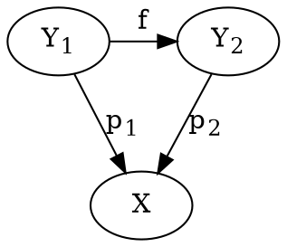

$(Y_1, p_1)$
および
$(Y_2, p_2)$
を、第一の定義で
$(A,E,\rceil)$
と
$(B,E,\rceil)$
とに書き換えてみる.
このとき $f$ はいかに表現されるか.

$$\begin{align}
\Gamma_A(U) & = \{ a : p_1(a(x)) = x \}\\
& = \{ a : p_2(f(a(x))) = x \}\\
& = \{ a : p_2((f \circ a)(x))) = x \}
\end{align}$$

$$\begin{align}
\Gamma_B(U) & = \{ b : p_2(b(x)) = x \}
\end{align}$$

従って、$a \in A \iff (f \circ a) \in B$ です.
かなり紛らわしいけど、$f \circ a$ を $f(a)$ とかくことにする.
後者の $f$ は前者の $f$ とは違う写像で
$$f : A \rightarrow B$$

次の2つを満たす.
$$Ef(a) = Ea$$
$$f (a\rceil U) = f(a) \rceil U$$

ドメインも射も保存される.

## $\Omega$の性質

$(X, id_X)$ は明らかに $X$上の層である.
この層を $1_X$ とか $1$ と書く.

$X$の上の層 $(Y,p)$ から層1への射は唯一つ存在する.
なぜならば:
$$p = id_X \circ f \iff f = p$$

局所同相写像
$t: X \rightarrow \Omega$
を次のように定義する:
$$t(x) = (x, X)$$

これは
$t: 1 \rightarrow \Omega$
という層から層への射でもある.

$X$上の層 $(Y, p)$ は普通の関数の制限でもって
$(Y_0, p_0=p \lceil Y_0)$ (ただし $Y_0 \subseteq Y$)
という別な層を作れる.
$$p: Y \rightarrow X$$
$$p_0: Y_0 \rightarrow X$$
$id: Y_0 \rightarrow Y$
という恒等写像は
$Y_0$から$Y$への射である.

$y \in Y$, $y$の近傍 $U \subseteq Y$,
$U_0 = U \cap Y_0$.  
$x = p(y)$,
$V_0 = p(U_0)$
射 $f: Y \rightarrow \Omega$
$$f(y) = (x, V_0)$$
を定義すると、

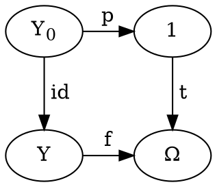

が可換である.
先に述べたように、$Y_0 \rightarrow 1$ という射は $p$ 唯一つである.

さて、次が可換であるような $X$ 上の層 $(Z, p_Z)$ 及び射 $g, h$ を仮定する.

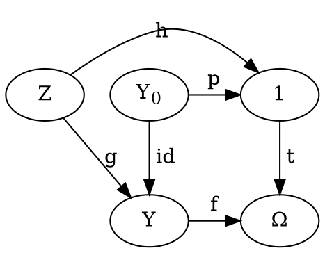

これが可換であるとはすなわち、
$$f \circ g = t \circ h$$
とあること.
$$t \circ h = t \circ p_Z = \lambda z .~ (p_Z(z), X)$$
$$f \circ g = \lambda z .~ (p_Z(z), X)$$
$$f(g(z)) = (p_Z(z), X)$$

$x = p_Z(z)$, $y = g(z)$ とおくと、
$$f(y) = (x, X)$$

$f$の定義から
$$f(y) = (p(y), p(U(y) \cap Y_0))$$

したがって
$$p(y) = x$$
$$p(y) \subseteq p(U(y) \cap Y_0) \iff y \in Y_0 \iff g(z) \in Y_0$$

特に2つ目から、 $g$ は $g: Z \rightarrow Y_0$ という射にもなっていることがわかる.
先ほどの可換図式から、$Z \rightarrow Y_0$ という射が唯一つ導かれること.

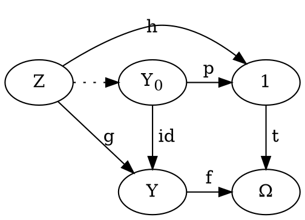

### pullback

先に出てきた図式をより一般化する.
$X$の上の4つの層 $Y_1, Y_2, Y_3, Y_4$ に次のような射があるとする:

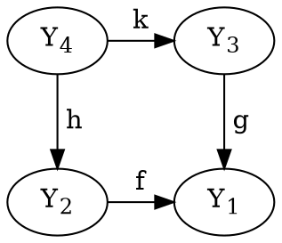

この図式が

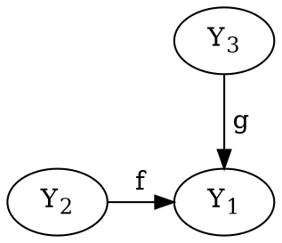
の pullback
であるとは、
任意の $(Z, m: Z \rightarrow Y_2, \ell: Z \rightarrow Y_3)$
について
$Z \rightarrow Y_4$
が唯一つ存在すること.

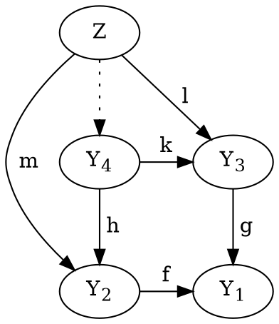

## 層の直積

$X$上の2つの層 $(Y_1, p_1)$, $(Y_2, p_2)$ の直積を定義する.
つまり、この2つから導かれる新しい $X$上の層
$Y_1 \times Y_2$
を定義する:
$$Y_1 \times Y_2 = \{ (y_1, y_2) : y_1 \in Y_1, y_2 \in Y_2, p_1(y_1) = p_2(y_2) \}$$
$p(y_1,y_2) = p_1(y_1) = p_2(y_2)$ とおけば、これはこの直積の為の局所同相写像.
$Y_1 \times Y_2$ に位相を導入するために近傍を定義したい.

$(y_1, y_2) \in Y_1 \times Y_2$:  
$x_0 = p_1(y_1) = p_2(y_2)$  
$y_1$ の近傍 $U_1$,
$x_0$ の近傍 $V_1$:
$$p_1: U_1 \rightarrow V_1$$

$y_2$ の近傍 $U_2$,
$x_0$ の近傍 $V_2$:
$$p_2: U_2 \rightarrow V_2$$

$V = V_1 \cap V_2$:
$$U(y_1, y_2) = \{ ( p_1^{-1}(x), p_2^{-1}(x) ) : x \in V \}$$
これを $Y_1 \times Y_2$ 上の近傍と定義する.  
要するに$p$の行き先での近傍.

いわゆる射影関数を以ってして、次の射を考えることができる:
$$\pi_1 : Y_1 \times Y_2 \rightarrow Y_1$$
$$\pi_2 : Y_1 \times Y_2 \rightarrow Y_2$$

$X$上の層 $Z$ 及び射 $f, g$ を追加するとき、
下のように可換にする
射 $h: Z \rightarrow Y_1 \times Y_2$ が唯一つあることを確認する.

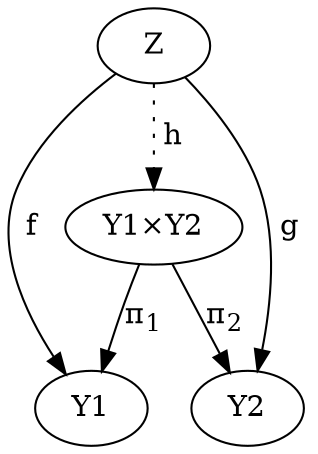

$z \in Z$:
$p_1(f(z)) = p_2(g(z)) = p(z)$
であるので (N.B. 層から層への射の定義そのものである).
$$(f(z), g(z)) \in Y_1 \times Y_2$$
であって、
$$h(z) = (f(z), g(z))$$
は射である.
しかも唯一である (
$h\prime(z) = (y_1, y_2) \in Y_1 \times Y_2$.
$\pi_1 \circ h\prime = f$
より
$y_1 = f(z)$.
同様に
$y_2 = g(z)$.
結局 $h' = h$).

### 集合バージョンの直積

今定義した直積は、
層 $(A, E, \rceil)$, $(B,E,\rceil)$ については次のように書ける.

$$A \times B = \{(a,b) : Ea = Eb \}$$
$$(a,b) \rceil U = (a \rceil U, b \rceil U)$$
$$E(a,b) = Ea = Eb$$

## 層の巾 (冪)

$X$上の2つの層
$(A,E,\rceil)$,
$(B,E,\rceil)$
から導かれる層
$B^A$
を定義する.
$$\begin{align}
B^A = \{ & (f, V) : f: A \rightarrow B, V \in \O(X),\\
& \forall a \in A. Ef(a)=V \cap Ea\\
& \forall a \in A. \forall U \in \O(X). f(a\rceil U) = f(a) \rceil U
& \}
\end{align}$$

*N.B.* 定義中の $f$ はあくまで関数であって一般に射ではない.

> 明らかに、$B^A$ ってのは層による層としての関数の再定義

$$E(f,V) = V$$
と定義する.
$V$ というデータは $E$ に持たせることにして、単に
$B^A = \{ f : ... \}$
として再定義することにする.
$$Ef = V$$

(これって $(f,V_1),(f,V_2)\in B^A \Rightarrow V_1 = V_2$
じゃないと、$E$ が関数にならないから死ぬ定義だよね?)

$$f \in B^A
~ \iff ~
Ef(a) = Ef \cap Ea
~ \land ~
f(a\rceil U) = f(a) \rceil U$$

$\rceil$ を次のように定義する:
$$(f \rceil U)(a) = f(a) \rceil U$$
$$E(f \rceil U) = Ef \cap U$$

このように定義するとちゃんと層の$\rceil$になっている.
つまり

$$f \rceil U: A \rightarrow B$$
であって、
$$f \rceil U \in B^A$$
である
(これを示すためには先程の $f \in B^A \iff ...$ を使う).

### `ev`

関数適用を射
$$ev: A \times B^A \rightarrow B$$
$$ev (a, f) = f(a)$$
として定義する.
`ev` は `evaluation` の略である.

射であることを確認しよう.

$(A,E,\rceil)$版の射は
[この2つ](#arr-definition-of-sheaf1)
を満たせば良いのであった.

$$E(ev(a,f)) = E(f(a))$$
$$(a, f) \in A \times B^A \iff E(a,f) = Ea = Ef = Ef(a).$$
従って、
$$E(a, f) = E(ev(a,f)).$$

また、
$$ev((a,f) \rceil U) = (a \rceil U, f \rceil U) = (f \rceil U)(a \rceil U) = f(a \rceil U) \rceil U = f(a) \rceil U$$
$$ev(a,f) \rceil U = f(a) \rceil U.$$
従って、
$$ev((a,f) \rceil U) = ev(a,f) \rceil U$$

とあって、$ev$ が射であることがわかる.

### さて

$X$ の上の層 $A,B,C$,
射 $g: A \times C \rightarrow B$
が与えられたときに、
射 $\hat{g}: C \rightarrow B^A$
を導く.

```dot
digraph {
  AxC -> A;
  AxC -> C;
  AxC -> B [label=" g "];
  C -> BA [label=" g&#770; "];
  AxC[label="A&times;C"];
  BA [label=<B<sup>A</sup>>];
  {rank=same; AxC; A };
  {rank=same; C; B };
}
```
図式にする意味あんまないな.

$c \in C$ に対して:
$$f(a) = g(a \rceil Ea \cap Ec, c \rceil Ea \cap Ec)$$
なる関数 (射ではない) $f$ を対応附ける.

確認すると、
$$E(a \rceil Ea \cap Ec) = Ea \cap Ec = E(c \rceil Ea \cap Ec)$$
であるので
$$(a \rceil Ea \cap Ec, c \rceil Ea \cap Ec) \in A \times C$$
として存在する.

$$Ef(a) = Eg(a', c') = E(a', c') = Ea' = Ea \cap Ec$$

$Ef = Ec$ とすると
$f \in A^B$
であることを確認する.
必要十分条件は
[こんなん](#power-sheaf-condition)
であった.

$Ef(a) = Ef \cap Ea = Ec \cap Ea$ は定義から明らか.

$$\begin{align}
f(a \rceil U) & = g(a' \rceil U, c' \rceil U)\\
& = g(a', c') \rceil U & = f(a) \rceil U
\end{align}$$

というわけで $f \in A^B$ である.

$$\hat{g}: C \rightarrow A^B$$
$$\hat{g}(c) = f$$
は関数として定義できる.
次にこれが射であることを示す.
すなわち次の2つを示す.
$$E \hat{g}(c) = Ec$$
$$\hat{g}(c \rceil U) = \hat{g}(c) \rceil U$$

ひとつ目は $E\hat{g}(c) = Ef = Ec$ だから明らか.  
ふたつ目もまぁ、示せるでしょう.

```dot
digraph {
  AC -> ABA [label=<id<sub>A</sub> &times; g&#770; >];
  AC -> B [label=" g "];
  ABA -> B [label=" ev "];
  {rank=same; ABA; B};
  AC [label="A&times;C"];
  ABA [label=<A&times;B<sup>A</sup>>];
}
```
こう書けるわけ！

ここで、$f \times g$ とは $\lambda (a, c) .~ (f(a), g(c))$ のことで、
これ自体ももちろん射である.

$$E(\hat{g}(c)(a)) = Ef(a) = Ef \cap Ea = Ec \cap Ea$$
$$g(a,c) = ev(a,f) = f(a) = (\hat{g}(c))(a)$$

$\hat{g}$ の唯一性は以上から示されるものである.

## 空間性トポス

位相空間 $X$ の上の層全体を $Top(X)$ と書いて空間性トポス (spatial topos) と呼ぶ.
2つの位相空間 $X, Y$ の間の連続関数
$$f: X \rightarrow Y$$
があるとき、この関数は
$Top(X), Top(Y)$
の間にどんな関係を与えるかを調べることにする.

### 層 $f^*T$ の定義
$$f^*: Top(Y) \rightarrow Top(X)$$
$Top(Y)$ の元たる層 $(T, p: T \rightarrow Y)$
について
$$f^*T = f^*(T) = \{ (x, t) : x \in X, t \in T, f(x) = p(t) \}$$
と定義する.

$(f^*T, \pi_1)$ は確かに
$X$上の層である.

<fieldset>
<legend>Prop</legend>
$$f^*(T_1 \times T_2) \simeq f^*(T_1) \times f^*(T_2)$$
両辺の同型を言ってる.
具体的には
$(x, (t_1, t_2)) \simeq ((x, t_1), (x, t_2))$
ということ.
</fieldset>

### 射 $f^*g$ の定義

$f: X \rightarrow Y$,
$T_1, T_2 \in Top(Y)$,
$g: T_1 \rightarrow T_2$
が与えられた時、

射:
$$f^*g: f^*T_1 \rightarrow f^*T_2$$
$$f^*g (x, t_1) = (x, g(t_1))$$
を定義する.
(`mapSnd g` だな)

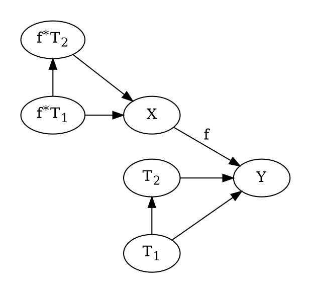

$f$ は連続であれば任意の関数であるが、
$g$ は射であるので局所同相であるため、  
$f^*g$ もまた、局所同相である
($f$はあくまでもドメインに影響するだけ).

### 層 $f_*S$ の定義

層 $(S, p: S \rightarrow X)$、
関数 $f: X \rightarrow Y$
が与えられたとき、
$Y$の上の層
$f_*S$
を定義する.

層$S$についての$U \in \O(X)$上の断面全体:
$$\Gamma(U) = \{ 連続関数~ a : \forall x \in U.~ p(a(x)) = x \}$$
を用いて、
$$f_*S = \{ (a, y) : \exists V \in \O(Y) .~ y \in V \land a \in \Gamma(f^{-1}(V)) \}$$
ただし同値関係
$$(a_1, y) \equiv (a_2, y) \iff
\exists V \in \O(Y) .~
y \in V \land
a_1 \lceil f^{-1}(V)
=
a_2 \lceil f^{-1}(V)$$
を定義して、これで割っておく.
$f_*S$ のための局所同相写像として、
$p(a,y) = y$
を用いる.
近傍は $y$ の近傍で定義する.
以上を以って、 $f_*S$ は層である.

$y \in V$ かつ $f^{-1}(V) = \emptyset$ なる $V$ が存在するとき、  
$\Gamma(\emptyset)$ は空集合なる関数唯一つからなるシングルトンである.
$$(\emptyset, y) \in f_*S$$

### 射 $f_*g$ の定義

今度は単に `fstMap g` で定義する:
$$f_*g: f_*S_1 \rightarrow f_*S_2$$
$$(f_*g)(a, y) = (g(a), y)$$

## $Hom$ の定義

層 $A$ から $B$ への射全体を
$$Hom(A, B)$$
と書くことにする.

## 大切な定理

$X$ 上の層 $(S, p: S \rightarrow X)$,  
$Y$ 上の層 $(T, p: T \rightarrow Y)$ とする.

連続関数 $f: X \rightarrow Y$ によって,  
$f^*T$ は $X$ 上の層,  
$f_*S$ は $Y$ 上の層である.

<fieldset>
<legend>定理</legend>
$$Hom(T, f_*S) \simeq Hom(f^*T, S)$$
</fieldset>

射 $g \in Hom(T, f_*S)$
に一対一で
射 $g^\# \in Hom(f^*T, S)$
を対応附けることでこれを証明する.

$$g: T \rightarrow f_*S$$
$$g(t) = (a, y)$$

についてある $V \in O(Y)$ が存在して次の3つが成立するのであった:
$$a \in \Gamma(f^{-1}(V))$$
$$y \in V$$
$$p(t) = y$$

最後のは $g$ が射であることから.
で、肝心の $g^\#$ を次で定義する:

$$g^\#: f^*T \rightarrow S$$
$$g^\#(x, t) = a(x)$$

> 適当なことを言うと、
$g$ は $t$ を $(a,y)$ に写すのだけど、
$y$は$p(t)$ に等しいので、結局 $t$ 以上の情報を持ってない.
$g$ は $t \mapsto a$ のデータしか含まれない.
$g^\#$ を見ると、
$(x,t) \mapsto a(x)$ になってる.
$x$ を $a$ に適用してしまってるのが気になるけど、
両辺から $x$ のデータをちょうど引き算できて
$t \mapsto x$ になるのなら、
$g^\#$ がデータとして持つ情報量は
$g$ に等しい.

$$p(g^\#(x,t)) = \left( p(a(x)) = x \right) = p(x,t)$$
であるので、
$g^\#$ が連続関数であることだけ確認すれば射であることが示される.
なんかまあ近傍をとっていけばそうなる.

一対一であることの証明。略。

