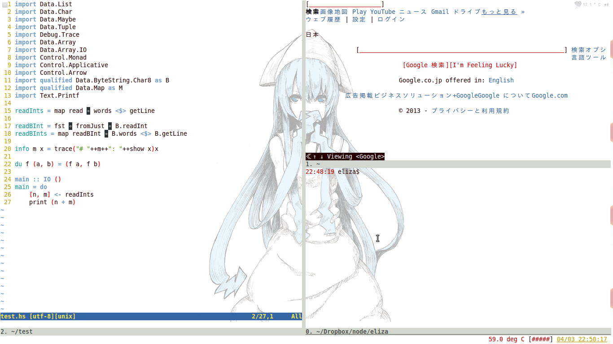

% Apr 03 2014

GNU screen には screen 一つに対して一つの hardstatus と、
window 一つに対して一つの caption があって、
別々のタイトルを付けたかった。
なぜなら、hardstatus には %w で全てのwindowsのタイトルを列挙させるけど、平気で10とか開いちゃうとどうせ全部見られなくて一部省略されるのがすごく気に触るから。

- captionには、そのwindow一つの情報を一行で表示して、
- hardstatusには、全体の情報を一行で表示する必要がある。

// これは、どだいムリな話なのである。

そこで、私がやりたかったのは、

- caption には、起動してる中で最後のプロセスの名前と、カレントディレクトリ
- hardstatus には、全てのwindow について、起動してるプロセスの名前

を表示させたかったけど、分からなかった。

妥協策として

- caption には、カレントディレクトリ
- hardstatus には、もうwindowに関する情報は一切表示さしない

hardstatus に window 一覧、%w を入れないのは、
我ながら、斬新だと思うけど。

## 設定ファイル

- [https://www.dropbox.com/s/ct68s3jm0ishzo2/bashrc.txt](https://www.dropbox.com/s/ct68s3jm0ishzo2/bashrc.txt)
- [https://www.dropbox.com/s/j9mz3oigh3tfjl6/screenrc.txt](https://www.dropbox.com/s/j9mz3oigh3tfjl6/screenrc.txt)

## 参考

- [shとbashでの変数内の文字列置換など - ろば電子が詰まっている](http://d.hatena.ne.jp/ozuma/20130928/1380380390)
- [Screen User's Manual](http://www.gnu.org/software/screen/manual/screen.html#Window-Settings)

