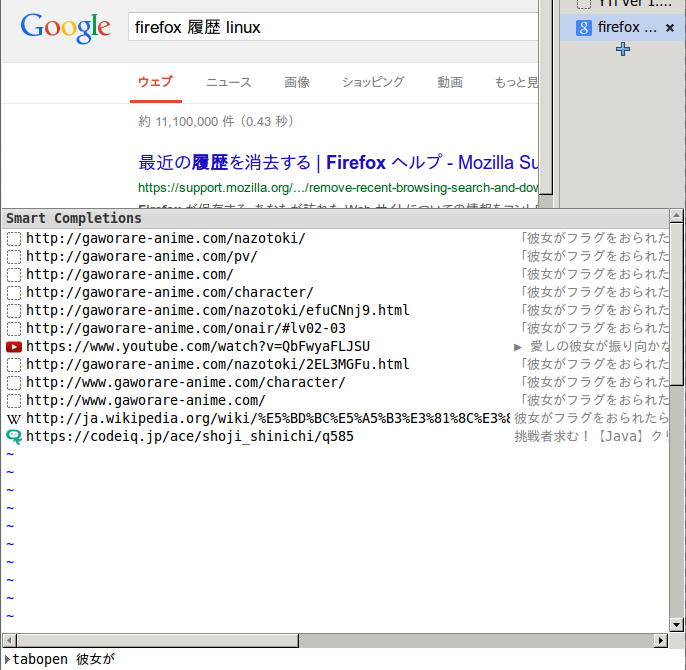
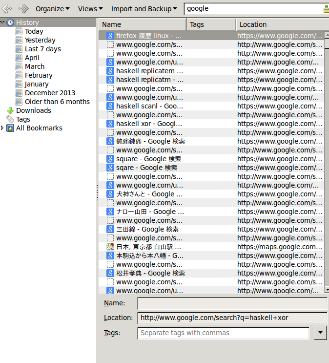

% May 04 2014

## 今年の抱負を定めた

あまりに俗っぽいのでここに書くことはしないけれど、
覚書帳にでもメモしておこう。

新しいマシンの環境を整える作業を私は楽しめるし、
それは本来楽しい性質のものだと思えるし、大丈夫だ、きっと

## memo :audio :device :volume

`alsamixer`はCLIで音出力の、デバイスに対する音量を調整できるが、大抵そこに表示されてるデバイスのほとんど多くはなんだかよく分からないものが並んでて、しかも外に繋いだものは表示されない。`pavucontrol`を使おう。

## Firefoxの履歴

色んなところでFirefoxの閲覧履歴は利用される。
何度も開いたことのあるページは、smart completion の名のもとに、
こちらがさぁて新しいページを開こうかなとしただけでFirefoxが薦めてくる。
役に立ったことはない。

中でも一番役に立たないのは、
googleの検索結果ページだ。
興味の対象はその先であり、それは役に立つことはある。
ページのタイトルらしきものを与えれば、そのページに行ける。
例えば

  
Figure 1. キーワード「彼女が」でタブページを新たに開こうとする図

というわけで、google検索履歴を削除したい。
ところがFirefoxの履歴削除は遅い。
もしかしたら単に、何件を、あるいは全てを削除するのは早いのかもしれない。
キーワードを与えて、例えば今の場合「google」というキーワードを与えて、
それによってフィルタされた履歴の削除は大変に遅い。
1000件くらいから怪しくなる。
5桁になると、ちょっとばかりFirefoxが返事をしなくなるのでコーヒーを入れる暇が出てくる。
単に、検索してから、全てを選択、するだけでも遅い。

  
Figure 2. Firefox閲覧履歴を「google」でフィルタした恥ずかしい結果

Ctrl+A で全選択をすると、10秒程ややあって、下に 11309 items と表示される。
精神的に良いのは、1000件程度ずつ選択して削除するのを11回繰り返すことだろう。
PCから手を離して時間を過ごすのが嫌いでない人は全て一片に削除すればいいけど。

## Google 検索履歴から振り返る今月

自分の履歴一覧を消すにあたって、こういう試みも面白いかもと思った。
でも、閲覧した日付の指定（月の指定）とキーワードでのフィルタとが同時にできそうにないのでまたいつかにする.

Google検索だときりがないので、Wikipediaくらいにするのはどうか
