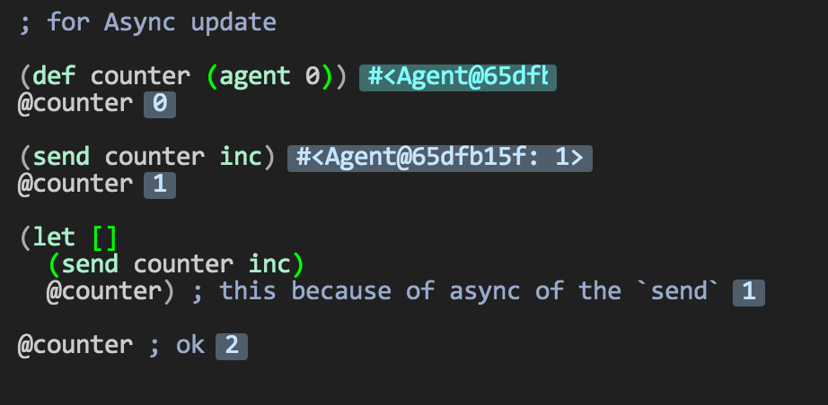
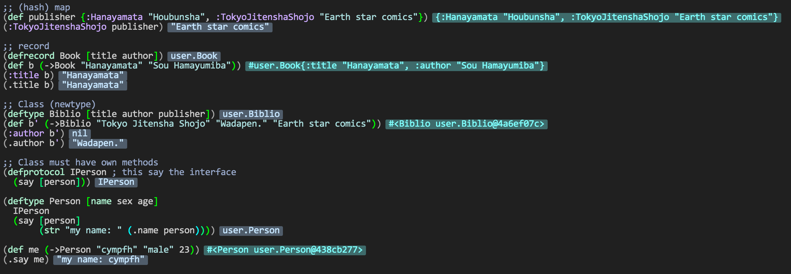

% Mon Sep 15 23:51:41 JST 2014

## Light Table を使ってみた

Clojure with Light Table, REPL editor  
partially practical i think

### three kinds of refference var

### infinitely sequence by `for`

too noisy...

### map, record and class

ugly class
