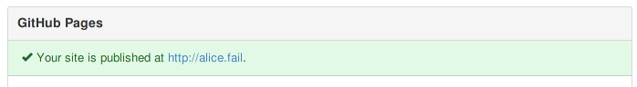

% Wed Jan  7 20:27:57 JST 2015

## 日記

サークルのためのwebページとして、
単にドメイン名を短く覚え易く見た目に可愛らしさとクールさがあるものが欲しいという理由で、
お名前.comでドメインをとりあえず一年契約し、
一緒に共有サーバ契約すると、お試しということであろうが、
3ヶ月1円だそうなので、それらを申し込んだ。
次の日にコンビニで3981円と手数料を支払って3時間か4時間後には使えるようになった。

この共有サーバというのがftp接続した用意してなくて、
この時代にftpはさすがに古臭すぎる。
github pages の便利さを思い知った。

静的なものしか置けないことと、
pushしてから実際に更新されるまでにタイムラグがあるというデメリットはあるけども。
(タイムラグについては、頻繁に更新されるページほど短く、めったに更新されない、特に作りたてのページは長いという経験則がある)

どうせ、手元にあるファイル全部をrecursiveにputする、という操作しかしないのに。
いちいち新しいファイルで上書きしますか？などと聞いてくるftpクライアントは馬鹿みたいだ。
gitのように勝手に差分を見て、それだけを送ってほしい。

[静的サイトをgithub.ioでホスティングし、独自ドメインでアクセスする - 結城浩のブログ](http://blog.textfile.org/20141014/github/)

これで良いのではないか。
試してみよう。 (下に追記アリ)

- [alice.fail](http://alice.fail/)
- [alice-lips.github.io](http://alice-lips.github.io/)

## 追記; Wed Jan 14 19:01:46 JST 2015

1. [Setting up a custom domain with GitHub Pages - User Documentation](https://help.github.com/articles/setting-up-a-custom-domain-with-github-pages/)
2. [Tips for configuring an A record with your DNS provider - User Documentation](https://help.github.com/articles/tips-for-configuring-an-a-record-with-your-dns-provider/)

順に従うだけ。

github pages に `CNAME` を置いた時点では、`hoge.github.io` に行くと CNAME に書いた url に飛ばされるだけになる。
DNSの設定が本当に反映されるまでに少しタイムラグがあって、(本当にその設定が正しいのかも分からないのに) 
多少手間取ったけど。

私の場合はお名前.comという一部で評判の良くないところを使ってるので、そのwebサイトの上で設定を以下のように行った。
こういうwebサービスは名称や使ってる言葉がころころ変わったりして、
役に立つかわからないけれども、以下のように。

下の2つを私が追加したのであって、このVALUEには、先に上げた2つ目の[ページ](https://help.github.com/articles/tips-for-configuring-an-a-record-with-your-dns-provider/)
に載っているIPアドレスを指定している。
このIPも、去年に一度変更があったらしいので、
もしかしたら将来も、チェックする必要が出てくるかもしれない。

github pages の[設定のページ](https://github.com/alice-lips/alice-lips.github.io/settings)
の方でも以下のメッセージが登場するようになる。

IPアドレスが変更するなどの警告も、ここに出るようである。
