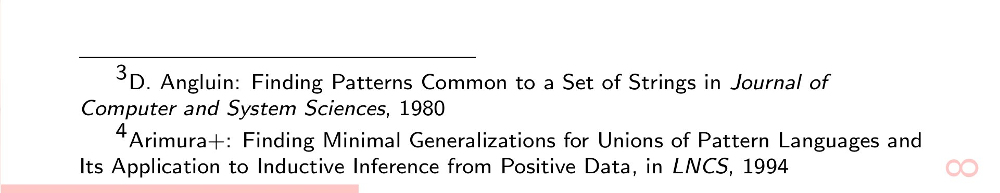
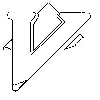
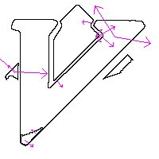

% Mon Sep 14 02:29:58 JST 2015

## beamerスライドでプログレスバーを出す

スライドの一番下のところに、
今示してるページは全体の何割あたりのところであるかを、
棒で可視化するやつ



プリアンブルに次を書いておく.
もちろん、`usetheme` を呼んだ後でないと上書きされる.

```tex
%%% FOOTER
\makeatother
\setbeamertemplate{footline}
{
  \dimen0=1.1\paperwidth
  \multiply\dimen0 by \insertframenumber
  \divide\dimen0 by \inserttotalframenumber
  \edef\progressbarwidth{\the\dimen0}
  \leavevmode%
  \setbeamercolor{progress outer}{fg=white, bg=white}
  \setbeamercolor{progress bar}{bg=pink!90!white}
  \begin{beamercolorbox}[wd=1.1\paperwidth,ht=0.25ex,dp=1ex]{progress outer}
    \begin{beamercolorbox}[wd=\progressbarwidth,ht=0.25ex,dp=1ex]{progress bar}
    \end{beamercolorbox}%
  \end{beamercolorbox}%
}
\makeatletter
```

本来、1.1という数字は要らないのだけど、なんか左右に余白が勝手にできるので (どっかでいじった？).

ついでながら、
ページ番号は、ナビゲーションの代わりに挿入させてる.

```tex
\setbeamertemplate{navigation symbols}{
  \setbeamercolor{footline}{fg=pink!90!white}
  \usebeamerfont{footline}%
  \usebeamercolor[fg]{footline}%
  \hspace{1em}
  \fontsize{2.8em}{2.8em}\selectfont
  \rotatebox{90}{\insertframenumber}
```

オシャレのつもりで90度回転させてるけど、どうだろう...

## Mon Sep 14 21:21:25 JST 2015

### Scala の List.diff が遅い

といっても、クイックソートと基数ソートを比べるようなものだけど...

```scala
import scala.math._
import scala.collection.mutable.{Queue, Set}
import scala.collection.immutable._
 
object Main {

  // 時間計測
  def thetime(proc: () => Unit): Unit = {
    val start = System.currentTimeMillis
    proc()
    println((System.currentTimeMillis - start) + "msec")
  }

  // 関数型っぽい普通の差分
  // ただしソート済みであることを前提とする
  def difference(xs: List[Int], ys: List[Int]): List[Int] = {
    def sub(ac: List[Int], xs: List[Int], ys: List[Int]): List[Int] = {
      if (xs.length == 0) ac.reverse
      else if (ys.length == 0) ac.reverse ++ xs
      else if (xs.head == ys.head) sub(ac, xs.tail, ys.tail)
      else if (xs.head > ys.head) sub(ac, xs, ys.tail)
      else sub(xs.head :: ac, xs.tail, ys)
    }
    sub(List(), xs, ys)
  }

  // 一回配列 [Bool] にしてから差分を出す
  // ただし、リストの要素が [0 ... n] であることを前提とする
  // (基数ソートっぽい)
  def viaArray(n: Int, xs: List[Int], ys: List[Int]): List[Int] = {
    val a = Array.fill(n)(false)
    val b = Array.fill(n)(false)
    for (x <- xs) a(x) = true
    for (y <- ys) b(y) = true
    var ret = List[Int]()
    for (i <- 0 until n) if ((!a(i)) && b(i)) ret = i :: ret
    ret
  }

  def main(args: Array[String]) {
    val cin = new java.util.Scanner(System.in)

    val a: List[Int] = Range(0, 100000) toList
    val b: List[Int] = Range(100, 10000) toList
    val c: List[Int] = Range(10, 1000) toList
    def a1(): Unit = println((a diff b).length) // 10^5 * 10^4
    def a2(): Unit = println((b diff c).length) // 10^4 * 10^3
    def b1(): Unit = println(difference(a, b).length)
    def b2(): Unit = println(difference(b, c).length)
    def c1(): Unit = println(viaArray(100001, a, b).length)
    def c2(): Unit = println(viaArray(100001, b, c).length)
    thetime(a1)
    thetime(a2)
    thetime(b1)
    thetime(b2)
    thetime(c1)
    thetime(c2)
  }
}
```

結果が以下のよう

```
# List.diff (組み込み)
90100
96msec
9000
3msec
# 自前 difference
90100
2956msec
9000
25msec
# 自前 differenceViaArray
90100
43msec
9000
2msec
```

組み込み `diff` のソースコードがどこにあるのかわからないので読んでないのだが、
`differenceViaArray` に較べて 二倍程度 遅い.
`a-b` と `b-c` を比べると、 $O(n^2)$ というわけでもないようだけれど.

`thetime(() => println(0))` って書きたいんだけど、型エラーでコンパイルできない.
なんだろう.

## Mon Sep 14 02:29:58 JST 2015

### 簡易的な、画像の自動分類を試す

画像識別といえばNNsだけど、
SIFTに代表されるような旧き良き画像特徴量を用いた
分類を行う.

### 事前処理

扱いやすさのために次の情報をわざと失う

- 色
- 比

具体的には、
モノクロにし、比率を無視した200x200の大きさにリサイズして
出来た画像を、直接扱うことにする.
また、輪郭だけを取り出したほうが良い特徴量が得られる気がするので、そのようにする.

> 改良としては、色の情報を用いること.
画像にはカラー画像とモノクロ画像とがあるので、
まずどちらであるかを分類して、
それぞれで学習した異なる分類器を作るのが良いだろう.
また、何で分類するかであるが、
例えば画像に写った顔で分類するなら、
顔を検出してそこだけ取り出すとかは、
普通すべきことだろう.
今回はそこまでするつもりはない.

モノクロやリサイズはツールで簡単に出来るにしても、
輪郭を取り出すのはそんな簡単にできるだろうか、
とググったらすぐに見つかった.
今回は
[ImageMagick で写真の輪郭を取り出す - Oi!](http://www.johf.com/log/20130304b.html)
を参考にする.
そこに載ってるコマンドに `-reize` と `-monochrome` だけ追加して

```sh
convert -resize 200x200! -segment 1x1 +dither -colors 2 -edge 1 -negate -monochrome in.jpg out.jpg
```

となる.

さらに、`jpg` のようなバイナリだとそのままでは読めないので、
テキストとして読める `ppm` にすることにする.

```sh
convert -resize 200x200! -segment 1x1 +dither -colors 2 -edge 1 -negate -monochrome -compress none in.jpg out.ppm
```




これで、画像はグレイスケールの行列 $E$ として表現される

$$0 \leq E_{i,j} \leq 255 (0 \leq i, j < 400)$$

### 画像特徴量

画像をさらに、画像に適した特徴量 (アフィン変換に不偏であるとか云々) 
に変換することが必要.
ざっくりとどういうのがあるのかは
[画像認識の初歩、SIFT,SURF特徴量](http://www.slideshare.net/lawmn/siftsurf)
を読むと良い.

最悪自分で実装しようと思ったが、
[OpenSIFT: An Open-Source SIFT Library](http://robwhess.github.io/opensift/)
てのがあったのでこれを用いる.
ソースがurl先で配布されてるので自分でビルドして使う.

```
./robwhess-opensift-6233815/bin/siftfeat -o hoge sample/out.ppm
```

```
Finding SIFT features...
Found 17 features.
```

`hoge` というテキストファイルが生成されて、
あとついでに、得られた特徴量を可視化したのであろう画像  

が表示される
(というか、たったの17個かぁ).

この `hoge` を元に、学習・分類すればよいわけである.
どう使おう.

### `hoge` ファイルの読み方

頭のほうだけ見てみると

```
17 128
46.330449 144.342443 9.258731 2.132983
 13 26 13 87 107 1 0 0 59 62 9 12 100 34 0 0 114 113 12 2
 63 34 2 4 23 45 22 9 35 83 7 7 32 12 2 23 117 87 11 5
 117 42 1 3 54 71 16 20 25 87 21 3 59 117 60 24 23 70 36 9
 6 7 49 90 3 0 0 0 40 117 40 5 83 27 8 2 25 87 42 29
 36 20 13 5 9 66 46 67 9 0 0 0 0 3 44 114 0 0 0 0
 12 25 1 0 3 6 2 0 35 74 33 17 28 6 3 0 0 4 22 96
 6 0 0 0 0 0 0 17
46.330449 144.342443 9.258731 -0.172558
 0 36 45 6 3 1 1 0 1 35 95 8 0 0 0 0 1 10 92 24
 :
 :
```

つまりこういうことだろう.
一つの特徴量が $N$ 次元の特徴量が $M$ 個あるとき、
一行目は

```
M N
```

二行目以降、$M$ 個、データセットが複数行に渡って与えられる.
一つのデータセットはこう

```
x y z w
 a1 a2 .. aN
```

$x,y,z,w$ が何を意味するのかよくわからない.
特徴量が見つかった点の座標と長さと、もうひとつは、角度？かな？

$a_1 ... a_N$ が実際の、特徴量.
長さの情報はこちらに含まれるのでゎ？
まぁ、いいや、実際に使うのはこっちだけにしよう.

### 学習データの整形

一つの画像から、$M$ 個の特徴量が見つかって、
全部合わせると $NM$ 次元の特徴量が見つかる.
$N$ は $128$ で固定だけど、$M$ は画像によって異なる.

画像ごとに次元が違うのは困るので、
どうするのかというと、
確か、
大きいのから$m$個拾ってくるということをすることで、
次元を揃える.
「大きい」ってどうやって見るんだろう.
`hoge` を見ると、
データセットは $x,y,z,w$ の順に並んでるというわけでも
ないようなので、「大きい」順に出力されてるのかもしれない.
いやそうに違いない.
$m$ 個に足りない場合は、ゼロで埋める.

`hoge` を簡単に、学習用のデータにしよう.
そもそも何の学習器を用いるか考えてないけど、
どうせ学習データのフォーマットはみんな決まってる.

bashスクリプトで書いてみる.

```bash
m=10 # 例えばね
cat hoge |
grep '^ ' | # 使いたい特徴量はみんな空白で始まる行に書かれる
grep -o '[0-9]*' | # 数字単位で改行
head -n $(( $m * 128 )) | # 使うのは最初の m*128 個
awk '{print $1 + 1}' | # 0-origin が出力されるので 1-originにする
sort -n | uniq -c | # 数える
sed 's/^ *\([0-9]*\) \([0-9]*\)/\2:\1/' | # <1-origin id>:<個数> のフォーマットにする
tr '\n\' ' ' # 改行を空白に置換
```

邪魔なコメントと改行を取り除くと下のようになる

```bash
m=10;
cat hoge | grep '^ ' | grep -o '[0-9]*' | head -n $(( $m * 128 )) | awk '{print $1 + 1}' | sort -n | uniq -c | sed 's/^ *\([0-9]*\) \([0-9]*\)/\2:\1/' | tr '\n\' ' '
```

### 学習

画像処理の分野での主流が分からないけど、
まあ、分類といえばSVMでしょ.

- [SVM-Light Support Vector Machine](http://svmlight.joachims.org/)

バイナリが配布されていてそのまま使える.

学習・テストデータは、
一行に一つのデータセットを書いたテキストファイル.
一つのデータセットは、

```
<target>\t<1-origin id>:<weight>\t...<1-origin id>:<weight>
```

`<target>` はデータセットの分類結果.
学習の場合には、`1` または `-1` と書く.
結果がわからない場合には適当に書いておけばいい
(`0` とか書いとけばいい?).

`<1-origin id>:<weight>`
は先ほど作ったものをそのまま用いればよい.
先ほどのでは `<weight>` として、そのIDの出現回数を用いた.
普通は正規化くらいするわな (`特徴量正規化`).
大抵の場合、正規化はするほうがよい.

改めて書くと、

```bash
( echo -n '1 '; cat hoge | grep '^ ' | grep -o '[0-9]*' | head -n $(( $m * 128 )) | awk '{print $1 + 1}' | sort -n | uniq -c | sed 's/^ *\([0-9]*\) \([0-9]*\)/\2:\1/' | tr '\n' ' ' ; echo ) > train
svm_learn ./train
```

って感じ
(これは訓練事例1つだけで訓練したもの).

道具は揃ったので、あとはやってみるだけ.
画像は元々持ってるのを使う.

「ゆゆ式」の画像54枚をポジティブとする.
(キャラクターじゃなくてアニメを直接ターゲットとするのは、
本当はどうかと思う)
思ったより手持ちが少なかった.
ネガティブ（「ゆゆ式」ではない画像）はいくらでもあるのだけど、
ポジティブに対して極端にネガティブが多いと良くないので、
同じ54枚だけ使うことにする.

```bash
#!/bin/bash

m=70

: > ./train

target=1
for f in `cat posimgs`; do
  convert -resize 200x200! -segment 1x1 +dither -colors 2 -edge 1 -negate -monochrome -compress none $f out.ppm
  ./robwhess-opensift-6233815/bin/siftfeat -x -o sift.txt out.ppm
  (
  echo -n "$target ";
  cat sift.txt | grep '^ ' | grep -o '[0-9]*' | head -n $(( $m * 128 )) | awk '{print $1 + 1}' | sort -n | uniq -c | sed 's/^ *\([0-9]*\) \([0-9]*\)/\2:\1/' | tr '\n' ' ' ;
  echo ) >> train
done

target=-1
for f in `cat negimgs`; do
  convert -resize 200x200! -segment 1x1 +dither -colors 2 -edge 1 -negate -monochrome -compress none $f out.ppm
  ./robwhess-opensift-6233815/bin/siftfeat -x -o sift.txt out.ppm
  (
  echo -n "$target ";
  cat sift.txt | grep '^ ' | grep -o '[0-9]*' | head -n $(( $m * 128 )) | awk '{print $1 + 1}' | sort -n | uniq -c | sed 's/^ *\([0-9]*\) \([0-9]*\)/\2:\1/' | tr '\n' ' ' ;
  echo ) >> train
done

svm_learn ./train a.model
```

```
Runtime for XiAlpha-estimates in cpu-seconds: 0.00
XiAlpha-estimate of the error: error<=93.58% (rho=1.00,depth=0)
XiAlpha-estimate of the recall: recall=>7.27% (rho=1.00,depth=0)
XiAlpha-estimate of the precision: precision=>7.27% (rho=1.00,depth=0)
Number of kernel evaluations: 3822
```

全然ダメと読む.

`convert` での事前処理を省いたり、
使う特徴量を増やしたりしたけど全然ダメだった
