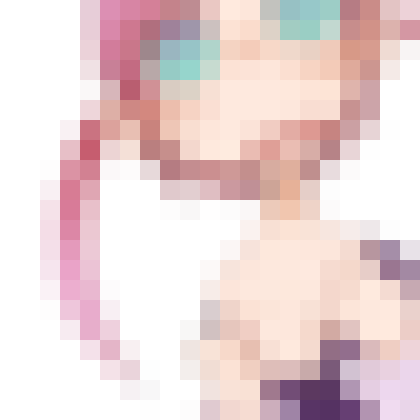

% Wed Sep 23 10:11:49 JST 2015

## モザイク画像を作る

3日くらいかかっていた (季節の変わり目) 風邪も、
椅子に座って作業ができる程度には治った.

風邪の時に特有な、体の関節が痛かったり、妙に皮膚が敏感なあの症状には、
何か名前があるのだろうか.
きっとあるのでしょうね.

<table>
<tr><td>original.png</td><td>out.png</td></tr>
<tr><td>
</td><td>
</td></tr></table>

```bash
convert -resize 40x40 -compress none original.png temp.ppm
./main.exe < temp.ppm > out.ppm
convert out.ppm out.png
```

`main.exe` は以下通り

```cpp
#include <bits/stdc++.h>
#include <unistd.h>
using namespace std;

#define rep(i,n) for(int i=0;i<(n);++i)

using vi = vector<int>;
using vvi = vector<vi>;

int main(int argc, char*argv[]) {
  cin.tie(0);
  ios::sync_with_stdio(0);
  cout.setf(ios::fixed);
  cout.precision(10);

  string typ; cin >> typ;
  int h, w; cin >> w >> h;
  int col_depth; cin >> col_depth;

  vvi r(h, vi(w, 0));
  vvi g(h, vi(w, 0));
  vvi b(h, vi(w, 0));

  rep (i, h) {
    rep (j, w) {
        cin >> r[i][j] >> g[i][j] >> b[i][j];
    }
  }

  int mag = 20;
  cout << typ << endl;
  cout << (w*mag) << ' ' << (h*mag) << endl;
  cout << col_depth << endl;

  rep (i, h * mag) {
    rep (j, w * mag) {
      cout
        << r[i/mag][j/mag] << ' '
        << g[i/mag][j/mag] << ' '
        << b[i/mag][j/mag] << endl;
    }
  }

  return 0;
}

```

## 追記 (Wed Aug 31 23:09:29 JST 2016)

無圧縮PPMにおいて画像サイズは 高さ、幅 の順に与えられるものとばかり思っていたが逆で、 幅、高さ の順に数字がくるらしい.
ただしピクセルの並びを思っていたとおり、左上から右に走って、端に来たら一つ下の1番左に戻る.
上のコードは逆に勘違いして書いていたので訂正します.
