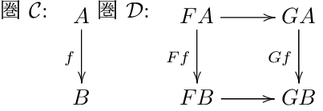
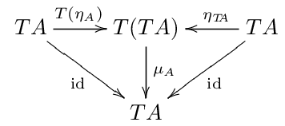
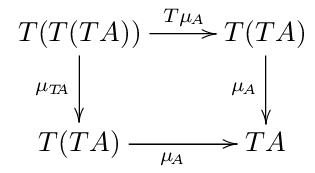
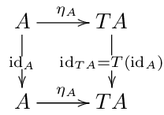
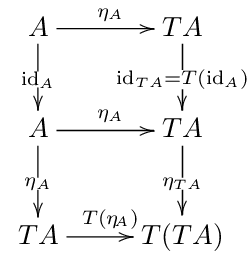
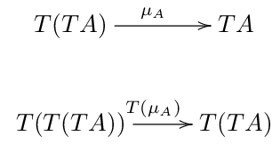
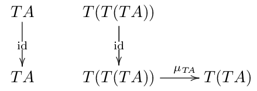
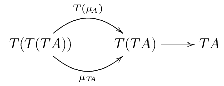

% Sat Sep 26 12:04:17 JST 2015

この記事における可換図式は全て LaTeX の xy パッケージを用いて作成した.
拡張子の .png を .tex に変えてアクセスすればソースがある.

## 手カウントを加算させるやつ

お互いの両手を用いる二人ゲーム.
手は指を立てることで、1から5の状態を取ることができる.
ただし5は0と同一視して、以下 mod5 を取る.
プレイヤーは交互に、
自分のどちらかの手で相手のどちらかの手を選択して叩く.
叩かれた手は叩いた手の値だけ加算される.
5になった手は死ぬ.
死んだ手を用いて叩くことはできない.
また、死んだ手を叩く対象に選ぶこともできない.
先に両手が死んだ人の負け.

初期状態は、両手ともに1を示している.

初め、メモ化再帰で解こうとしたが、
簡単にループに陥ったのでやめ.

簡単な考察として、

1. ある状態から始めるとループに陥る
1. もっと言えば、到達できない状態がある
1. あいこは存在しない

ダイクストラ的に、
ゲーム木の上を自明な解から辿って行くことにする.

状態をテーブル `int f[5][5][5][5]` で表現する.
これからアクションを起こす側の手を $(i, j)$ 、もう一方を $(k, l)$ とするとき
`f[i][j][k][l]`
は、
アクションを起こす側が必勝なら、$1$ 負けるならば $-1$、
到達不可能な状態であるならば $0$ という値を格納させる.

ダイクストラするために適切な初期状態が必要である.

1. 全ての $(k, l) \ne (0,0)$ について `f[0][0][k][l] = -1`
1. 他は `0`

とした.
この 1 ($((0,0), (k,l)) : (k,l) \ne (0,0)$) をスタートにして、
ダイクストラ的に、
深さ優先探索を行う.

ソースコードは次の通り.
Ideoneは出力まで一緒に載せられるので便利だが、
課金してないと一定時間で消えるそうなので、
gistも合わせて置いておく.

- [Ideone.com - grY14J](https://ideone.com/grY14J)
- [手でカウントさせる二人完全情報有限和うんたらゲーム](https://gist.github.com/cympfh/23aabe29b61335e94279)

## 自然変換

関手 $F: C \rightarrow D$
とは
圏$C$ における $f: A \rightarrow B$ を
正しく
$Ff: FA \rightarrow FB$
に映すような写像であった.
つまり、内部に対象を写す写像と射を写す写像の2つを持っている.

2つの関手 $F, G: C \rightarrow D$ について、
自然変換 $\alpha: F \rightarrow G$ とは、

における右側を可換にするような
2つの射 $FA \rightarrow GA$ 及び $FB \rightarrow GB$
を
任意の $f: A \rightarrow B$ に対して
与えるような何か ($\alpha$) のことである.

便宜上、この2つの射のことを
$$\alpha_A: FA \rightarrow GA$$
$$\alpha_B: FB \rightarrow GB$$
と呼ぶ.

## モナド

定義としてはこう.
モナドとは三組 $(T, \eta, \mu)$ のことであり、
$T$ は圏から自己圏への関手.
$\eta$ とは $id \rightarrow T$ という自然変換.
$\mu$ とは $T \cdot T \rightarrow T$ という自然変換.

条件として、任意の対象 $A$ について、
次を可換にすること.

以上が定義の丸写しである.
ちょっと理解が及ばないので、いじって遊んで見ることにする.

まず、ひとつ目の三角の可換図式から.

1. $id_A: A \rightarrow A$ を 関手 $T$ で写す.

$A$ 以外の対象が定義に出てこないのだから、この射を考えるしかしょうがない.

自然変換 $\eta$ は $id \rightarrow T$ っていうものなので、
次のような $\eta_A$ が存在する.

2. この下辺にある $\eta_A: A \rightarrow TA$ を関手 $T$ で写す.

これで、
定義に出てくる射が出揃った.
$\mu_A$ 以外.

定義にある
$\mu_A$ は
一番右下にある $T(TA)$ から一つ左の $TA$
または一つ上の $TA$ のどちらでも行ける.

定義の可換図式は、
次の意味で、$\eta_{TA}$ と $T(\eta_A)$ は同じものだと言う.

$$\mu \cdot \eta_{TA} = \mu \cdot T(\eta_A)$$

$\mu$ についてもう少し.

$id: A \rightarrow A$ について、自然変換 $\mu$ は
$\mu_A: T(TA) \rightarrow TA$ という射を導く.
これをさらに関手$T$ で写すことができる.

また、$id: TA \rightarrow TA$ については、自然変換 $\mu$ によって次を導ける.

これで2つの射
$$T(\mu_A), \mu_{TA} : T(T(TA)) \rightarrow T(TA)$$
が得られたことになる.

定義の四角い方の可換図式は、この2つの射を次のように合わせても良いことを言う.

