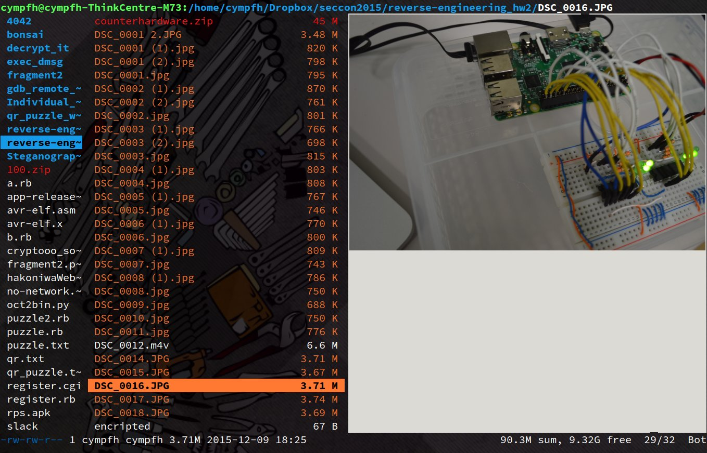

% Mon Jan 11 23:11:17 JST 2016

## Linux, terminal, ranger

ranger はターミナルから使うCLIなファイルマネージャ.



- [ranger cli | 画像検索](https://www.google.co.jp/search?site=imghp&tbm=isch&source=hp&biw=1200&bih=1495&q=ranger+cli&oq=ranger+cli&gs_l=img.3..0i19l10.1506.2517.0.2666.10.10.0.0.0.0.184.942.6j3.9.0....0...1ac.1.64.img..1.9.940.9D9kIicUoQg)
- [ranger](http://ranger.nongnu.org/)
- [man](http://ranger.nongnu.org/ranger.1.html)

もちろん、
いわゆる (もちろん GUI の) ファイルマネージャ (e.g. nautilus, thunar)
と同様に、
当たり前のファイルの操作ができる.
それでCUI. でも、それだけなら vim でいい.
普通、GUI のファイルマネージャをわざわざ起動するのは、
画像や動画のサムネイルを見て直観的にファイルの移動や削除を行いたいから.

ranger は、できるだけ徹底的にプレビュー機能がついている.
動画ならサムネイルを生成するし、
テキストファイルのちょっとしたプレビューもある.
その際には可能な限りの外部コマンドを使ってる
(`ranger/data/scope.sh`).
ソースコードなら、`highlight` があれば、ハイライトして (htmlを出力する) から表示する (htmlはw3mを使う).
画像なら、`w3mimgdisplay` を使って画像をターミナルに表示してしまう (頭の画像).
w3m がなければ lynx を使う. lynx がなければ...

## INSTALL

`apt-get` にもあるけど古い. バージョン 1.7代が今の最新.
中身は実はただのスクリプトファイルなので、頭に貼った公式のwebページから直接ダウンロードしてくるのがいい.

ちなみにデフォルトだと、プレビュー機能はオフになってる.
動作が遅くなるしね.

画像のプレビューなら (vim 同様に)

```
:set preview_images true
```

すると機能がオンになる (タブ補完が効く).
`true` ってのは、`on/On/true/True` でもいいし、
対義語は `off/Off/false/False`.
設定ファイルを用意しておくことができて (後述)、
それに予め書いておけば、毎度設定する必要はない.

## GNU screen, SIXEL

私が使っているターミナルは terminator っていうんだけど、
まあ、最近のなら、大抵、画像を表示する.
(`apt-get w3m-img` して、 `w3m google.co.jp` してみるといい.)

しかしながら、
私はいつも、terminator の上に更に GNU screen を実行してして、
その上で全ての操作をしている.


どうやら、GNU screen は画像を表示できないらしい.

そうだった、そうだった.
それでこれだ:

- [GNU Screen - バグ: bug #45506, sixel integration [Savannah]](http://savannah.gnu.org/bugs/?45506)

見方がよくわからないけれど、たぶんまだ組み込まれてはいないんだよね、たぶん

本体に組み込まれてないなら、無理に使いたくない.
一回だけデタッチして任意のコマンドを一つだけ実行して、
それが終了したら自動的にアタッチしてくれる、みたいなコマンドがあればいいんだけど.

```
terminator -e ranger .
```

で誤魔化そう.

## 設定ファイル

こんな感じ

```
   cat ~/.config/ranger/rc.conf
set preview_files true
set preview_images true
set tilde_in_titlebar true
```

設定項目は、起動した ranger の上で、`?` `s` を順にタイプすると、
設定事項のリストが出てくる.

## でも正直

受け売りで色々書いたけど、画像のプレビューはできたけど、
pdf のプレビューとかソースコードのハイライトとか、
本来は出来るんだろうけど、
まだ手元で再現できてない.
設定が面倒すぎるという印象.
しかも、最悪自分で(bash) スクリプトを弄ってね、という姿勢らしい.

