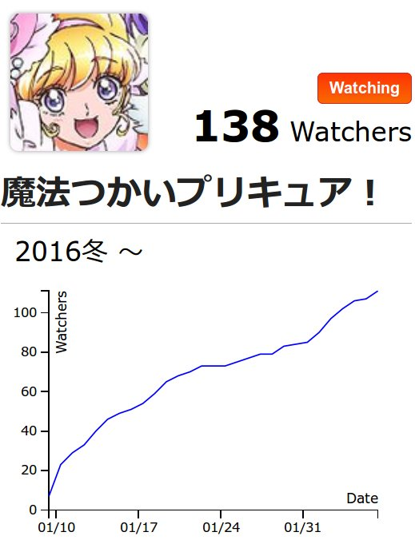

% Sun Feb  7 12:58:53 JST 2016

## Animetick, webスクレイピング

Animetickという個人的に好きなサービスがある.
端的に言えば、今の時期に放送されているアニメについて、
どれを見ていて、どの回をまだ見てないかを管理するだけのツールである.

少し詳細に機能を言う.

あるアニメについて、私は見逃したくないと思っている.
そういう場合はアニメのタイトルの横にある "Watching" ボタンを押す.
そうすると、過去放送された回について、まだ見ていないと登録され、
「未視聴チケット」が発行される.
放送回一つに対応付けられているので、
その回を見たら、チケットを消す.
新しい放送がなされたら、新しくチケットが発行される.
もうそのアニメは見ないのでチケットを発行してほしくない、過去のチケットも見たくない、という場合は、
再び "Watching" を押すことで、Watchingの状態を解除できる.

他にもできることはある

- どんなアニメが今放送されているかの確認
- 他の人が最近何を見たか
- どのアニメはどれだけの人に見られているか (Watcher数)

特にこの3つめは良い.
どれだけの人に、というのは、Animetickの上でWatching登録しているユーザーの数である.
管理ツールという性質上、かなり正確な数字に思われる.
なぜなら、見たくなくなったら、即座に外すことが、ユーザーにとっても利益だから.

でも逆に登録を面倒臭がって、
本当に最終話まで見続ける覚悟が出来て始めてWatchingを押すような人もいるかもしれない.

## Watcher数の統計情報

今現在の具体的なWatcher数は、アニメタイトルに固有なページにアクセスすると見られるし、
過去三ヶ月の、Watcher数の推移が折れ線グラフとして表示してくれる.



内部的にはどれだけデータを置いてるのか知らないけれど、
どうも、どんな古いタイトルについても、
ページを閲覧した時点を含めた過去三ヶ月の表示しかしてくれない.


しょうがないので自分でデータを持っておこう.

```bash
curl -s "http://animetick.net/anime/$ID" -H 'Cookie: _animetick_session=長い文字列--少し長い文字列' >$TMP
```

持っておきたいデータとしては、アニメのタイトル、放送シーズン (これは念の為)、Watcher数、
そしてデータを抜き出した時刻.

```
TITLE=$(cat $TMP | grep -A 4 '<div class="anime-info-bottom">' | grep -o '<h2>[^<]*</h2' | sed 's/^....//g' | sed 's/....$//g')
SEASON=$(cat $TMP | grep -A 4 '<div class="anime-info-bottom">' | grep -A 1 '<div class="season">' | tail -1 | tr -d ' ')
NUM=$(cat $TMP | grep '<span class="watcher"><span class="num">' | grep -o '[0-9][0-9]*')
DATE=$(date "+%m/%d %H:%M")
```

こんなのをログとして持っておく.

`ID` は、http://animetick.net/anime/list みたいなところからリストを作っておく.

### 結果

こんな感じ: http://sprunge.us/BFUM

一番右の数字がWatcher数である.
これがそのアニメの人気度なわけである.
(たぶんね.)
(といっても1クールで終わる深夜アニメと、ドラえもんみたいなタイトルを比べるのはおかしいけど.)

これを半年以上続けて、推移を見て楽しもう.
ある時点でがくっと減ったりしてたら、楽しそう.

## アニメリストの取得

その日の放送時間のズレにも対応しているのであれば、

http://animetick.net/anime/list

は結構便利なテレビ欄として使える.
確認したら使う.

