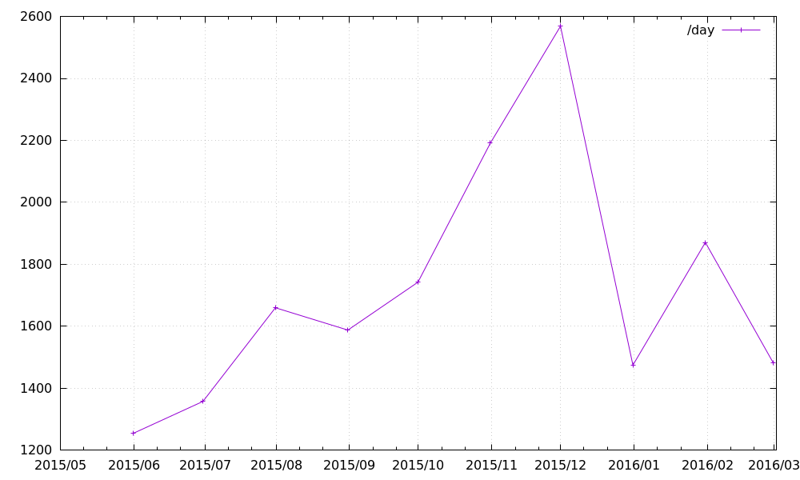

% Thu Mar 17 14:06:30 JST 2016

## 家計簿 (食費・雑費)

日付、支出額、買い物の中身をタブ区切りで記録する.  
年は日付に含めず、年ごとにファイルを作ることにしてる.

```
   cat 2016.tsv
MM/DD\tYEN\t備考 (買ったもののメモとか)
03/17\t108\tドーナツ
03/17\t380\t夕食
```

ざっと、お金を使いすぎたか、節約できてるかを見積もるための方法として、
一日あたりの支出を月ごとに出してみて、今月の額を過去の額と比較するというのがある.

> 今日一日の支出だとバラつきがあって当前なので、一ヶ月のスパンで平均を出すわけ

以下のスクリプトを `perday` として置く.

```bash
#!/bin/bash

TMP=`mktemp`

if [ $# == 0 ]; then
  cat > $TMP
else
  cp $1 $TMP
fi

echo "month      average        yen  days"
for m in {01..12}; do
  SUM=$(
  cat $TMP | grep "^$m" | sort -k1,1 -n | grep '	' | awk -v s=0 '{s+=$2} END{print s}'
  )
  DAYS=$(
  cat $TMP | grep "^$m" | sort -k1,1 -n | grep '	' | cut -f1 | uniq | wc -l
  )

  if [ $DAYS -gt 0 ]; then
    echo -n "$m    "
    ruby -e "print sprintf('%12.3f %10d %5d', $SUM/$DAYS.to_f, $SUM, $DAYS)"
    echo
  fi
done

rm $TMP
```

`./perday 2016.tsv` とか `cat 2016.tsv | ./perday` として使う.

```
   ./perday 2015.tsv
month      average        yen  days
06        1253.414      36349    29
07        1357.226      42074    31
08        1659.452      51443    31
09        1587.433      47623    30
10        1742.097      54005    31
11        2191.333      65740    30
12        2568.348      59072    23
   ./perday 2016.tsv
month      average        yen  days
01        1474.258      45702    31
02        1870.379      54241    29
03        1482.125      23714    16
```



