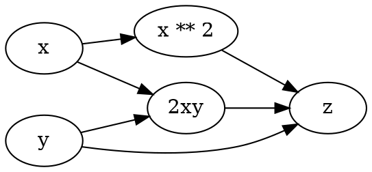

% Sun Jul  3 12:40:03 JST 2016

昨日2日、 `Chainer Meetup #03`
([http://chainer.connpass.com/event/32917/](http://chainer.connpass.com/event/32917/))
なるものに参加した.

趣旨としては、chainer の開発者 (つまりPFNの中の人たち) が chainer について直接語るので、みんな chainer をもっと使ってくれ、というもの.
それから無関係な人たちが chainer を使ってこんなことをしたというLTをする、
要するに chainer の布教活動.
あと NVIDIA がスポンサーとなっているので、NVIDIA の中の人が、
chainer ユーザーに向けた GPU やら CUDA やらの紹介、宣伝をするもの.

以下、メモ

## Chainer, CuPy入門  -- 海野

- Chainer Meetup の最初は毎回、これであるらしい.
- v1.10 向け

### ニューラルネットワークの説明

- 一般にニューラルネットワークはDAG構造 (計算グラフ) を持った合成関数
    - 計算をDAGにデータを流すことで行う
    - 逆伝播はDAGを逆方向に何かしらを流す
- chainer は計算グラフの設計だけをすれば、他は自動でやってくれる
    - 実際的には `Variable` オブジェクトの順伝播の計算式を書くことで、計算グラフを表現する
    - 例; `z = x ** 2 + 2 * x * y + y`
        - `x` や `y` は `Variable` オブジェクト
        - 累乗を計算する `** 2` とか四則演算が定義されていて、その結果も `Variable`
        - 上の計算式は、下の計算グラフを記述したことと同等

### Chainer による設計の方法

- `Link`
    - パラメータ付きの関数
- ロス
    - `Function` にすぎない
    - 一つの値が得られるように自分で設計しても良い
    - 出てきたロスを使って勾配を計算
    - Optimizer を update することでパラメータを更新

### Cupy の話

- numpy 互換の CUDA ライブラリです
    - numpy 互換こそが設計思想
- GPUを使う研究がかなり増えてきた
    - 昔はGPU使う研究なんてニッチだったのに
    - 自分で直接CUDAなんて書いたら吐く
    - 裏で nvcc コンパイラが走ってる
- 深層学習以外でももちろん便利に使える

## Chainer v1.8から1.10の新機能  -- 得居

- CaffeFunction の対応
    - Python2 にしか対応してなかったが Python3 でもok
- Weight Initializer
- float16/64 への対応
    - が進みつつある
- いろんな Function Link が追加された
    - `Variable.__getitem__` (`F.get_item`)
        - ベクトルの indexing
    - 他にもいろいろ
        - cast, clip, log1p, minimum, permutate ....
- cupy 側
    - `cupy.nonzero`
        - ゼロでない添字の列挙
- chainer の開発方針の話
    - minor release
        - 2週間毎と決めていた
        - 何か機能追加があれば、2週間しなくてもバージョンアップしていく

### 近い今後の機能

- これから (v1.11-1.12)
    - TheonoFunctions のサポート
    - streamの対応 (??)

- Dataset and Trainer
    - データセットの上の反復、学習の反復を抽象化する
    - Trainer は Reporter を用いて集計を行う
        - `chainer.report`
    - https://twitter.com/unnonouno/status/749119081324769280

### もっと今後の予定

- メジャーアップデートを行う
    - 後方互換性を切ってしまうようなアップデートです
    - 今年10-12月を予定
- CuPy を chainer からレポジトリレベルで分離する
- パッケージシステム
    - FunctionとかLinkとかなんとかを管理、公開するためのシステム
- CPU/GPU のやりとりを非同期にやる
- Parameter shape inference

## マルチメディアで云々  -- 中山さん

http://www.nlab.ci.i.u-tokyo.ac.jp/

中山研究室での実用例のご紹介

1. 動画からの物体追跡 and 識別タスク
    - 静止画に比較して動画の場合はまだまだこれだという手法が定まってない段階
    - RNNで時間方向のダイナミクスをモデル化
        - Noriki Nishida, Jan Zdenek, Hideki Nakayama, "Object Detection from Video with Nested Recurrent Neural Networks"
    - 毎フレームをぶち込むための (outer) RNN と、1フレームを読むための (inner) RNN
    - ただし
        - 時間を考えず、フレームごとに独立に物体識別するのが state-of-the-art

2. Microsoft Video to Language Challenge 2016
    - 動画キャプショニング
    - 動画の内容説明文を生成するコンペ
        - NIIと組んでやってた
        - 手法は未発表のものなので結果だけの発表

3. マルチモーダル
    - Noriki Nishida, Hideki Nakayama, "Multimodal gesture recognition using multi-stream recurrent neural network" (2015)
        - 関連; Late fusion, early fusion
        - fusion のタイミングは早すぎても遅すぎてもダメ
        - どのユニットでもfusion できるようなRNNを設計する

4. 機械翻訳
    - 対訳コーパスを使うってのがあるけど、画像を媒介するようなコーパスが使えるかもしれない
        - データ形式その1: `(日本語, 画像)`
        - データ形式その2: `(画像, 英語)`
    - アイデア勝負なのだ...

## Chainerを使って細胞を数えてみた  -- samacobaさん

- 細胞カウント
    - 細胞を数えることは培養の基本
- 細胞の画像
    - 一個一個の細胞の輪郭が肉眼では見えづらく、数えるのが辛い
    - 試薬で核を光らせる
        - 光った点を数えれば良いのでマシ
        - しかし、試薬が細胞に与える影響を無視できない
- 数を数えるするNNsを作った
    - つまり、粒々が大量に写った写真を与えて自然数に写すネットワーク
    - 教師データは数になる
        - 教師を作るために人間が数えるハメになる
        - 辛い
    - まず、細胞一つについて細胞の座標1点を特定するタスクにする
        - 細胞の座標を、核で定義する
        - その教師に、核が光ったのが使える
            - いわば、「試薬で核が光った写真を出力にするネットワーク」
    - 前半を畳み込み、後半を逆畳み込み
        - 途中、全結合な層は無い
        - 大きさのある細胞1個が、それなりに小さな大きさの丸になる
    - 画像処理のフィルタ的な処理 (NNsで言うところのプーリング) で本当に点にする
    - 最後に適当に足し算させる

## ヤフー音声認識サービスでのディープラーニングとGPU利用事例  -- 磯部さん

- YJVOICE
    - Yahooのなんかそういう製品
    - 2箇所でdeepなタスクがある
        - 音声区間検出
            - 入力から実際に声が入ってる部分を検出
            - 10ms単位で音声/not音声の分類
        - 音響モデル
            - 10ms単位で音素判別
                - 音を、ローマ字に変換する、っていう認識で正しいかな?
- 雑音重畳学習
    - 入力にノイズをわざと加えるテク
    - 綺麗な音声から "雑音重畳音声" を複数通り作って学習に使う

- GPU並列化の話ー。わからん。
    - GPU2台で頑張ったけど1台のときより遅くなった

## tensorが全然flowしないのでみんなchainer使おう by DEEPstation  -- hidesuke さん

- DEEPStation の宣伝
    - いろいろあったけど TensorFlow に対応した
    - オープンなのにまだ github に公開はされてない
    - 直接問い合わせましょう
- TensorFlow へのヘイト
    - チュートリアルが不親切
    - メモリ食い過ぎ
        - Ran out of memory
    - ネットに情報が足りない
        - チュートリアル、MNISTのサンプルやったくらいしかない
- みんな、Chainer使おう

## 深層学習フレームワーク全部入りDockerの構築方法  -- yutakashino さん

- 改題: "深層学習ライブラリの環境問題"
- https://github.com/bakfoo/dl-docker

## Peephole connectionsを実装してChainerのcontributorになった話  -- setoyamaさん

- LSTM with Peephole [Gers, 01]
- これを chainer の Function として実装した
- まだマージされてない

## Chainerを使って白黒アニメの彩色実験をしてみた  -- Eiji_Kbさん

- 自動彩色
    - 魔法使いサリー
        - 17話までは白黒、18以降はカラー
- はじめTensorFlowでやってたけど辛い
- Automatic Colorization を chainer で実装
    - VGGネット
    - lab色空間
        - よくわからんからキーワードだけ拾った

## Real-Time Style Transferについて  -- mayfaさん

- Yusuke Tomoto さん
- style transfer
    - 一枚のスタイル画像について、画像変換をする一つのネットワークを学習
    - リアルタイムに適用できる

## On the benchmark of Chainer -- 大野さん

- フレームワークのベンチマーク
    - chainerはそこそこ
    - Pythonとしては良いよね

- ところで、ベンチマークを測るのは容易ではない
    - GPUへのワーク (「キック」って言うらしい) はキューに溜まるのであって即座に実行されない
    - CPUから適当に観測するだけじゃダメ
    - 特別なイベントを前後に置いてGPUにキックする
        - それはCPUと同期させるようなイベント

## 感想

ハードウェア的な話はまったく興味が無いので寝てた.
聞いてて面白かったのは、「細胞を数えてみた」と、リアルタイムスタイル転写.

### Chainerを使って細胞を数えてみた  -- samacobaさん

細胞を数える、ってのはつまり、画像を入力にして、自然数全体を値域とするネットワークである.
自然数全体に写すようなネットワークってのは、もしかしたら初耳かもしれない.
もっとも、回帰には違いないし、私が大袈裟に驚き過ぎかもしれない.
数を学習データとして作るのが大変なので、一旦別のタスクを解いていたが、
人工的に学習データを作ることにするなら、簡単なはずである.
つまり、適当に数を決めて、その数だけ細胞を配置した画像を作れば良い.
samacobaさんにしてみれば、既に持っているデータをうまく活用したかったのかも.

### Real-Time Style Transferについて  -- mayfaさん
実のところ原理をよくわかってないが、畳込みと同様に、同一のネットワークを画像の局所部分に適当するようなものなのだろうか.
だからこそリアルタイムでの適用が可能？という理解で正しいだろうか.
最後のデモは、正直、あんまり良く転写されてるようには見えなかった.
