% Wed Dec  7 14:39:25 JST 2016

> この記事は
> [
> まんがタイムきらら Advent Calendar 2016](http://www.adventar.org/calendars/1454)
> の7日目に書かれました.

> 追記:
> 例えば、2017年1月号のきららキャラットは11月末の発売でした.
> (mod 12) を取るとして、(n-2) 月末に n 月号が発売されます.
> 以下の記事ではこれを勘違いして、(n-1) 月末に n 月号が発売されるとしています.

## まんがタイムきらら Advent Calendar 2016 7日目: まんがタイムきららキャラットの表紙で振り返る2016年

<code>＼まんがタイムきららキャラットのドキドキビジュアルコミックス！／</code>

さっそく 2016 年をまんがタイムきららキャラットの表紙で振り返ってみましょう.

表紙画像は全て
[http://www.dokidokivisual.com/magazine/carat/backnumber/index.php](http://www.dokidokivisual.com/magazine/carat/backnumber/index.php)
からの引用です.

<figure>
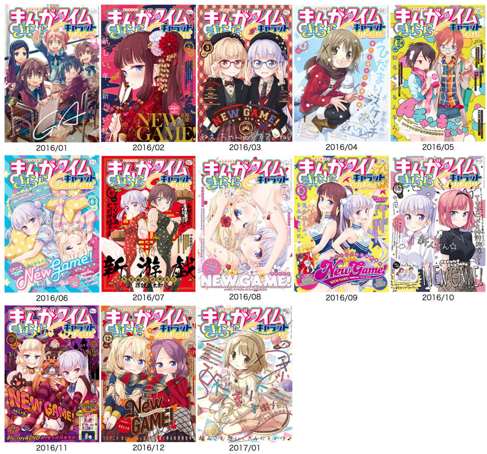
<figcaption>2016年1月号より2017年1月号までのまんがタイムきららキャラット表紙</figcaption>
</figure>

2017年1月号も入ってるのはご愛嬌.

こうしてみるともうホント、見事に NEW GAME! ですね.
2016年1月号 から 2017年1月号 までの 13 の内 9 の表紙が NEW GAME! です.
1月号の表紙が GA なのは2月号で最終話だったからですが、2月号は GA ではなくやっぱり NEW GAME!.
着物姿のひふみんです. 初詣でしょうね. 2月号なのに正月なのは 1 月末発売だからです.
NEW GAME! のアニメ化の文字が初登場したのが 2015年12月号の表紙で、この次の2016年1月号から、
見開き一番にカラーで「NEW GAME NEWS」なるものが始まり、今なお続いております.
この贔屓すごい.
得能先生に嫉妬です.

個人的にはまんがタイムといえば、ひだまりスケッチなのですが、2016年中1回 (+2017年1月) だけという.
2015年を見ると4回表紙を飾っているので、かなりスペースを奪われてるのが分かります.

<figure>
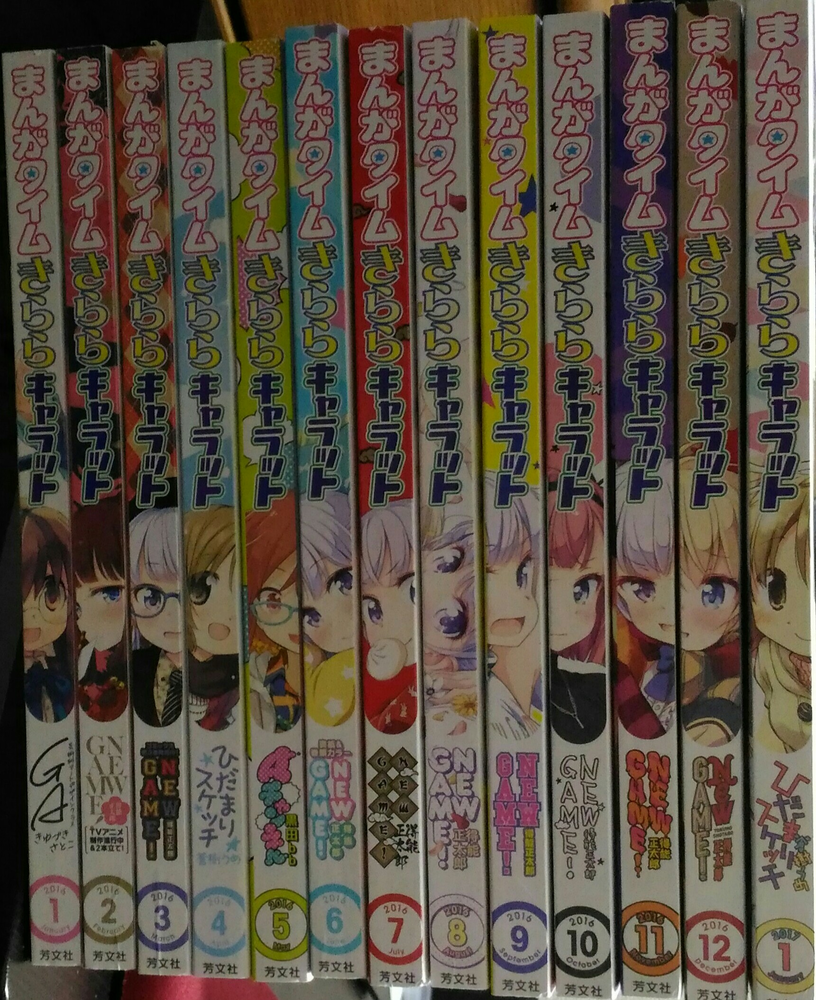
<figcaption>画像を増やすために今撮った写真</figcaption>
</figure>

2016年5月号はAチャンネルでした. これは単行本第七巻が発売だったので.
2017年1月号がひだまりなのは、これは単行本第九巻の発売だから.
2016年4月号もひだまりスケッチ. ちょうど蒼樹うめ展の "in 大阪" が3月にありました.
この宣伝のためでしょう. あれ? でも宣伝遅くない?

## 可愛らしさランキング (小ネタ)

もちろん可愛らしさというのは主観です.
偶然、私の手元には、可愛らしさ判定機械であるところの kwibot さん
([先日の記事参照](06.md.html))
がいらっしゃいます.
kwibot さんには私の持つ「可愛い」という概念を完璧に理解していただいているので、
彼女を使って 2016年のきららキャラット表紙をランキングしてみます.
ただし、あくまでも kwibot さんの判定は私の **主観** を元にしていることにご注意ください.
要するにどんな結果になってもご容赦下さいということです.

> _N.B._ kwibot さんを使う利点は、人間ではついついブレてしまう可愛らしさに絶対的な指標を与えてくれることです.
> 微妙な A と B との差を kwibot さんは決定してくれるのです.
> 人間なら、寝て起きたらやっぱり B のが A より可愛いよな、と意見が変わることもあってアテになりませんね.

### 第四位

<figure>

<figcaption>2016年12月号: Kawaii level=0.5111</figcaption>
</figure>

とてもいい.
こうりんが降臨って感じ.

コウとりんとの間には縦に「あっためてね♪」とあります.
なかなか攻めた表紙ですね.
コウの髪型はこれポニーテールですかね?
右に寄ってるのでもしかしたら右手で雑に止めたのかも.

### 第三位

<figure>

<figcaption>2016年1月号: Kawaii level=0.8710</figcaption>
</figure>

皆さんとてもいい笑顔ですね (特に感想なし).

### 第ニ位

<figure>
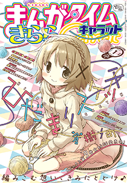
<figcaption>2017年1月号: Kawaii level=0.9510</figcaption>
</figure>

芳文社さん、ちょっと、露骨に NEW GAME! 推し過ぎですけどね、
ひだまりスケッチこそ芳文社の顔ですよね.

### 第一位

<figure>

<figcaption>2016年4月号: Kawaii level=0.9598</figcaption>
</figure>

4月なのに雪遊び.
内容は大学見学の後編で、特に冬は関係ありませんでした.

### 最下位

<figure>

<figcaption>2016年7月号: Kawaii level=0.1866</figcaption>
</figure>

ごめんなさい.
チャイナドレスの 7月号が最下位となってしまいました.
これは私の好みですけど、露出がちょっと多いんですよね.
はじめさんはセクシー担当なのでしょうがないですね.
ちなみに内容は、はじめさんとゆんさんの高校時代の思い出話でした.

### まとめ

結果全てをまとめますと下表になります.

| 号 | Kawaii level 高い方が可愛い |
| :------: | :----: |
| 2017/01  | 0.9510 |
| 2016/12  | 0.5111 |
| 2016/11  | 0.2978 |
| 2016/10  | 0.3968 |
| 2016/09  | 0.2452 |
| 2016/08  | 0.4464 |
| 2016/07  | 0.1866 |
| 2016/06  | 0.3104 |
| 2016/05  | 0.2381 |
| 2016/04  | 0.9598 |
| 2016/03  | 0.4865 |
| 2016/02  | 0.4495 |
| 2016/01  | 0.8710 |

何度も言いますと、機械を用いた判定とは言え、基本的に、これは私の好みの数値化です.
なので NEW GAME! が結構低いですがご容赦下さい.
八神コウさんが好きなんです.

## 右上 (メイン)

こちらがメインです.
きららキャラットと言えば右上だと思います.
中の人の言葉がそのまま筒抜けして見えてる感じがして、アレを楽しみにしている自分がいます.
季節感も反映しているのも楽しいです.
あ、そうだ.
クイズにしましょう.

画像は全て写真経由なので汚いですごめんなさい.

### Q. それぞれ何月号の右上でしょうか？

<figure>
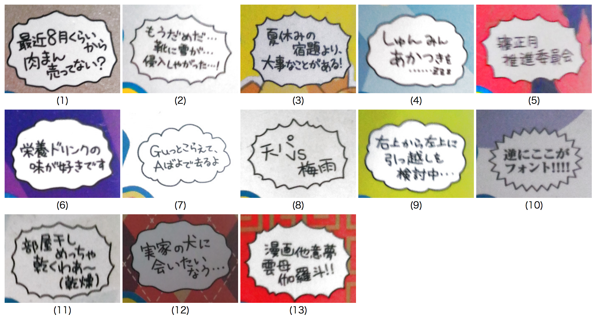
<figcaption>2016年1月号より2017年1月号までのまんがタイムきららキャラットの右上. 順序はランダムに入れ替えた.</figcaption>
</figure>

是非とも考えてみて下さい.
背景の色や模様を表紙絵と照らし合わせると一発ですが、
ぜひその内容から推測してみて下さい.

さて、いきなり答え合わせです.

### 答え合わせ

<table>
<tr>
<td>( 1) 2016/12</td>
<td>( 2) 2016/04</td>
<td>( 3) 2016/09</td>
<td>( 4) 2016/06</td>
<td>( 5) 2016/02</td>
</tr><tr>
<td>( 6) 2016/11</td>
<td>( 7) 2016/01</td>
<td>( 8) 2016/08</td>
<td>( 9) 2016/05</td>
<td>(10) 2016/10</td>
</tr><tr>
<td>(11) 2017/01</td>
<td>(12) 2016/03</td>
<td>(13) 2016/07</td>
</tr>
</table>

### お返事

右上は中の人から読者へのお便りだと思っています.
なのでお返事をします.

#### 2016/01

GA

#### 2016/02

 
2月号なので1月末発売のハズ.
もうとっくに正月終わってますよっっ.
月刊誌って正月を狙い撃ちできないので惜しいですよね.
キャラットはクリスマスなら狙い撃ちできますが.

#### 2016/03

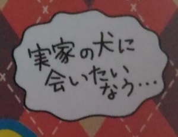

長生きするペットを飼ったことがないのでよくわからない.

#### 2016/04

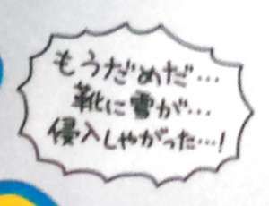

表紙のゆのっちと照らし合わせるとなんか笑った.

#### 2016/05

ずっと右上にいて下さい.

#### 2016/06

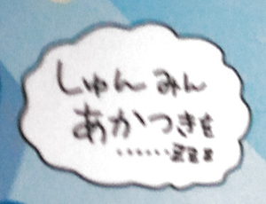

6月号ですからねっ.
いやしかし、春眠って4月くらいだと思ってたけど旧暦で言うのかな.

#### 2016/07

まんがたいむ
きらら
きゃらっと！！

#### 2016/08

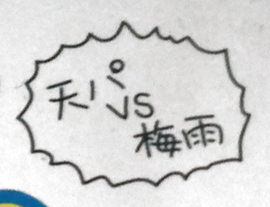

髪で天気が分かって便利そう.

#### 2016/09

ある！

#### 2016/10

意味がわからないです.
解説をお願いします.

#### 2016/11

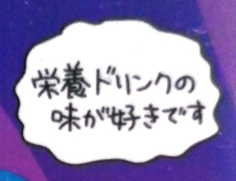

むしろ味だけなんですよ.

#### 2016/12

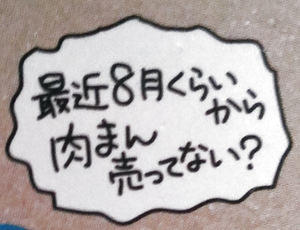

これを12月 (11月) で気づきましたか.

#### 2017/01

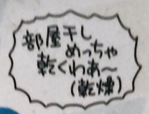

梅雨なんかより乾燥の方が辛いです.

## おわりに

というわけで今回はキャラット表紙で私なりの2016年を振り返ってみました.
ゆゆ式アドベントカレンダーがらがらなので、きっと誰かが他のきららでもやってくれると思います.

ところで

<blockquote class="twitter-tweet" data-lang="en">
長らくお待たせいたしました！ 新作アニメスペシャルエピソードのOVAが来年2月22日に発売決定！！&#13;さらに主題歌CD・キャラクターソングアルバムのリリースも決定いたしました！お楽しみにお待ち下さい♪&#13;詳細は→<a href="https://t.co/9Mzjl9ZAjF">https://t.co/9Mzjl9ZAjF</a> <a href="https://twitter.com/hashtag/yuyushiki?src=hash">#yuyushiki</a> <a href="https://t.co/C0pwTGIowA">pic.twitter.com/C0pwTGIowA</a>
&mdash; TVアニメ「ゆゆ式」 (@yuyushiki_anime) <a href="https://twitter.com/yuyushiki_anime/status/803886501389946880">November 30, 2016</a></blockquote>

