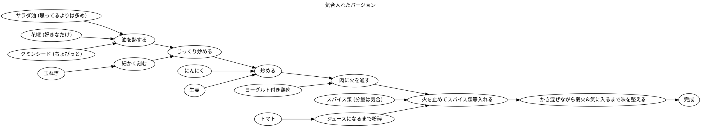
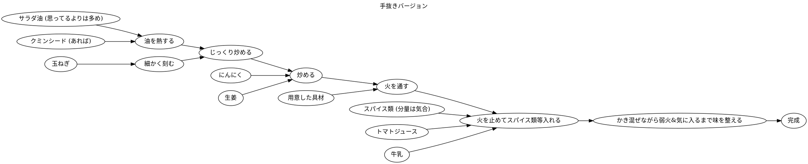

% Sun Jul 26 2020

## インドカレーについて

友人が作ってるのに感化されて自分でも試してみた.

私がレシピとして第一に参照してるのはこれ:

- [インド人なら100円ショップのスパイスでも本格インドカレーは作れるのか？本場の味を知るインド人が挑戦！](https://livejapan.com/ja/article-a0002426/)

自分が組み立てたレシピは以下の通り.

### 気合をいれた場合

#### 材料

- サラダ油
- 赤玉ねぎ1個
    - 「紫玉ねぎ」が由緒正しいインド風らしいけど, 赤玉ねぎと別物なのか分かってない
    - どちらにしろ手に入るのがこれなので
- 鶏肉
    - 少なめのヨーグルトを表面に塗って冷蔵庫で一時間寝かす
- トマト一個
    - 小さめのを一個
- にんにく, 生姜
    - チューブタイプが便利
- スパイス
    - 花椒
    - クミンシード
    - ターメリック（粉）
    - コリアンダー（粉）
    - ガラムマサラ（粉）

#### 工程

### 手を抜いたバージョン

いくつかの材料工程は不要だと思ってる.
例えば肉をヨーグルトにつける作業は無駄だと思う.
臭み消しと柔らかくするための操作だと思うのだが, まず日本のスーパーで手に入る肉は普通臭くない.
柔らかさは…よくわかんないです.
柔らかく煮込んだりビーフシチューみたいな作り方するわけでもなし.

#### 材料

- サラダ油
- 玉ねぎ1個
    - 新玉ねぎだろうが普通のだろうがお好きに
- なんでも具材
    - その日食べたいもの, 冷蔵庫に放置してあったもの, なんでも！
- トマトジュース
    - 塩分無添加のものがいいとは思う
    - 塩分調整のためにケチャップもあるとよし
- 牛乳
    - なくてもいいけどあったほうが
- にんにく, 生姜
    - チューブタイプ
- スパイス
    - ガラムマサラ（粉）
    - ターメリック（粉）
    - 花椒（なくていい）
    - クミンシード（なくていい）
    - コリアンダー（なくていい）

**玉ねぎ** なんでもいい.
**具材** お好きに.
肉をヨーグルトに漬ける操作, しなくていい.
ただ乳製品を入れたまろやかさが好きなら牛乳入れるといい.
普通の日本のカレーでも牛乳入れたりするしね.
**トマト** 自分で粉砕する工程が面倒だから初めからそのようなものを買えばいい.
トマトピューレとかもあるけど, 飲む用のトマトジュースを初めから買うのが一番安価だと思う.
ただ適当にトマトジュース買うと塩分とか添加しまくってるのが普通だから何にも添加されてないものを選ぶこと.
探せばそういうのもあります.
**スパイス** ターメリックとガラムマサラだけあれば割とカレー. クミンシードくらいはあったほうがいいとは思うけど, 無くてもちゃんとカレーはカレー.

#### 工程

工程をいくつか省いただけでほぼほぼ同じ.

### 冷蔵/冷凍保存について

すればいい.

最後まで作ってから保存してもいいけど,
トマト（及び牛乳）を入れる手前が一番体積が小さいので, このタイミングで保存しておくのが便利だと思う.

### 玉ねぎの "細かく刻む" について

本当にペーストくらいになるまで刻むのがインド風らしい, が, 結構扱いに困る.
ペーストになった玉ねぎはどんどん油を吸うし粘度が高いと単純にヘラにくっついて炒めにくい.
私は5ミリ角くらいに留めておいてる.

[ぶんぶんチョッパー](https://www.google.com/search?client=firefox-b-d&q=%E3%81%B6%E3%82%93%E3%81%B6%E3%82%93%E3%83%81%E3%83%A7%E3%83%83%E3%83%91%E3%83%BC)
なるものを使ってる.
これは要するに手動のフードプロセッサー.
確かに便利だけど包丁で十分困ってないならそれでいい.
ただペーストになるまで刻む（もはやミキサーする）ということを試したい場合はこういったなにか道具があると便利.

玉ねぎは3個くらいまとめて売られてることが多い.
予め全部刻んでおいてジップロックに入れて冷凍保存してる.
料理するときにまな板と包丁が要らないように準備しておくことは料理の美徳.
