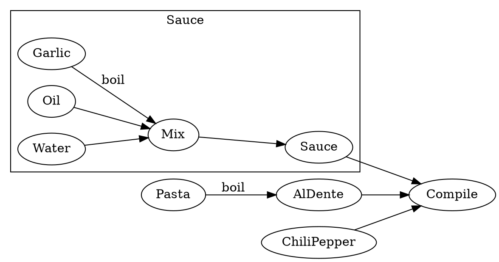

% Wed Nov 25 2020

## （アーリオ・オーリオ・エ・）ペペロンチーノ

本当はYouTubeに良い作り方動画があったんだけど, 消えちゃった.

ペペロンチーノといえばうるさいのがオリーブオイルの乳化だ.
してもしなくてもペペロンチーノはペペロンチーノなんだけど, した方が評判がいい.
ここで言う乳化という言葉が結局何を言うのかと言えば, 簡単で, 油に水が溶けて白濁した状態を言う.
当然水と油は分子レベルでは溶けないので,
単にオリーブオイルの中に水が細かい粒の状態で混ざりあっただけであり,
これによって白濁して見えるようになる.

巷では火で炙ったオリーブオイルに激しく水を入れてガチャゴチャかき混ぜてこれを行おうとする方法を指南する人たちがいるが,
結局のところかき混ぜれば何でも良い.
この方法ではハンドブレンダーを使う.
常温の状態で水とオリーブオイルを 1:1 で容器に入れてただかき混ぜれば良い.
加熱もしないので変に油が飛び跳ねたりしないし, 確実に乳化は成功する.

### レシピ



<details><summary>source code: peperoncino.dot</summary>

```cpp
digraph hoge {
    rankdir = "LR";
    subgraph cluster_sauce {
        label = "Sauce";
        Garlic -> Mix [label = "boil"];
        Oil -> Mix;
        Water -> Mix;
        Mix -> Sauce;
    }
    Pasta -> AlDente [label = "boil"];
    {Sauce AlDente ChiliPepper} -> Compile;
}
```

</details>

1. boil というエッジがちょうど2本だけあるが, 火はここでしか使わない
1. ニンニクは茹でてから使う
1. 分量は全部気持ちで
1. Mix はハンドブレンダーによる撹拌のこと
    - 液体の少しドロッとしたソースを作る
    - 元動画ではここにパセリを入れてた
    - 機械を使えばここに掛ける時間は 10 秒もあれば十分なので, 麺が茹で上がってから行えばよし
1. パスタは例によってアルデンテを目指す
    - パッケージに書いてある茹で時間の -1 分
    - 私はいちいち時間とか測ったことないけど
    - 一本とって齧ってみて, 芯がかろうじて残ってるくらいで上げればよし
1. Compile は全部を混ぜ合わせる作業
    - アルデンテの麺に今撹拌したばかりのソースをひたすら和える
        - ここでつい加熱したくなるけど, オリーブオイルは加熱で匂いが飛ぶので避ける
        - パスタがソースを吸うだけ吸わせることが目的
    - 最後にチリペッパーを掛ければ出来上がり

というのがレシピだ.
定番の作り方とはだいぶ違う.
よくあるのはニンニクをオリーブオイルで焦げるかその手前まで加熱して匂いを移すだとか,
鷹の爪を使うだとか.
このレシピでは匂いを移す代わりにニンニクをソースに全部入れてしまう.
鷹の爪は面倒くさいので粉のチリペッパーを振りかけるだけで済ます.


かなり合理的だし楽だし, そして大変に美味しいのでおすすめ.

### 追記

再現動画ならあった
<div class=youtube src-id="NGE-V8Wb2uQ"></div>

## その他のメモ

oculusアプリは買ってから2週間以内の申請であって起動時間が延べて2時間未満なら返金出きると書いてある。試してみた。申請してから3日とちょっと掛かったけど、出来た。3日も掛かるのは意外だった。

思想：苦しくなきゃ百合じゃない

なにか映画を見ようとPrimeVideoのアプリを起動する.
初めに目に入った映画を見る.
つまりAmazonのレコメンドどおりに私は行動する.

[いつだってやめられる 7人の危ない教授たち](https://filmarks.com/movies/60479)

面白かった.
しかも3部作になってる.
コメディドラマくらいのノリに思えたけど, これで映画らしい.
